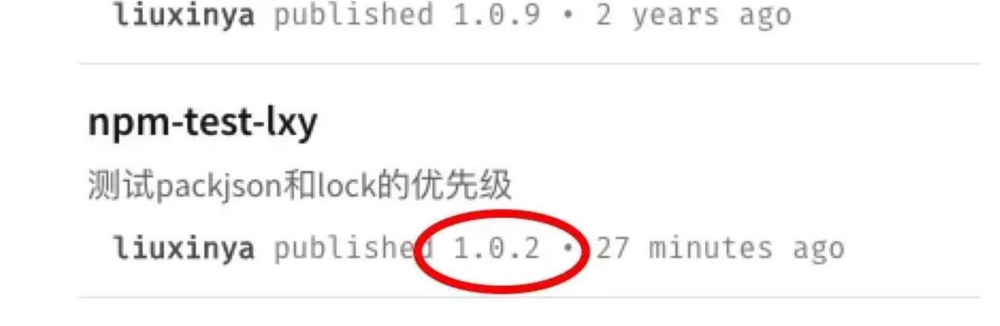
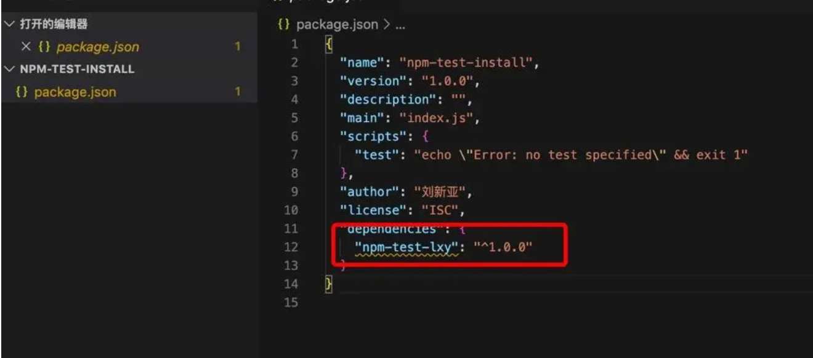
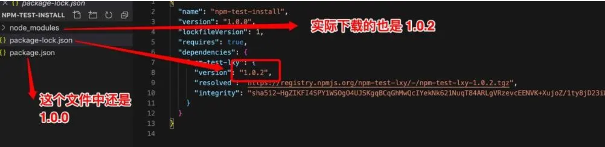
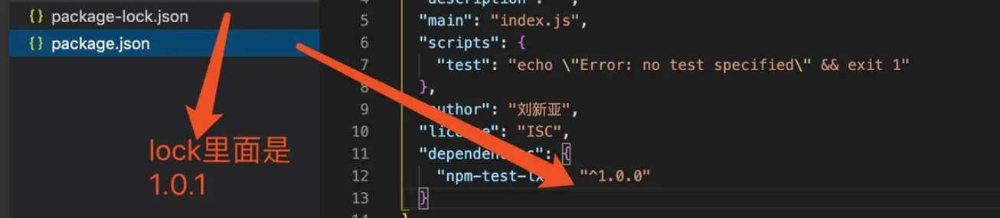
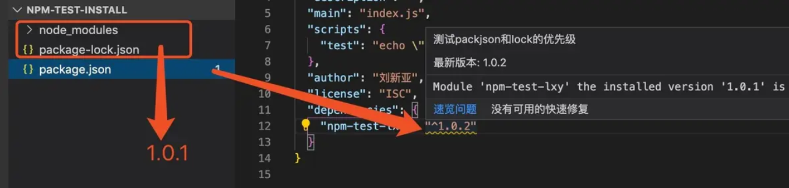
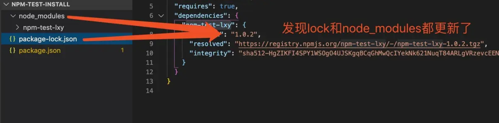

[TOC]

# package-lock.json 作用

## 结论

1. 如果lock文件中的版本高于package.json， 项目每次 install 都会根据 lock文件 的具体版本去拉取包，但并不会更新package.json中写的版本号
2. 如果lock文件中的版本低于package.json，项目install的时候会下载当前包大版本下的最新小版本，并更新lock
3. 等于的情况，就是下载当前版本号的依赖

##  实验

如果项目中只有`package.json`，那么第一次install会生成一个`package-lock.json`的文件

### **那么生成的package-lock.json中的依赖版本和package.json中的一定会一致吗？**

- 答案是否定的

- 如果`包A`在远程中是`1.0.2`， 而在`package.json`中是`1.0.0`，那么在第一次生成的`package-lock.json`文件中，依赖版本也是`1.0.2`

- 测试如下
  1、在远程准备了一个`npm-test-lxy`的包，并发了三个小版本`1.0.0` 、`1.0.1`、 `1.0.2`

  

  2、本地package.json文件中写死  1.0.0

 

  3、执行 npm install 发现生成的lock文件和实际下载到node_modules的是最新版本

- 但实际项目开发，lock文件肯定是上传到git仓库上的，每个开发人员的项目初始会有这个文件，并且保持一直

------

### 那么当lock文件和package.json不一致，且lock中的版本不是最新版本，npm install 会根据lock中的版本下载还是根据package.json下载，还是会下载最新版本并更新到lock里呢

- 带着这样的疑问，开始第二个试验

- 执行 npm install 之后 node_modules里面下载的包的版本是 `1.0.1`

------

### 那么我手动更改package.json中的包的版本，会怎样呢

- 再次install，结果如下

<https://www.jianshu.com/p/d6188b72cb3d>