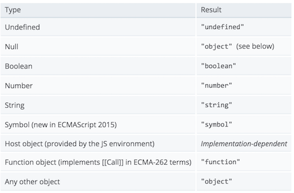

[TOC]


# 在JavaScript中，如何判断数组是数组？


如果你没有注意过这个问题，那么这个标题应该会让你感到困惑，判断数据类型这么基础的问题能有什么坑呢？

少年，你不能太天真了，我们朝夕面对的这门语言，可是JavaScript呀，任何你觉得已经习以为常的东西都可能瞬间转化成一个大坑，令人百思不得其解。

但是正是因为同样的原因，我们可以在学习和使用JavaScript这门语言的时候提出和讨论一些这门语言独有的，十分有趣的问题。比如我们今天要讨论的，在JavaScript当中如何判断一个数组是数组。

JavaScript有五种方法可以确定一个值到底是什么类型，分别是typeof运算符，constructor法，instanceof运算符，Object.prototype.toString方法以及Array.isArray法.

## 1.用typeof运算符来判断

typeof是javascript原生提供的判断数据类型的运算符，它会返回一个表示参数的数据类型的字符串，例如：

```
const s = 'hello';
console.log(typeof(s))//String
```

以下是我在MDN的文档中找到的一张包含typeof运算法的针对不同参数的输出结果的表格：



从这张表格可以看出，数组被归到了Any other object当中，所以typeof返回的结果应该是Object，并没有办法区分数组，对象，null等原型链上都有Object的数据类型。

```
const a = null;
const b = {};
const c= [];
console.log(typeof(a)); //Object
console.log(typeof(b)); //Object
console.log(typeof(c)); //Object
```

运行上面的代码就会发现，在参数为数组，对象或者null时，typeof返回的结果都是object，可以使用这种方法并不能识别出数组，因此，在JavaScript项目中用typeof来判断一个位置类型的数据是否为数组，是非常不靠谱的。

## 2.用instanceof判断

既然typeof无法用于判断数组是否为数组，那么用instance运算符来判断是否可行呢？要回答这个问题，我们首先得了解instanceof运算法是干嘛用的。

instanceof运算符可以用来判断某个构造函数的prototype属性所指向的對象是否存在于另外一个要检测对象的原型链上。在使用的时候语法如下：

```
object instanceof constructor
```

用我的理解来说，就是要判断一个Object是不是数组（这里不是口误，在JavaScript当中，数组实际上也是一种对象），如果这个Object的原型链上能够找到Array构造函数的话，那么这个Object应该及就是一个数组，如果这个Object的原型链上只能找到Object构造函数的话，那么它就不是一个数组。

```
const a = [];
const b = {};
console.log(a instanceof Array);//true
console.log(a instanceof Object);//true,在数组的原型链上也能找到Object构造函数
console.log(b instanceof Array);//false
```

由上面的几行代码可以看出，使用instanceof运算符可以分辨数组和对象，可以判断数组是数组。

## 3.用constructor判断

实例化的数组拥有一个constructor属性，这个属性指向生成这个数组的方法。

```
const a = [];
console.log(a.constructor);//function Array(){ [native code] }
```

以上的代码说明，数组是有一个叫Array的函数实例化的。
如果被判断的对象是其他的数据类型的话，结果如下：

```
const o = {};
console.log(o.constructor);//function Object(){ [native code] }
const r = /^[0-9]$/;
console.log(r.constructor);//function RegExp() { [native code] }
const n = null;
console.log(n.constructor);//报错
```

看到这里，你可能会觉得这也是一种靠谱的判断数组的方法，我们可以用以下的方式来判断:

```
const a = [];
console.log(a.constructor == Array);//true
```

但是，很遗憾的通知你，constructor属性是可以改写的，如果你一不小心作死改了constructor属性的话，那么使用这种方法就无法判断出数组的真是身份了，写到这里，我不禁想起了无间道的那段经典对白，梁朝伟：“对不起，我是警察。”刘德华：“谁知道呢？”。

```
//定义一个数组
const a = [];
//作死将constructor属性改成了别的
a.contrtuctor = Object;
console.log(a.constructor == Array);//false (哭脸)
console.log(a.constructor == Object);//true (哭脸)
console.log(a instanceof Array);//true (instanceof火眼金睛)
```

可以看出，constructor属性被修改之后，就无法用这个方法判断数组是数组了，除非你能保证不会发生constructor属性被改写的情况，否则用这种方法来判断数组也是不靠谱的。

## 4.用Object的toString方法判断

另一个行之有效的方法就是使用Object.prototype.toString方法来判断，每一个继承自Object的对象都拥有toString的方法。

如果一个对象的toString方法没有被重写过的话，那么toString方法将会返回"[object *type*]"，其中的*type*代表的是对象的类型，根据type的值，我们就可以判断这个疑似数组的对象到底是不是数组了。

你可能会纠结，为什么不是直接调用数组，或则字符串自己的的toString方法呢？我们试一试就知道了。

```
const a = ['Hello','Howard'];
const b = {0:'Hello',1:'Howard'};
const c = 'Hello Howard';
a.toString();//"Hello,Howard"
b.toString();//"[object Object]"
c.toString();//"Hello,Howard"
```

从上面的代码可以看出，除了对象之外，其他的数据类型的toString返回的都是内容的字符创，只有对象的toString方法会返回对象的类型。所以要判断除了对象之外的数据的数据类型，我们需要“借用”对象的toString方法，所以我们需要使用call或者apply方法来改变toString方法的执行上下文。

```
const a = ['Hello','Howard'];
const b = {0:'Hello',1:'Howard'};
const c = 'Hello Howard';
Object.prototype.toString.call(a);//"[object Array]"
Object.prototype.toString.call(b);//"[object Object]"
Object.prototype.toString.call(c);//"[object String]"
```

使用apply方法也能达到同样的效果：

```
const a = ['Hello','Howard'];
const b = {0:'Hello',1:'Howard'};
const c = 'Hello Howard';
Object.prototype.toString.apply(a);//"[object Array]"
Object.prototype.toString.apply(b);//"[object Object]"
Object.prototype.toString.apply(c);//"[object String]"
```

总结一下，我们就可以用写一个方法来判断数组是否为数组：

```
const isArray = (something)=>{
    return Object.prototype.toString.call(something) === '[object Array]';
}

cosnt a = [];
const b = {};
isArray(a);//true
isArray(b);//false
```

但是，如果你非要在创建这个方法之前这么来一下，改变了Object原型链上的toString方法，那我真心帮不了你了...

```
//重写了toString方法
Object.prototype.toString = () => {
    alert('你吃过了么？');
}
//调用String方法
const a = [];
Object.prototype.toString.call(a);//弹框问你吃过饭没有
```

当然了，只有在浏览器当中才能看到alert弹框，这个我就不解释了。

## 5.用Array对象的isArray方法判断

为什么把这种方法放在最后讲呢？因为它是我目前遇到过的最靠谱的判断数组的方法了，当参数为数组的时候，isArray方法返回true，当参数不为数组的时候，isArray方法返回false。

```
const a = [];
const b = {};
Array.isArray(a);//true
Array.isArray(b);//false
```

我试着在调用这个方法之前重写了Object.prototype.toString方法：

```
Object.prototype.toString = ()=>{
    console.log('Hello Howard');
}
const a = [];
Array.isArray(a);//true
```

并不影响判断的结果。
我又试着修改了constructor对象：

```
const a = [];
const b = {};
a.constructor = b.constructor;
Array.isArray(a);//true
```

OK，还是不影响判断的结果。

可见，它与instance运算符判断的方法以及Object.prototype.toString法并不相同，一些列的修改并没有影响到判断的结果。

你可以放心大胆的使用Array.isArray去判断一个对象是不是数组。
除非你不小心重写了Array.isArray方法本身。。

------

重要补充：有读者朋友在评论中提醒我，Array.isArray是ES5标准中增加的方法，部分比较老的浏览器可能会有兼容问题，所以为了增强健壮性，建议还是给Array.isArray方法进行判断，增强兼容性，重新封装的方法如下：

```
if (!Array.isArray) {
  Array.isArray = function(arg) {
    return Object.prototype.toString.call(arg) === '[object Array]';
  };
}
```

作者：方浩，**转载请注明出处！！！**
文章源链接：[https://segmentfault.com/a/11...](https://segmentfault.com/a/1190000006150186)


 