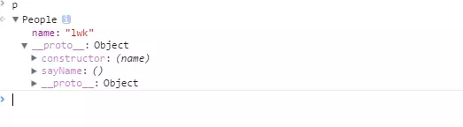
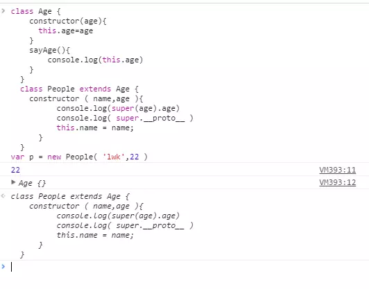

[TOC]


# es6 javascript Class 浅析

关键词：class,super,static,new target,getter,setter,extends

## class是什么：

> ES6提供了更接近传统语言的写法，引入了Class（类）这个概念，作为对象的模板。通过class关键字，可以定义类。基本上，ES6的class可以看作只是一个**语法糖**，它的绝大部分功能，ES5都可以做到，新的class写法只是让对象原型的写法更加清晰、更像面向对象编程的语法而已。

- 传统的面向对象写法：

```
function People (name){
  this.name=name;
}
People.prototype = {
  constructor : People,
  sayName : function(){
      console.log(this.name)
  }
}
var p = new People('lwk');
p.sayName()//lwk
```

- 用class的写法如下：

```
class People {   //一定要class开头，并且没有等号小括号直接大括号，并且打括号里面不是JSON格式
   constructor (name){   //constructor:定义属性，写法感觉像是没有function的函数。
      this.name=name
   }
   sayName(){  //定义方法
      console.log(this.name)
  }
}
var p = new People('lwk')
p.sayName():
```

[实例点击](https://link.jianshu.com/?t=http://js.jirengu.com/quza/2/edit)



Paste_Image.png

- 总结：class语法与传统面向对象的写法相比，更加简洁。

## Tips :

1. 使用class一定要使用new 实例化
2. class可以使用表达式的形式但是调用的还是前者：

```
let People = class Man {
  //...
}
let me = new People()
```

1. class不像以前的函数具有声明前置，而是按照JS执行顺序。

## 继承：使用super和extends

- 传统的继承写法：

```
function Age( age ){}
function People(name,age){
    Age.call(this,age)
}
People.prototype = Object.create( Age.prototype )
```

- class写法：

```
class Age {
  constructor(age){
      this.age=age
  }
  sayAge(){
      console.log(this.age)
}
}
class People extends Age {
  constructor ( name,age ){
        super(age)//super 代表父类的实例也就是People的实例对象。
        this.name = name;
  }
  sayName(){
        console.log(this.name)
  }
}
let p = new People( 'lwk',22 )
console.log(p.age)
p.sayAge()
```

(示例点击)([http://js.jirengu.com/geqod/2/edit](https://link.jianshu.com/?t=http://js.jirengu.com/geqod/2/edit))
在这里我们使用extends和super关键词就实现了People对象继承Age对象。
其中，extends要注意的是extends后面接的是你要继承的对象。

## 这里重点说一下super:

1. super的原理是实例化父类，也就是把你要继承的对象实例化，并把你的this传入。
2. super要在构造函数中使用时，**super关键字单独出现**，**必须在可以使用this关键字之前使用**。

```
//其实本人在刚开始看super对于super的理解也是挺模糊的,以为super实例化的是要继承对象。
//后来试了一下的代码：
class Age {
  constructor(age){
      this.age=age
  }
  sayAge(){
      console.log(this.age)
}
}
class People extends Age {
  constructor ( name,age ){
        console.log(super(age).age)
        console.log( super.__proto__)
        this.name = name;
  }
}
var p = new People( 'lwk',22 )
```

结果如图：



Paste_Image.png

结果可以看出来在你最开始写extends其实就已经完成继承，所以super的作用：
super()调用会生成一个空对象，作为context来调用父类的constructor，返回this对象，作为子类constructor的context继续调用构造函数。

## class的取值函数和存值函数：getter && setter：

语法：

```
class Info {
  get text(){
   // dosomething
  }
  set text(){
   // dosomething
  }
}
```

如果学过jquery的人应该对这两个函数相当眼熟，因为它和我们学习的jqueryAPI的特性很类似，但是形态上有很大的不同
如：$(e).text() 获取元素内的文本节点，$(e).text(...)设置元素内的文本节点，类似API还有html(),get()......

来演示一个简单的例子把：

```
//比如我们想这样调用来改变DOM元素的文本节点：
//var p = new Info(element);  //element是DOM结构
// console.log( p.text()); p.text( 'hello world' )
class Info {
  constructor(element){
        this.element=element;
  }
  get text(){
        return this.element.innerText;
  }
  set text(value){
       this.element.innerText = value;
  }
}
```

[示例点击](https://link.jianshu.com/?t=http://js.jirengu.com/qojuw/2/edit)

## class的静态方法：static

```
class People {
  static print(){
     console.log(100)
 }
}
var p = new People();
p.print()//报错
```

一般来说在类定义的方法都会被其实例继承，但是如果在方法钱加上static，表示方法不会被实例继承。

如果想要调用静态方法，只有2种：

1. 可以直接调用对象，在上面代码想要调用静态对象：可以直接： People.print();
2. 使用super可以调用静态方法。

最后：ES6规定class只有静态方法没有静态属性。

## new.target

该属性的作用是用于确定对象是否使用new调用：如果使用的是new那么new.target=实例对象的父类，如果不是new.target=undefined。

```
class People{
    constructor (){
      console.log( new.target===People )
  }
}
var p= new People() // true
```

需要注意的是：
如果使用继承的方法的话：

```
class A extends B{}
//这时候new.target指向的是A
```

利用这个方法我们可以写出不能独立使用，而必须继承才能使用的类。


https://www.jianshu.com/p/72012dd822fd
