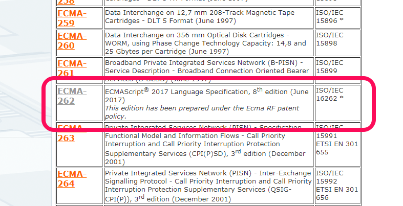
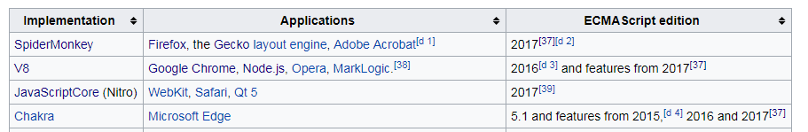

[TOC]

# 详解JavaScript与ECMAScript的区别

**译者按：** 简单的说，ECMAScript是标准，而JavaScript是实现。

- 原文: [What’s the difference between JavaScript and ECMAScript?](https://medium.freecodecamp.org/whats-the-difference-between-javascript-and-ecmascript-cba48c73a2b5)
- 译者: [Fundebug](https://www.fundebug.com/)

**为了保证可读性，本文采用意译而非直译。另外，本文版权归原作者所有，翻译仅用于学习。**

对于新手来说，大概会搞不清楚JavaScript与ECMAScript之间的关系与区别，这篇博客将详细介绍JavaScript与ECMAScript相关术语，帮助大家搞清楚状况…

### Ecma International

> 一个制定技术标准的组织

什么是标准呢？我们可以想一想键盘。绝大多数的键盘的字母顺序是一样的，并且都有空格、回车，方向和数字等键。这是因为大多数的键盘制造商都遵守了[ [QWERTY ](https://en.wikipedia.org/wiki/QWERTY)标准。

### ECMA-262

> 由Ecma International发布。它包含了脚本语言的标准。

ECMA-262类似于QWERTY，后者标准化了键盘布局，而前者标准化了脚本语言ECMAScript。

不妨把ECMA-262看做ECMAScript的编号。

### ECMAScript

> 由ECMA-262制定的标准，用于实现通用的脚本语言。

ECMAScript提供了脚本语言需要遵守的规则、细节和规范。下面的图片摘录了[ECMAScript 2017 Language Specification](https://www.ecma-international.org/publications/files/ECMA-ST/Ecma-262.pdf)，这个文档有900页…

#### **JavaScript**

> 通用脚本编程语言，它遵循了ECMAScript标准

换句话说，JavaScript是ECMAScript的方言。

通过阅读[ECMAScript标准](https://www.ecma-international.org/publications/files/ECMA-ST/Ecma-262.pdf)，你可以学会怎样**实现**一个脚本语言；而通过阅读[JavaScript文档](https://developer.mozilla.org/en-US/docs/Web/JavaScript)，你可以学会怎样使用脚本语言编程。

JavaScrit基本上实现了ECMA-262的标准，但是也有一些不同。Mozilla列出了JavaScript的[非ECMAScript特性](https://developer.mozilla.org/en-US/docs/Web/JavaScript/New_in_JavaScript/ECMAScript_Next_support_in_Mozilla)：

### JavaScript引擎

> 理解并执行JavaScript代码的解释器

浏览器中会有JavaScript引擎，比如Chrome有V8，Firefox有SpiderMonkey，Edge有Chakra。JavaScript引擎处理JavaScript代码，类似于人对语言的处理。

人对语言的处理存在差异，那么就不难理解浏览器处理JavaScript的差异了。

#### 浏览器性能差异

假设两个人都可以理解”jump”指令，其中1个人也许会反应快一些，因为他可以更快的理解和处理”jump”。同样的，两个浏览器都可以理解JavaScript代码，但是其中1个浏览器会快一些，因为它的JavaScript引擎的实现方式更加高效。

#### 浏览器支持差异

我们都知道，不同人对同一种语言的了解和使用是存在差异的。比如，许多人都使用英语，有些人知道的单词、短语和语法，其他人未必都知道。浏览器也是一样的。尽管浏览器的JavaScript引擎都能理解JavaScript，但是有些浏览器的理解能力更强，它们对JavaScript的支持是不一样的。

下面的表格来自 [ECMAScript](https://en.wikipedia.org/wiki/ECMAScript)维基百科，它显示了各种浏览器对ECMAScript的支持情况：

要知道，ECMAScript只是一个标准，它告诉我们脚本语言应该是怎样的。但是，发布一个新版本的ECMAScript时，并不意味着所有JavaScript引擎都会马上拥有新的特性。这取决于JavaScript引擎开发者是否支持最新特性。

因此，许多开发者都会这样问：“这个浏览器支持哪个版本的ECMAScript？”；“这个浏览器支持哪些ECMAScript特性？”。他们还想知道Chrome, Firefox以及Edge浏览器是否更新了JavaScript引擎，来确定这些浏览器是否支持最新的ECMAScript。 [ECMAScript compatibility table](http://kangax.github.io/compat-table/es6/)可以很好地回答这个问题。

当新的ECMAScript发布之后，JavaScript没有一次性支持所有新特性，则他们会逐步支持新特性，我们可以通过Firefox的Changelog看得到：

#### ECMAScript 6

> ECMA-262的第6个版本

同义词: ES6, ES2015, and ECMAScript 2015

这个版本的ECMAScript将它的名字从ES6改为了ES2015，因为Ecma International决定每年发布ECMAScript，并根据发布的年份进行命名。简单地说，ES6与ES2015指定是同一个ECMAScript版本。

### 先有鸡还是先有蛋

JavaScript是1996年创造的，它在1997年提交给Ecma International，因此才有了ECMAScript。同时，由于JavaScript遵循ECMAScript标准，因此JavaScript是ECMAScript的实例。

因此：ECMAScript是基于JavaScript的，而JavaScript也是基于ECMAScript的，两者密不可分。

https://blog.fundebug.com/2017/11/22/details-about-javascript-and-ecmascript/