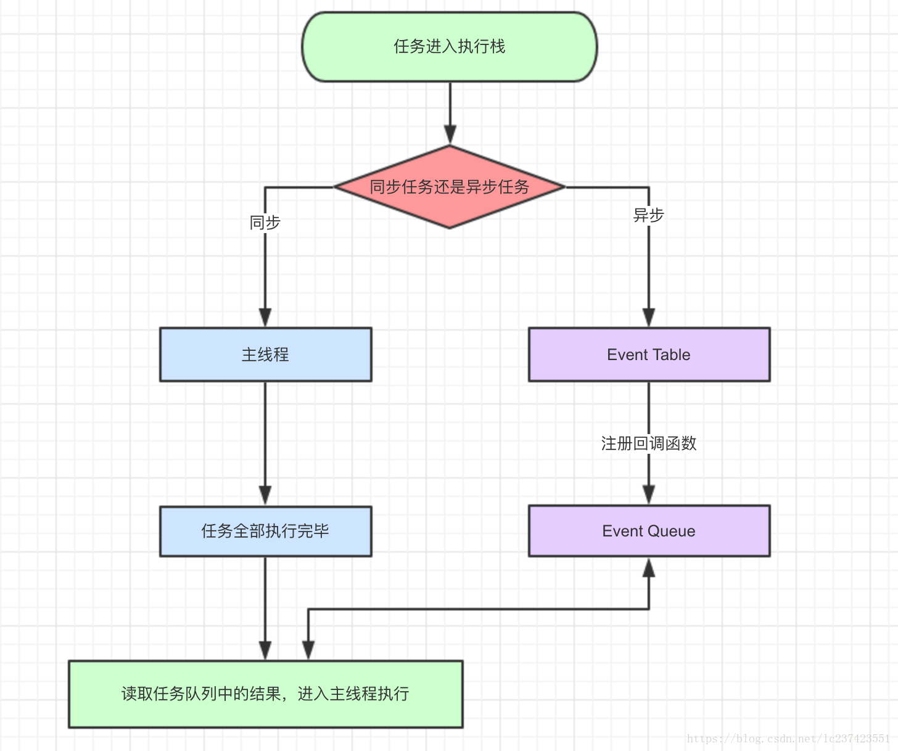
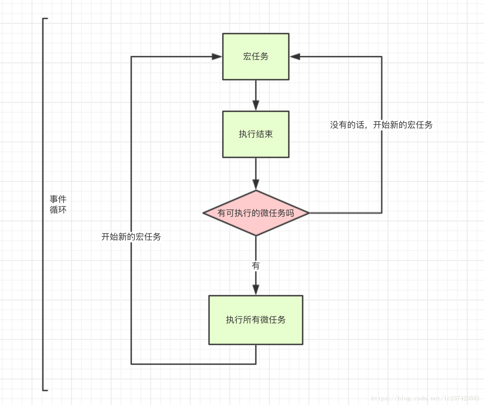

[TOC]


# javascript的宏任务和微任务

## 总结

macrotask 和 microtask 表示异步任务的两种分类。在挂起任务时，JS 引擎会将所有任务按照类别分到这两个队列中，首先在 macrotask 的队列（这个队列也被叫做 task queue）中取出第一个任务，执行完毕后取出 microtask 队列中的所有任务顺序执行；之后再取 macrotask 任务，周而复始，直至两个队列的任务都取完。

两个类别的具体分类如下：

- **macro-task:** script（整体代码）, `setTimeout`, `setInterval`, `setImmediate`, I/O, UI rendering
- **micro-task:** `process.nextTick`, `Promises`（这里指浏览器实现的原生 Promise）,`Object.observe`, `MutationObserver`

https://www.cnblogs.com/feng524822/p/4976887.html

## 示例

 题

```js
setTimeout(function () {
    console.log('1')
});

new Promise(function (resolve) {
    console.log('2');
    resolve();
}).then(function () {
    console.log('3');
});

console.log('4');
```

请你给出这段代码的运行顺序。当时我就蒙犊子了。同步异步我看过很多的讲解，大多都是要么你就一个setTimeout函数，要么就一个Promise函数。两个函数放到一起的我还真没见过。于是我就想：

settimeout肯定是异步的。 我也知道有一个event队列，你settimeout没设置时间应该直接就进入这个队列了吧，然后就是Promise的回掉函数进入event队列。 当时我二话不说给了个答案 2，4，1，3.并且很自信。然后面试官就问你不想想了?我说不想了。然后后半段他全程开始皱眉头了。我也凉凉。最后他让我回去看一下宏任务和微任务。

首先说一下普通的异步函数的执行过程吧：

同步和异步任务分别进入不同的执行"场所"，同步的进入主线程，异步的进入Event Table并注册函数。当指定的事情完成时，Event Table会将这个函数移入Event Queue。主线程内的任务执行完毕为空，会去Event Queue读取对应的函数，进入主线程执行。上述过程会不断重复，也就是常说的Event Loop(事件循环)。



图文我是转载的一个掘金的老哥的文章里的。他叫：ssssyoki

 

那么如此看来我给的答案还是对的。但是js异步有一个机制，就是遇到宏任务，先执行宏任务，将宏任务放入eventqueue，然后在执行微任务，将微任务放入eventqueue最骚的是，这两个queue不是一个queue。当你往外拿的时候先从微任务里拿这个回掉函数，然后再从宏任务的queue上拿宏任务的回掉函数。 我当时看到这我就服了还有这种骚操作。

再盗个图



而宏任务一般是：包括整体代码script，setTimeout，setInterval。

微任务：Promise，process.nextTick。

记住就行了。

然后回到开头的代码。因为settimeout是宏任务，虽然先执行的他，但是他被放到了宏任务的eventqueue里面，然后代码继续往下检查看有没有微任务，检测到Promise的then函数把他放入了微任务序列。等到主线进程的所有代码执行结束后。先从微任务queue里拿回掉函数，然后微任务queue空了后再从宏任务的queue拿函数。

所以正确的执行结果当然是：2，4，3，1。

如果还是不懂得同学可以去看一下这个老哥的文章，总结的挺到位的。向他学习。[点击打开链接](https://juejin.im/post/59e85eebf265da430d571f89)


https://blog.csdn.net/lc237423551/article/details/79902106