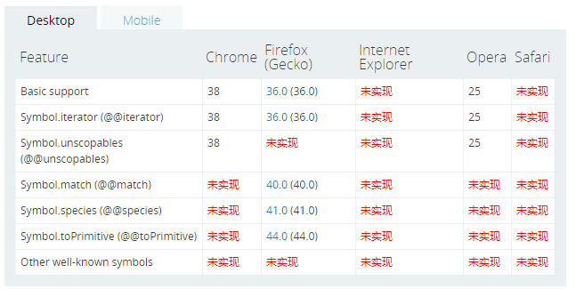

# 详解JavaScript中新数据类型Symbol

分类: [HTML5](http://www.ndislwf.com/category/html5/) 发布时间: 2017-07-17 15:39 

[javascript](http://www.ndislwf.com/tag/javascript/) 目前在全球的编程语言中排行第8。在 [StackOverflow](https://stackoverflow.com/) 和 [GitHub](https://github.com/) 的活跃度也都超过50%。随着 ES6 的推出，[JavaScript](http://www.ndislwf.com/tag/javascript/) 确实又火了一些。未来的物联网上 JavaScript 也大有作为。因此学习一下JavaScript也是很有必要的。

本文将重点讲解 JavaScript 中的新的数据类型Symbol。

Symbol 是一种特殊的、不可变的数据类型，可以作为对象属性的标识符使用。[Symbol](http://www.ndislwf.com/tag/symbol/) 对象是一个 symbol primitive data type 的隐式对象包装器。

symbol 数据类型是一个 primitive data type。

## javascript的七大数据类型

`null, undefined, number, boolean, string, Array、object// 基本数据类型：null、undefined、数字、布尔、字符串// 复杂数据类型: 数组、对象等 `
而Symbol 就是类似这些的一种数据类型。利用 typeof 运算符它的结果如下：

```
typeof Symbol() === 'symbol'// 为 true
```

## symbol 语法

```
Symbol([description])
```

symbol 参数：可选的，字符串。可用于调试但不能访问符号本身的符号描述。

## Symbol 数据类型的使用

要创建一个新的基本 symbol，你可以使用一个可选的字符串作为其描述,写Symbol()。

```
var sym0 = Symbol();
var sym1 = Symbol("symbol1");
var sym2 = Symbol("symbol2");
var sym3 = Symbol("symbol2");
```

上面的代码创建三个新的symbols。 注意，Symbol(“symbol2”) 不会强制字符串 “symbol2” 成为一个 symbol。它每次都会创建一个新的 symbol：
`Symbol("symbol2") === Symbol("symbol2"); // false`
下面使用 new 运算符的语法将会抛出一个 TypeError 错误：
`var sym = new Symbol(); // TypeError`
这会阻止创建一个显式的 Symbol 包装器对象而不是一个 Symbol 值。围绕原始数据类型创建一个显式包装器对象从 ECMAScript 6 开始不再被支持。 然而，现有的原始包装器对象，如 new Boolean、 new String以及new Number因为遗留原因仍可被创建。

## Symbol的使用场景

Symbol() 用于解决属性名的冲突。比如，对于同一个对象 obj，A 对其加了属性 a, 之后B修改代码也想对其加属性 a，此时如果不知情的情况下就会产生覆盖问题。

举个应用场景，比如一个人名叫“张三”，他可能拥有两个国家甚至更多国家的国籍，因此会有多个身份 Id号。此时我们直观的做法就是加 Id 属性：

```js
var person = {
name: "zhangsan",
id: "xttblog", // 可能多个
age: 20
}
```

也会有人说，用数组就好，那每个国家的 id 怎么获取？

```js
var person = {
name: "zhangsan",
id: ["xttblog.com", 'codedq.net'] // 哪个是中国人身份证的 id ？
age: 20
} 
```

此时若是用 Symbol 便能很好的解决问题。因为传入对象属性时，同样的Symbol不相等。看下面：
`Symbol('key') === Symbol('key') // false, 因为Symbol('key')`
Symbol(‘key’) 两次的返回值是不同的，且是独一无二的值。现在解决上面的问题。

```js
var person = {
name: "zhangsan",
age: 20
};
// Symbol('key') 生成引用类型，独一无二的，所以 chinaId 与 americaId 不等。
var chinaId = Symbol('id');
var americaId = Symbol('id');
person[chinaId] = "chinaId";
person[americaId] = "americaId";
```


## 全局共享的 Symbol

上面的语法使用Symbol() 函数 不会在你的整个代码库中创建一个可用的全局符号。 要创建跨文件可用的symbols，甚至跨域（每个都有它自己的全局作用域） , 使用这个方法Symbol.for() 和 Symbol.keyFor() 从全局symbol的注册处设置和取得symbols。

## 在对象中查找 Symbol 属性

方法Object.getOwnPropertySymbols() 让你在查找一个给定对象的符号属性时返回一个符号类型的数组。注意，每个初始化的对象都是没有自己的符号属性的，因此这个数组可能为空。除非你已经在对象上设置了符号属性。

## 浏览器兼容性



symbol 浏览器兼容性

从上图中可以看出，symbol 还未被广泛的支持。大家在实际使用中，一定要主要相关的运行环境。


http://www.ndislwf.com/2017/07/17/es6-javascript-symbol/