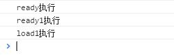

# document.ready和window.onload的区别

　　页面加载完成有两种事件，一是ready，表示文档结构已经加载完成（不包含图片等非文字媒体文件），二是onload，指示页面包含图片等文件在内的所有元素都加载完成。

　　ready事件在DOM结构绘制完成之后就会执行，这样能确保就算有大量的媒体文件没加载出来，JS代码一样可以执行。

　　load事件必须等到网页中所有内容全部加载完毕之后才被执行。如果一个网页中有大量的图片的话，则就会出现这种情况：网页文档已经呈现出来，但由于网页数据还没有完全加载完毕，导致load事件不能够即时被触发。

　　ready与load谁先执行？面试时经常会被问到这个问题：ready与load那一个先执行，那一个后执行？答案当然是ready先执行。

## **1、Dom Ready**

　　使用jQuery时一般都是这么开始写脚本的：

```
$(function(){ 
      // do something 
});
//$(function()){}是jQuery的方法，等价于$(document).ready(function(){}))
//$(document).ready(function(){})；$().ready(function(){})；和$(function(){})三者都是一样的，
//最完整的写法是：$(document).ready(function(){})，ready()函数仅能用于当前文档，因此无需选择器。
//所以document选择器可以不要，那么就可以写成：$().ready(function(){})
//最后$的默认事件就是ready，所以，ready也可以省略，写成：$(function(){}); 
```

　　例如：

```
$(function() {
     $("a").click(function() {
           alert("Hello world!");
      });
}) 
```

　　这个例子就是给所有的a标签绑定了一个click事件。即当所有链接被鼠标单击的时候，都执行 alert(“Hello World!”)，也就是说页面加载时绑定，真正该触发时触发。

　　Dom Ready的意义是：在Dom节点创建完成后执行。通常一个页面加载的顺序是，域名解析——加载html——加载js和css——加载图片等其他信息。那么Dom Ready应该在“加载js和css”和“加载图片等其他信息”之间。

## **2、Dom Load**

　　用原生的js的时候我们通常用onload事件来做一些事情，比如：

```
window.onload=function(){
      //do something
}
//或者经常用到的图片
document.getElementById("imgID").onload=function(){
     //do something
} 
```

　　Dom Load的意义是：在页面所有资源加载完后执行，document文档包括了加载图片等其他信息。那么Dom Load就是在页面响应加载的顺序中的“加载图片等其他信息”之后。

## **3、window.onload与$(function(){})的区别**

　　在某HTML页面内运行以下测试代码：

```
<script type="text/javascript">
    $(function () {
        console.log("ready执行");
    });

    $(function() {
        console.log("ready1执行");
    });

    window.onload = function () {
        console.log('load执行');
    };

    window.onload = function () {
        console.log('load1执行');
    }
</script> 
```

　　运行结果如下图所示：



　　结果表明了以下三点：

　　1、$(function(){})：在Dom节点创建完成后就执行，如果有多个定义则依次执行。

　　2、window.onload：在页面所有资源加载完后执行，如果有多个定义则只执行最后一个。

　　3、$(function(){})在window.onload前执行。

　　用一例子来通俗地解释：比如，页面中只有一个img标签，加载页面时，window.onload=function(){}中的代码要等图片完全显示出来之后才执行（假设其他代码都在图片显示之前加载完了）；而 $(function(){ }) 等标签加载完就执行了，这时候图片可能还没有显示出来。

　　DOM文档加载步骤： 
　　1、解析HTML结构 
　　2、加载外部的脚本和样式文件 
　　3、解析并执行脚本代码 
　　4、执行$(function(){})内对应代码 
　　5、加载图片等二进制资源 
　　6、页面加载完毕，执行window.onload

## **4、(function($) {…})(jQuery)写法**

　　(function(){…})表示一个匿名函数。function(arg){…}定义了一个参数为arg的匿名函数，然后使用(function(arg){…})(param)来调用这个匿名函数。其中param是传入这个匿名函数的参数。

　　这就相当于定义了一个参数为arg的匿名函数，并且将param作为参数来调用这个匿名函数。而(function($){…})(jQuery)则是一样的，之所以只在形参上使用美元符号，是为了不与其他库冲突，所以实参用jQuery。相当于：

```
funtion output(s){…};
output(jQuery);
//或者
var fn = function(s){…};
fn(jQuery); 
```

　　需要注意的是与$(function(){})的区别，后者用来在DOM加载完成之后执行一系列预先定义好的函数。

　　这种写法的最大好处是形成闭包。在(function($) {…})(jQuery)在内部定义的函数和变量只能在此范围内有效。比如：

```
var i=3;  
function init(){  
    alert("外层init："+i);  
}

(function($) {  
    var i=2;  
    function init(){  
        alert("内层init："+i);  
    }  
    init();  
})(jQuery);  
init();   
```

　　执行结果：

```
内层init：2
外层init：3
```


https://blog.csdn.net/fuzhongmin05/article/details/73521769