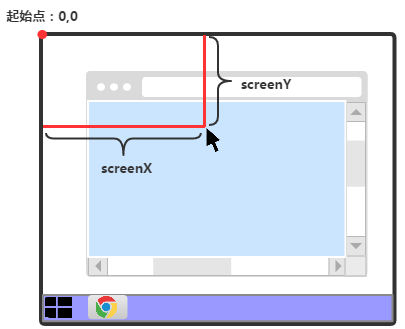
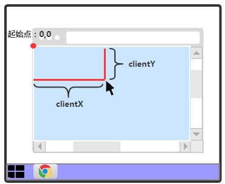
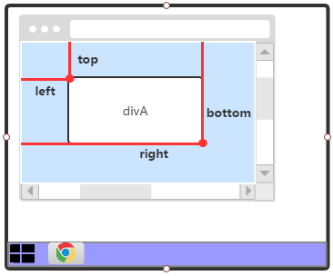
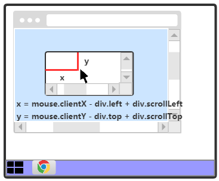

[TOC]

# HTML 鼠标坐标和元素坐标

在这一篇文章中，将会介绍鼠标坐标、元素坐标以及鼠标在指定元素内的坐标。

 

# 1. 鼠标坐标

在触发鼠标相关事件时(如：click、mousemove)，可以通过事件对象获取当前鼠标的坐标。

获取的坐标可分为2种：

1) MouseEvent.**screenX**、MouseEvent.**screenY** ：基于屏幕的X、Y坐标；以屏幕的左上角为0,0起始点。

 

2) MouseEvent.**clientX**、MouseEvent.**clientY** ：基于body的X、Y坐标；以**当前**body的左上角为0,0起始点，若body含有水平滚动条或垂直滚动条时，左上角还是0,0坐标点。

 

 

# 2.  元素的坐标

元素的**getBoundingClientRect**()方法可获取一个 **ClientRect** 对象，其描述了元素的方位和宽高等信息。

## 2.1 ClientRect对象属性

| 属性名称 | 属性说明                                                |
| -------- | ------------------------------------------------------- |
| width    | 元素的宽度                                              |
| height   | 元素的高度                                              |
| left     | 元素左上角距离当前可视body的宽度                        |
| top      | 元素左上角距离当前可视body的高度                        |
| right    | 元素右下角距离当前可视body的宽度；right = left + width  |
| bottom   | 元素右下角距离当前可视body的高度；bottom = top + height |

 

## 2.2 图示

 

## 2.3 其他坐标

除了这些直接属性外，还可以结合其他元素获取更详细的坐标：

1) 元素左上角在**整体body的水平坐标** = document.body.scrollLeft + element.getBoundingClientRect().left;

2) 元素左上角在**整体body的垂直坐标** = document.body.scrollTop + element.getBoundingClientRect().top;

 

# 3. 鼠标在元素内的坐标

通过之前学到的获取鼠标坐标和元素坐标后，还可进一步获取鼠标在元素内的坐标。

以鼠标在元素内的x坐标为例，等于鼠标的 clientX 减去 元素的getBoundingClientRect()放的left，最后在加上元素的scrollLeft的值。

**公式如下**：

**x** = mouse.clientX - element.left + element.scrollLeft

**y** = mouse.clientY - element.top + element.scrollTop

### 示例

 

End

[Web开发之路系列文章](http://www.cnblogs.com/polk6/archive/2013/05/10/3071327.html)

http://www.cnblogs.com/polk6/p/6624779.html