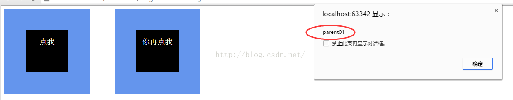
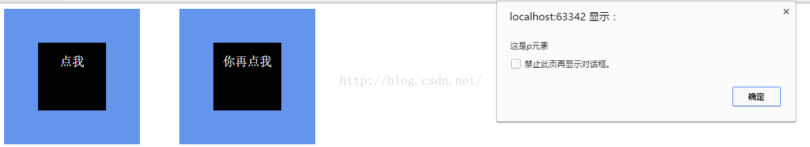

# javascript事件 event.preventDefault与event.stopPropagation的作用

 如题，本篇文章讨论preventDefault和stopPropagation二者的作用，首先，先理解一下二者的字面意思：

一、preventDefault，prevent是动词，意为“防止，阻止”；Default是名词，有“系统默认值”的意思，preventDefault在js中的意思就   是“阻止系统默认（行为）”。

二、stopPropagation，stop是动词，意为“中止”；Propagation是名词，意为“传播”，stopPropagation在意为“中止传播”，在js中的意思

是“阻止js事件冒泡”。

下面来看二者具体作用：

关于e.preventDefault，这里有一段html：

```
<a href="https://www.baidu.com/" id="goBaidu">你点我试试</a>
```

如果是在正常状态下，当点击该元素，窗口会跳转到百度的首页，然而，我给它加上一段js:

```javascript
var goBaidu = document.getElementById('goBaidu');
goBaidu.onclick = function(e){
    stopJump(e)
};
function stopJump(e){
    e.preventDefault();
}
```

这个时候，再点击该元素，它不会有任何反应，或者说，它反应之后的状态跟点击之前一样比较恰当，发生改变的根本，就是js中的

e.preventDefault()，因为当a标签的href属性存在并有一个正确的地址时，点击它，它会跳转到对应的地址去，这就是它的默认行为，而e.preventDefault()的作用正是阻止这种行为。


关于e.stopPropagation，这里同样有一段html：

```html
<!DOCTYPE html>
<html lang="en">
<head>
    <meta charset="UTF-8">
    <title>Title</title>
    <style type="text/css" rel="stylesheet">
        .box {
            width: 200px;
            height: 200px;
            display: inline-block;
            background-color: #6495ed;
            margin-right: 50px;
            cursor: pointer;
        }

        .box > .boxSon {
            display: inline-block;
            width: 100px;
            height: 100px;
            margin: 50px;
            background-color: black;
        }

        .box > .boxSon > p {
            font-size: 18px;
            color: #ffffff;
            text-align: center;
            cursor: pointer;
        }
    </style>


</head>
<body>


<div class="box" id="parent01" onclick="alert(this.id)">
    <div class="boxSon">
        <p onclick="alert('这是p元素')">点我</p>
    </div>
</div>

<div class="box" id="parent02" onclick="alert(this.id)">
    <div class="boxSon" onclick="stopUp(event)">
        <p onclick="alert('这是p元素')">你再点我</p>
    </div>
</div>

<script type="text/javascript">
    function stopUp(e) {
        //阻止事件冒泡！
        e.stopPropagation();
    }
</script>
</body>
</html>

```


上面的html代码中，有两个class名为box的蓝色div，它们包含的元素也是一模一样其子元素绑定的事件也是一模一样，唯一不同的是，第一个box里面，它的子元素boxSon没有绑定事件，而第二个box里面的子元素boxSon绑定了事件，它的事件只有一行代码，就是e.stopPropagation();现在来操作一下两个box内的事件：

点击第一个box里面的p元素，先后弹出两次提示框：


第一次弹出



第二次弹出

事件执行顺序是：点击p元素，触发其自身事件，弹第一次，而后事件冒泡到box的时候，触发了box绑定的点击事件，弹出了第二次。


点击第二个box里面的p元素，只弹出了一次提示框：

事件执行顺序：点击p元素，触发其自身事件，弹出提示框，而后原本应该像点击第一个box出现一样的情况，但是在事件冒泡过程中，冒泡到class为boxSon的div时，触发了它的事件，执行了e.stopPropagation()，结果就没有继续冒泡，像第一个box一样弹第二次。

通过对比我们可以得出结论：e.stopPropagation的作用就是阻止事件冒泡！


https://blog.csdn.net/magic__man/article/details/51782523