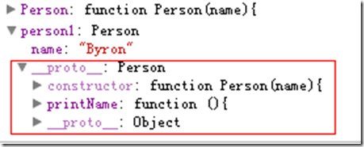
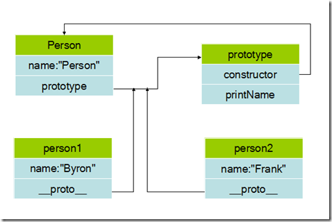
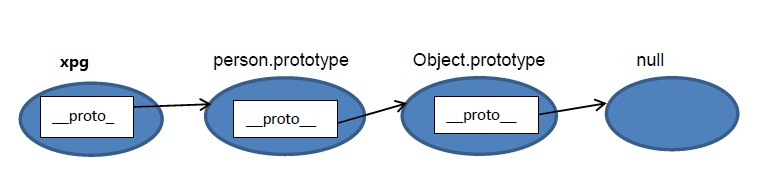

[TOC]


# JavaScript prototype原型和原型链详解

 

用过JavaScript的同学们肯定都对prototype如雷贯耳，但是这究竟是个什么东西却让初学者莫衷一是，只知道函数都会有一个prototype属性，可以为其添加函数供实例访问，其它的就不清楚了，最近看了一些 JavaScript高级程序设计，终于揭开了其神秘面纱。

每个函数都有一个prototype属性，这个属性是指向一个对象的引用，这个对象称为原型对象，原型对象包含函数实例共享的方法和属性，也就是说将函数用作构造函数调用（使用new操作符调用）的时候，新创建的对象会从原型对象上继承属性和方法。**不像传统的面向对象语言，Javascript的继承机制基于原型，而不是Class类。**

## 1、私有变量、函数

在具体说prototype前说几个相关的东东，可以更好的理解prototype的设计意图。在了解JavaScript原型链之前，有必要先了解一下JavaScript的作用域链。JavaScript的函数作用域，在函数内定义的变量和函数如果不对外提供接口，那么外部将无法访问到，也就是变为私有变量和私有函数。

```
function Obj(){
    var a=0; //私有变量
    var fn=function(){ //私有函数

   }
}123456
```

这样在函数对象Obj外部无法访问变量a和函数fn，它们就变成私有的，只能在Obj内部使用，即使是函数Obj的实例仍然无法访问这些变量和函数

```
var o=new Obj();
console.log(o.a); //undefined
console.log(o.fn); //undefined123
```

## 2、静态变量、函数

当定义一个函数后通过 “.”为其添加的属性和函数，通过对象本身仍然可以访问得到，但是其实例却访问不到，这样的变量和函数分别被称为静态变量和静态函数，用过Java、C#的同学很好理解静态的含义。

```
function Obj(){}
    Obj.a=0; //静态变量
    Obj.fn=function(){ //静态函数       
}

console.log(Obj.a); //0
console.log(typeof Obj.fn); //function

var o=new Obj();
console.log(o.a); //undefined
console.log(typeof o.fn); //undefined1234567891011
```

## 3、实例变量、函数

在面向对象编程中除了一些库函数我们还是希望在对象定义的时候同时定义一些属性和方法，实例化后可以访问，JavaScript也能做到这样

```
function Obj(){
    this.a=[]; //实例变量
    this.fn=function(){ //实例方法    
    }
}

console.log(typeof Obj.a); //undefined
console.log(typeof Obj.fn); //undefined

var o=new Obj();
console.log(typeof o.a); //object
console.log(typeof o.fn); //function123456789101112
```

这样可以达到上述目的，然而

```
function Obj(){
    this.a=[]; //实例变量
    this.fn=function(){ //实例方法

    }
}

var o1=new Obj();
o1.a.push(1);
o1.fn={};
console.log(o1.a); //[1]
console.log(typeof o1.fn); //object
var o2=new Obj();
console.log(o2.a); //[]
console.log(typeof o2.fn); //function123456789101112131415
```

上面的代码运行结果完全符合预期，但同时也说明一个问题，在o1中修改了a和fn，而在o2中没有改变，由于数组和函数都是对象，是引用类型，这就说明o1中的属性和方法与o2中的属性与方法虽然同名但却不是一个引用，而是对Obj对象定义的属性和方法的一个复制。

这个对属性来说没有什么问题，但是对于方法来说问题就很大了，因为方法都是在做完全一样的功能，但是却又两份复制，如果一个函数对象有上千和实例方法，那么它的每个实例都要保持一份上千个方法的复制，这显然是不科学的，这可肿么办呢，**prototype应运而生**。先看看对象的含义：

## 4 . 普通对象与函数对象

JavaScript 中，万物皆对象！但对象也是有区别的。分为普通对象和函数对象，Object ，Function 是JS自带的函数对象。下面举例说明

```
 function f1(){};
 var f2 = function(){};
 var f3 = new Function('str','console.log(str)');

 var o3 = new f1();
 var o1 = {};
 var o2 =new Object();

 console.log(typeof Object); //function
 console.log(typeof Function); //function
 console.log(typeof o1); //object
 console.log(typeof o2); //object
 console.log(typeof o3); //object
 console.log(typeof f1); //function
 console.log(typeof f2); //function
 console.log(typeof f3); //function 12345678910111213141516
```

在上面的例子中 o1 o2 o3 为普通对象，f1 f2 f3 为函数对象。怎么区分，其实很简单，**凡是通过 new Function() 创建的对象都是函数对象，其他的都是普通对象。** f1,f2,归根结底都是通过 new Function()的方式进行创建的。Function Object 也都是通过 New Function()创建的。

## 5、prototype原型

在JavaScript 中，每当定义一个对象（函数）时候，对象中都会包含一些**预定义的属性**。其中函数对象的一个属性就是原型对象 prototype。注：普通对象没有prototype,但有*_ proto _*属性。

原型对象其实就是普通对象（Function.prototype除外,它是函数对象，但它很特殊，他没有prototype属性（前面说道函数对象都有prototype属性））。看下面的例子：

```
 function f1(){};
 console.log(f1.prototype) //f1{}
 console.log(typeof f1.prototype) //Object
 console.log(typeof Function.prototype) // Function，这个特殊
 console.log(typeof Object.prototype) // Object
 console.log(typeof Function.prototype.prototype) //undefined123456
```

从这句console.log(f1.prototype) //f1 {} 的输出就结果可以看出，f1.prototype就是f1的一个实例对象（这里就是f1的原型对象）。就是在f1创建的时候,创建了一个它的实例对象并赋值给它的prototype，基本过程如下：

```
 var temp = new f1();
 f1. prototype = temp;12
```

所以，Function.prototype为什么是函数对象就迎刃而解了，上文提到凡是new Function ()产生的对象都是函数对象，所以temp1是函数对象。

```
var temp1 = new Function ();
 Function.prototype = temp1;
123
```

那原型对象是用来做什么的呢？**主要作用是用于继承**。举了例子：

```
var person = function(name){
   this.name = name
};
person.prototype.getName = function(){
   return this.name; // 这里this指向原型对象person ==>person.name
}
var xpg = new person(‘xiaopingguo’);
xpg.getName(); //xiaopingguo 
```

从这个例子可以看出，通过给person.prototype设置了一个函数对象的属性，那有person实例（例中：xpg）出来的普通对象就继承了这个属性。具体是怎么实现的继承，就要讲到下面的原型链了。

在深入的讲一遍：无论什么时候，只要创建了一个新函数，就会根据一组特定的规则为该函数创建一个prototype属性（同时它也是一个对象），默认情况下prototype属性(对象)会默认获得一个constructor(构造函数)属性，这个属性是一个指向prototype属性所在函数的指针，有些绕了啊，写代码、上图！

```
function Person(){

} 
```


根据上图可以看出Person对象会自动获得prototyp属性，而prototype也是一个对象，会自动获得一个constructor属性，该属性正是指向Person对象。

当调用构造函数创建一个实例的时候，实例内部将包含一个内部指针（很多浏览器这个指针名字为*_ proto _* ）指向构造函数的prototype，这个连接存在于实例和构造函数的prototype之间，而不是实例与构造函数之间。

```js
function Person(name){
    this.name=name;
}

Person.prototype.printName=function(){
    alert(this.name);
}

var person1=new Person('Byron');
var person2=new Person('Frank'); 
debugger
```



**Person的实例person1中包含了name属性，同时自动生成一个_ proto _属性，该属性指向Person的prototype，可以访问到prototype内定义的printName方法，大概就是这个样子的:**



写段程序测试一下看看prototype内属性、方法是能够共享

```js
function Person(name){
    this.name=name;
}

Person.prototype.share=[];

Person.prototype.printName=function(){
    alert(this.name);
}

var person1=new Person('Byron');
var person2=new Person('Frank');

person1.share.push(1);
person2.share.push(2);
console.log(person2.share); //[1,2]
debugger
```

果不其然！实际上当代码读取某个对象的某个属性的时候，都会执行一遍搜索，目标是具有给定名字的属性，搜索首先从对象实例开始，如果在实例中找到该属性则返回，如果没有则查找prototype，如果还是没有找到则继续递归prototype的prototype对象，直到找到为止，如果递归到object仍然没有则返回错误。同样道理如果在实例中定义如prototype同名的属性或函数，则会覆盖prototype的属性或函数。—-**这就是Javascript的原型链。**

```js
function Person(name){
    this.name=name;
}

Person.prototype.share=[];

var person=new Person('Byron');
person.share.push(1);
debugger
//定义如prototype同名的属性或函数，则会覆盖prototype的属性或函数。
person.share=0;

console.log(person.share); //0；而不是prototype中的[]


```

## 6．原型链

JS在创建对象（不论是普通对象还是函数对象）的时候，都有一个叫做*_ proto _*的内置属性，用于指向创建它的函数对象的原型对象prototype。以上面的例子

```
console.log(xpg.__ proto __ === person.prototype) //true1
```

同样，person.prototype对象也有*_ proto _*属性，它指向创建它的函数对象（Object）的prototype

```
console.log(person.prototype.__ proto __=== Object.prototype) //true1
```

继续，Object.prototype对象也有*_ proto _*属性，但它比较特殊，为null

```
console.log(Object.prototype.__ proto __) //null1
```

这个有*_ proto _* 串起来的直到Object.prototype.*_ proto _*为null的链叫做原型链。如下图：



**原型链中属性查找：** 
当查找一个对象的属性时，JavaScript 会向上遍历原型链，直到找到给定名称的属性为止，到查找到达原型链的顶部 - 也就是 Object.prototype - 但是仍然没有找到指定的属性，就会返回 undefined，我们来看一个例子：

```
 function foo() {
    this.add = function (x, y) {
        return x + y;
    }
}

foo.prototype.add = function (x, y) {
    return x + y + 10;
}

Object.prototype.subtract = function (x, y) {
    return x - y;
}

var f = new foo();
alert(f.add(1, 2)); //结果是3，而不是13
alert(f.subtract(1, 2)); //结果是-11234567891011121314151617
```

通过代码运行，我们发现subtract是安装我们所说的向上查找来得到结果的，但是add方式有点小不同，这也是我想强调的，就是属性在查找的时候是先查找自身的属性，如果没有再查找原型，再没有，再往上走，一直插到Object的原型上，所以在某种层面上说，用 for in语句遍历属性的时候，效率也是个问题。

还有一点我们需要注意的是，我们可以赋值任何类型的对象到原型上，但是不能赋值原子类型的值，比如如下代码是无效的：

```
function Foo() {}
Foo.prototype = 1; // 无效12
```

## 7、构造函数、实例和原型对象的区别

实例就是通过构造函数创建的。实例一创造出来就具有constructor属性（指向构造函数）和**proto**属性（指向原型对象），

构造函数中有一个prototype属性，这个属性是一个指针，指向它的原型对象。

原型对象内部也有一个指针（constructor属性）指向构造函数:Person.prototype.constructor = Person;

实例可以访问原型对象上定义的属性和方法。

在这里person1和person2就是实例，prototype是他们的原型对象。

再举个栗子：

```
<script type="text/javascript">
    function Animal(name)   //积累构造函数
    {
        this.name = name;//设置对象属性
    }

    Animal.prototype.behavior = function() //给基类构造函数的prototype添加behavior方法
    {  
        alert("this is a "+this.name);
    }

    var Dog = new Animal("dog");//创建Dog对象
    var Cat = new Animal("cat");//创建Cat对象

    Dog.behavior();//通过Dog对象直接调用behavior方法
    Cat.behavior();//output "this is a cat"

    alert(Dog.behavior==Cat.behavior);//output true;
</script> 
```

## 8、原型的使用

**原型使用方式1：** 
在使用原型之前，我们需要先将代码做一下小修改：

```js
var Calculator = function (decimalDigits, tax) {
    this.decimalDigits = decimalDigits;
    this.tax = tax;
};

var calculator = new Calculator(1, 3 ) 
debugger
```

然后，通过给Calculator对象的prototype属性赋值对象字面量来设定Calculator对象的原型。

```js
 var Calculator = function (decimalDigits, tax) {
    this.decimalDigits = decimalDigits;
    this.tax = tax;
};

var calculator = new Calculator(1, 3 ) 
debugger

Calculator.prototype = {
            add: function (x, y) {
                return x + y;
            },

            subtract: function (x, y) {
                return x - y;
            }
        };
//var result = calculator.add(1, 3); //报错new的时候没有原型方法
var result = new Calculator().add(1, 3);
debugger
```

我们就可以new Calculator对象以后，就可以调用add方法来计算结果了。

**原型使用方式2：** 
第二种方式是，在赋值原型prototype的时候使用function立即执行的表达式来赋值，即如下格式：

```
Calculator.prototype = function () { } (); 
```

它的好处在前面的Item里已经知道了，就是可以封装私有的function，通过return的形式暴露出简单的使用名称，以达到public/private的效果，修改后的代码如下：

```js
'use strict';

var Calculator = function (decimalDigits, tax) {
    this.decimalDigits = decimalDigits;
    this.tax = tax;
};
Calculator.prototype = function () {
  var add = function (x, y) {
    return x + y;
  };

  var subtract = function (x, y) {
    return x - y;
  };

  return {
    add: add,
    subtract: subtract
  }
}();

var calculator = new Calculator();
var aa = calculator.add(11, 3);
console.log(aa)
debugger
```

同样的方式，我们可以new Calculator对象以后调用add方法来计算结果了。

**分步声明：** 
上述使用原型的时候，有一个限制就是一次性设置了原型对象，我们再来说一下如何分来设置原型的每个属性吧。

```
var BaseCalculator = function () {
    //为每个实例都声明一个小数位数
    this.decimalDigits = 2;
}; 
```

//使用原型给BaseCalculator扩展

```
BaseCalculator.prototype.add = function (x, y) {
    return x + y;
};

BaseCalculator.prototype.subtract = function (x, y) {
    return x - y;
};1234567
```

声明了一个BaseCalculator对象，构造函数里会初始化一个小数位数的属性decimalDigits，然后通过原型属性设置2个function，分别是add(x,y)和subtract(x,y)，当然你也可以使用前面提到的2种方式的任何一种，我们的主要目的是看如何将BaseCalculator对象设置到真正的Calculator的原型上。

```
var BaseCalculator = function() {
    this.decimalDigits = 2;
};

BaseCalculator.prototype = {
    add: function(x, y) {
        return x + y;
    },
    subtract: function(x, y) {
        return x - y;
    }
}; 
```

**重写原型：**

在使用第三方JS类库的时候，往往有时候他们定义的原型方法是不能满足我们的需要，但是又离不开这个类库，所以这时候我们就需要重写他们的原型中的一个或者多个属性或function，我们可以通过继续声明的同样的add代码的形式来达到覆盖重写前面的add功能，代码如下：

```js
//覆盖前面Calculator的add() function
Calculator.prototype.add = function (x, y) {
  return x + y + this.tax;
};

var calc = new Calculator(2,3);
console.log(calc.add(1, 1));
```

这样，我们计算得出的结果就比原来多出了一个tax的值，但是有一点需要注意：那就是重写的代码需要放在最后，这样才能覆盖前面的代码。

## 9、hasOwnProperty函数

hasOwnProperty是Object.prototype的一个方法，它可是个好东西，他能判断一个对象是否包含自定义属性而不是原型链上的属性，因为hasOwnProperty 是 JavaScript 中唯一一个处理属性但是不查找原型链的函数。

```js
// 修改Object.prototype
Object.prototype.bar = 1; 
var foo = {goo: undefined};

foo.bar; // 1
'bar' in foo; // true

foo.hasOwnProperty('bar'); // false
foo.hasOwnProperty('goo'); // true 
```

只有 hasOwnProperty 可以给出正确和期望的结果，这在遍历对象的属性时会很有用。 没有其它方法可以用来排除原型链上的属性，而不是定义在对象自身上的属性。

但有个恶心的地方是：JavaScript 不会保护 hasOwnProperty 被非法占用，因此如果一个对象碰巧存在这个属性，就需要使用外部的 hasOwnProperty 函数来获取正确的结果。

```
var foo = {
    hasOwnProperty: function() {
        return false;
    },
    bar: 'Here be dragons'
};

foo.hasOwnProperty('bar'); // 总是返回 false

// 使用{}对象的 hasOwnProperty，并将其上下为设置为foo
{}.hasOwnProperty.call(foo, 'bar'); // true1234567891011
```

当检查对象上某个属性是否存在时，hasOwnProperty 是唯一可用的方法。同时在使用 for in loop 遍历对象时，推荐总是使用 hasOwnProperty 方法，这将会避免原型对象扩展带来的干扰，我们来看一下例子：

```
// 修改 Object.prototype
Object.prototype.bar = 1;

var foo = {moo: 2};
for(var i in foo) {
    console.log(i); // 输出两个属性：bar 和 moo
}1234567
```

我们没办法改变for in语句的行为，所以想过滤结果就只能使用hasOwnProperty 方法，代码如下：

```
// foo 变量是上例中的
for(var i in foo) {
    if (foo.hasOwnProperty(i)) {
        console.log(i);    //moo
    }
}123456
```

这个版本的代码是唯一正确的写法。由于我们使用了 hasOwnProperty，所以这次只输出 moo。如果不使用 hasOwnProperty，则这段代码在原生对象原型（比如 Object.prototype）被扩展时可能会出错。

总结：推荐使用 hasOwnProperty，不要对代码运行的环境做任何假设，不要假设原生对象是否已经被扩展了

## 10、拓展

**_ ptoto _属性**

*_ ptoto _*属性（IE浏览器不支持）是实例指向原型对象的一个指针，它的作用就是指向构造函数的原型属性constructor，通过这两个属性，就可以访问原型里的属性和方法了。

Javascript中的对象实例本质上是由一系列的属性组成的，在这些属性中，有一个内部的不可见的特殊属性——*_ proto _*，该属性的值指向该对象实例的原型，一个对象实例只拥有一个唯一的原型。

```
function Box(){        //大写，代表构造函数
    Box.prototype.name = "trigkit4";//原型属性
    Box.prototype.age = "21";
    Box.prototype.run = function()//原型方法
    {  
        return this.name + this.age + 'studying';
    }
}

var box1 = new Box();
var box2 = new Box();
alert(box1.constructor);//构造属性，可以获取构造函数本身，
                        //作用是被原型指针定位，然后得到构造函数本身
 
```

**_ proto _属性和prototype属性的区别**

prototype是原型对象中专有的属性。 
*_ proto _* 是普通对象的隐式属性，在new的时候，会指向prototype所指的对象； 
*_ ptoto _* 实际上是某个实体对象的属性，而prototype则是属于构造函数的属性。*_ ptoto _*只能在学习或调试的环境下使用。

**原型模式的执行流程**

1.先查找构造函数实例里的属性或方法，如果有，就立即返回。 
2.如果构造函数的实例没有，就去它的原型对象里找，如果有，就立即返回

原型对象的

```
function Box(){        //大写，代表构造函数
    Box.prototype.name = "trigkit4";//原型属性
    Box.prototype.age = "21";
    Box.prototype.run = function()//原型方法
    {  
        return this.name + this.age + 'studying';
    }
}

var box1 = new Box();
alert(box1.name);//trigkit4,原型里的值
box1.name = "Lee";
alert(box1.name);//Lee,就进原则

var box2 = new Box();
alert(box2.name);//trigkit4,原型的值，没有被box1修改12345678910111213141516
```

构造函数的

```
function Box(){                 
    this.name = "Bill";
}

Box.prototype.name = "trigkit4";//原型属性
Box.prototype.age = "21";
Box.prototype.run = function()//原型方法
{  
        return this.name + this.age + 'studying';
}

var box1 = new Box();
alert(box1.name);//Bill,原型里的值
box1.name = "Lee";
alert(box1.name);//Lee,就进原则
12345678910111213141516
```

综上，整理一下：

```
function Person(){};

Person.prototype.name = "trigkit4";
Person.prototype.say = function(){
    alert("Hi");
}

var p1 = new Person();//prototype是p1和p2的原型对象
var p2 = new Person();//p2为实例化对象，其内部有一个__proto__属性，指向Person的prototype

console.log(p1.prototype);//undefined,这个属性是一个对象，访问不到
console.log(Person.prototype);//Person
console.log(Person.prototype.constructor);//原型对象内部也有一个指针（constructor属性）指向构造函数
console.log(p1.__proto__);//这个属性是一个指针指向prototype原型对象
p1.say();//实例可以访问到在原型对象上定义的属性和方法


123456789101112131415161718
```

- 构造函数.prototype = 原型对象
- 原型对象.constructor = 构造函数(模板)
- 原型对象.isPrototypeof(实例对象) 判断实例对象的原型 是不是当前对象


https://blog.csdn.net/i10630226/article/details/48689561