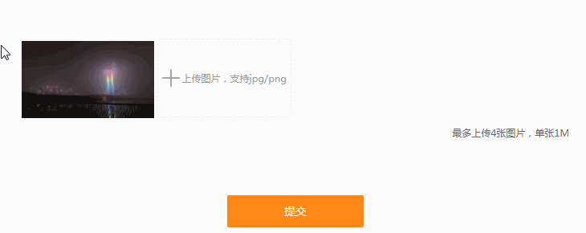

# JavaScript图片上传，预览以及图片删除

/Users/jerryye/backup/studio/AvailableCode/web/javascript/javascript_demo/file文件对象/图片上传预览以及图片删除

### 背景

前两天在做一个PC网站的意见反馈，其中涉及到了图片上传功能，要求可以上传多张图片，并且支持图片上传预览及图片删除， 图片上传这一块以前没怎么搞过，而且一般也很少会碰到这样的需求，所以在做这个功能的时候，参考了很多网上的代码 ， 现在就单独写一篇博客来记录下实现的整个过程，以及在做的过程中遇到的一些坑。

先来看下实现的最后效果：




首先先创建好一个用于展示预览图片及上传按钮的div，content-img-list用于动态展示预览图片，file用于显示上传按钮

```
<div class="content-img">
        	<ul class="content-img-list">
        		<!-- <li class="content-img-list-item"><a class="delete-btn"><i class="ico-delete"></i></a></li> -->
        	</ul>
        	<div class="file">
        		<i class="ico-plus"></i>上传图片，支持jpg/png<input type="file" name="file" accept="image/*" id="upload" >
        	</div>	
        </div>
复制代码
```

### 上传按钮美化

默认input type=file的上传按钮非常的丑陋，实现自定义上传按钮样式，这里主要通过设置input的透明度将它设置为opacity: 0;

### 图片上传实现步骤

#### 图片上传

通过jquery监听input change事件，这样我们可以获取到上传的图片流信息，从而可以获取到图片的地址、大小、格式以及名称等信息

这里创建3个数组，imgName、imgSrc、imgFile分别用于存放上传图片的名称、url地址以及图片流信息

```
var fileList = this.files;
		for(var i = 0; i < fileList.length; i++) {
			var imgSrcI = getObjectURL(fileList[i]);
			imgName.push(fileList[i].name);
			imgSrc.push(imgSrcI);
			imgFile.push(fileList[i]);
		}
复制代码
```

getObjectURL方法是一个用于获取本地图片的地址，使用该url可以显示图片

```
function getObjectURL(file) {
	var url = null ;
	if (window.createObjectURL!=undefined) { // basic
		url = window.createObjectURL(file) ;
	} else if (window.URL!=undefined) { // mozilla(firefox)
		url = window.URL.createObjectURL(file) ;
	} else if (window.webkitURL!=undefined) { // webkit or chrome
		url = window.webkitURL.createObjectURL(file) ;
	}
	return url ;
}
复制代码
```

#### 控制上传图片大小、格式以及上传数量

```
	$('#upload').on('change',function(){		
		  if(imgSrc.length==4){
			return alert("最多只能上传4张图片");
		}
		var imgSize = this.files[0].size;  //b
		if(imgSize>1024*1024*1){//1M
			return alert("上传图片不能超过1M");
		}
		if(this.files[0].type != 'image/png' && this.files[0].type != 'image/jpeg' && this.files[0].type != 'image/gif'){
			return alert("图片上传格式不正确");
		}
	})
复制代码
```

#### 图片预览

创建一个addNewContent方法用于动态展示添加的图片实现图片预览，在每次上传图片的时候调用该方法

```
function addNewContent(obj) {
	$(obj).html("");
	for(var a = 0; a < imgSrc.length; a++) {
		var oldBox = $(obj).html();
		$(obj).html(oldBox + '<li class="content-img-list-item"><a index="'+a+'" class="hide delete-btn"><i class="ico-delete"></i></a></li>');
	}
}
复制代码
```

#### 图片删除

1.通过监听鼠标的mouseover事件，显示图片删除按钮

```
$('.content-img-list').on('mouseover','.content-img-list-item',function(){
		$(this).children('a').removeClass('hide');
	});
复制代码
```

2.监听鼠标的mouseleave事件，隐藏图片删除按钮

```
$('.content-img-list').on('mouseleave','.content-img-list-item',function(){
		$(this).children('a').addClass('hide');
	});
复制代码
```

3.获取图片index下标属性，通过js的splice方法删除数组元素，重新调用addNewContent方法遍历图片数组显示预览图片

```
$(".content-img-list").on("click",'.content-img-list-item a',function(){
	    	var index = $(this).attr("index");
			imgSrc.splice(index, 1);
			imgFile.splice(index, 1);
			imgName.splice(index, 1);
			var boxId = ".content-img-list";
			addNewContent(boxId);
			if(imgSrc.length<4){//显示上传按钮
				$('.content-img .file').show();
			}
	  });
复制代码
```

#### 图片上传提交

这里主要使用FormData来拼装好数据参数，提交到后台

```
var formFile = new FormData();
复制代码
```

遍历imgFile图片流数组拼装到FormData中

```
 $.each(imgFile, function(i, file){
            formFile.append('myFile[]', file);
        });
复制代码
```

添加其他参数

```
    formFile.append("type", type); 
        formFile.append("content", content); 
        formFile.append("mobile", mobile); 
复制代码
```

最后使用ajax提交内容

```
 $.ajax({
            url: 'http://zhangykwww.yind123.com/webapi/feedback',
            type: 'POST',
            data: formFile,
            async: true,  
            cache: false,  
            contentType: false, 
            processData: false, 
            // traditional:true,
            dataType:'json',
            success: function(res) {
                console.log(res);
            }
        })
复制代码
```

以上就实现了图片上传、图片预览和图片删除的功能

### 实现过程中遇到的坑

1.解决input file上传图片无法上传相同的图片 如果是相同图片onChange事件只会触发一次 onChange里面清除元素的value

```
document.querySelector('#uploader-get-file').value = null
复制代码
```

也可以这样this.value = null;

```
$('#upload').on('change',function(){//图片上传
        this.value = null;//解决无法上传相同图片的问题
})
复制代码
```

2.使用formData上传file数组 3种方式（参考https://segmentfault.com/q/1010000009622562）

```
方式1：
$.each(getImgFiles(), function(i, file){
    formData.append('files', file);
});
方式2：
$.each(getImgFiles(), function(i, file){
    formData.append('files[]', file);
});
方式3：
$.each(getImgFiles(), function(i, file){
    formData.append('files_' + i, file);
});
复制代码
```

3.jquery设置 ajax属性

```
processData : false, // 告诉jQuery不要去处理发送的数据
contentType : false,// 告诉jQuery不要去设置Content-Type请求头
复制代码
```

[戳我在线查看demo](https://link.juejin.im/?target=http%3A%2F%2Fblog.diankr.cn%2Ffrontcode%2Fsrc%2F02%2Findex.html)

完整的代码我已经上传到了[github.com/fozero/fron…](https://link.juejin.im/?target=https%3A%2F%2Fgithub.com%2Ffozero%2Ffrontcode)，可以点击查看，如果觉得还不错的话，记得star一下哦！

> 作者：fozero 声明：原创文章，转载请注明出处，谢谢！[www.cnblogs.com/fozero/p/88…](https://link.juejin.im/?target=http%3A%2F%2Fwww.cnblogs.com%2Ffozero%2Fp%2F8835628.html)
> 标签：input,file,图片上传


https://juejin.im/post/5ad365e4f265da237d0375a5