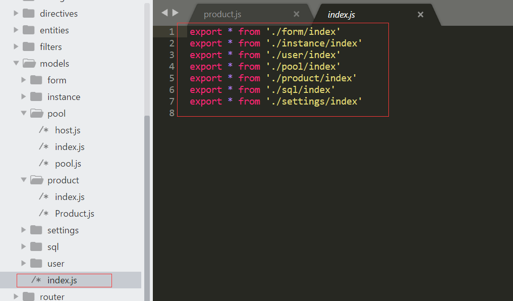
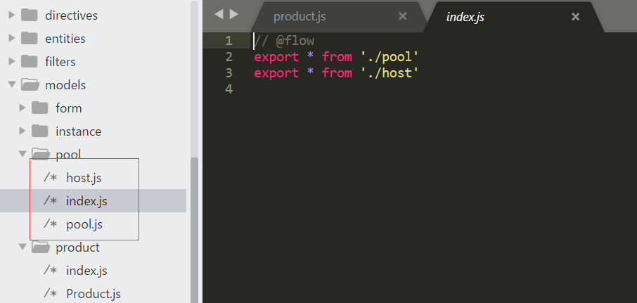

[TOC]


# ES6 import 引用文件夹/目录及其处理过程

## 1、现象　　

　　看redux的时候发现官网的教程里直接`import`了一个文件夹，我再三确定没有看错， 是一个 **文件夹** `(Directory)`, 它直接 `import`了一个目录！这个 文件夹/目录 底下还有一个`index.js`文件。 **js文件只能用index.js，换其他名字都会报错**。我使用的是webpack + babel-loader来编译它的，也许是webpack或者是babel的某个设定而不是ES6 import本身的，总之这样是可以用的。

　　我也发现了这个问题，import是可以导入目录的，我看到的一种情况是**这个index.js把文件夹下的其他的js文件导入进来，作为了唯一的对外的接口**，我怀疑ES6的import导入文件夹的时候会分析文件夹的依赖关系，找到这个接口，或者默认导入index.js。

## 2、原理

　　这个和 ES6 没有关系，是模块系统的约定以及实现。在 node 文档里面详细描述了处理过程。

　　在 Node.js 模块系统中，如果 require 的模块不是核心模块，而且没有 './' 之类的开头，那就需要从当前 package 的 node_modules 里面找，找不到就到当前 package 目录上层 node_modules 里面取... 一直找到全局 node_modules 目录。

　　这样找到的往往是文件夹，所以接下来就是处理一个文件目录作为 Node 模块的情况。如果文件目录下有 package.json，就根据它的 main 字段找到 js 文件。如果没有 package.json，那就**默认取文件夹下的 index.js**。

　　由于 webpack browsersify 等模块打包工具是兼容 node 的模块系统的，自然也会进行同样的处理流程。不同的是，它们支持更灵活的配置。比如在 webpack 里面，可以通过 alias 和 external 字段配置，实现对默认 import 逻辑的自定义。 

```js
//webpack.config.js
alias: {
  Icon: path.resolve(__dirname, 'src/components/Icon.jsx',
}

//test.js
import Icon from 'Icon' // -> /path/to/src/components/Icon.jsx
```

　　比如models目录下，index.js引入其他文件夹里的index，该index.js再把文件夹下其他文件引入

 

 

<https://www.cnblogs.com/goloving/p/8889585.html>