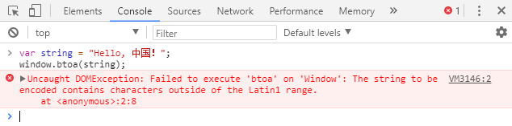
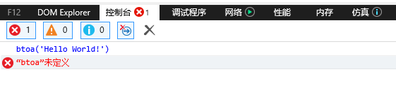
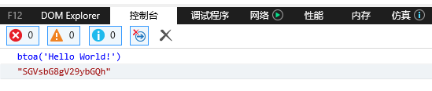
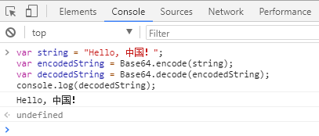

[TOC]


## javascript用btoa和atob来编码解码Base64

发布于 2018/01/27 18:14 

btoa和atob是window对象的两个函数，其中btoa是binary to ascii，用于将binary的数据用ascii码表示，即f的编码过程，而atob则是ascii to binary，用于将ascii码解析成binary数据，看一个例子：

```js
// Define the string
var string = 'Hello World!';

// Encode the String
var encodedString = btoa(string);
console.log(encodedString); // Outputs: "SGVsbG8gV29ybGQh"

// Decode the String
var decodedString = atob(encodedString);
console.log(decodedString); // Outputs: "Hello World!"
```

可以看到，字符串“Hello World!”已被Base64编码和解码。但是，atob和btoa不能编码Unicode字符：

```js
var string = "Hello, 中国！";
window.btoa(string);
```



那如何用这种方式支持汉字呢？这里我们可以先将带有非Latin1字符的串先用encodeURIComponent编码：

```js
var string = "Hello, 中国！";
//"SGVsbG8lMkMlMjAlRTQlQjglQUQlRTUlOUIlQkQlRUYlQkMlODE="
var encodedString = btoa(encodeURIComponent(string));
var decodedString = decodeURIComponent(atob(encodedString));
console.log(decodedString); //"Hello, 中国！"
```

注意，编码的过程是先encodeURI，再编码，那么解码的过程应该是先解码，再decodeURI。另外，在使用atob和btoa这两个函数时需要注意的是，**IE9是不支持的，在IE11中，用仿真工具切换到IE9模式，然后直接在控制台调用btoa方法：**



如果在IE中使用，需要IE版本为10及以上（以下是IE10的效果）：



正是因为IE9不支持atob和btoa，我们才需要为兼容IE9而使用无奈之举：使用公共类库：

```js
// Create Base64 Object
var Base64={_keyStr:"ABCDEFGHIJKLMNOPQRSTUVWXYZabcdefghijklmnopqrstuvwxyz0123456789+/=",encode:function(e){var t="";var n,r,i,s,o,u,a;var f=0;e=Base64._utf8_encode(e);while(f<e.length){n=e.charCodeAt(f++);r=e.charCodeAt(f++);i=e.charCodeAt(f++);s=n>>2;o=(n&3)<<4|r>>4;u=(r&15)<<2|i>>6;a=i&63;if(isNaN(r)){u=a=64}else if(isNaN(i)){a=64}t=t+this._keyStr.charAt(s)+this._keyStr.charAt(o)+this._keyStr.charAt(u)+this._keyStr.charAt(a)}return t},decode:function(e){var t="";var n,r,i;var s,o,u,a;var f=0;e=e.replace(/[^A-Za-z0-9+/=]/g,"");while(f<e.length){s=this._keyStr.indexOf(e.charAt(f++));o=this._keyStr.indexOf(e.charAt(f++));u=this._keyStr.indexOf(e.charAt(f++));a=this._keyStr.indexOf(e.charAt(f++));n=s<<2|o>>4;r=(o&15)<<4|u>>2;i=(u&3)<<6|a;t=t+String.fromCharCode(n);if(u!=64){t=t+String.fromCharCode(r)}if(a!=64){t=t+String.fromCharCode(i)}}t=Base64._utf8_decode(t);return t},_utf8_encode:function(e){e=e.replace(/rn/g,"n");var t="";for(var n=0;n<e.length;n++){var r=e.charCodeAt(n);if(r<128){t+=String.fromCharCode(r)}else if(r>127&&r<2048){t+=String.fromCharCode(r>>6|192);t+=String.fromCharCode(r&63|128)}else{t+=String.fromCharCode(r>>12|224);t+=String.fromCharCode(r>>6&63|128);t+=String.fromCharCode(r&63|128)}}return t},_utf8_decode:function(e){var t="";var n=0;var r=c1=c2=0;while(n<e.length){r=e.charCodeAt(n);if(r<128){t+=String.fromCharCode(r);n++}else if(r>191&&r<224){c2=e.charCodeAt(n+1);t+=String.fromCharCode((r&31)<<6|c2&63);n+=2}else{c2=e.charCodeAt(n+1);c3=e.charCodeAt(n+2);t+=String.fromCharCode((r&15)<<12|(c2&63)<<6|c3&63);n+=3}}return t}}

// Define the string
var string = 'Hello World!';

// Encode the String
var encodedString = Base64.encode(string);
console.log(encodedString); // Outputs: "SGVsbG8gV29ybGQh"

// Decode the String
var decodedString = Base64.decode(encodedString);
console.log(decodedString); // Outputs: "Hello World!"
```

这个自定义的Base64对象可以转码的字符也不仅限于Latin1字符：

```js
var string = "Hello, 中国！";
var encodedString = Base64.encode(string);//"SGVsbG8sIOS4reWbve+8gQ=="
var decodedString = Base64.decode(encodedString);
console.log(decodedString); //"Hello, 中国！"
```



参考页面：

<https://scotch.io/tutorials/how-to-encode-and-decode-strings-with-base64-in-javascript>


<https://my.oschina.net/itblog/blog/1613977>