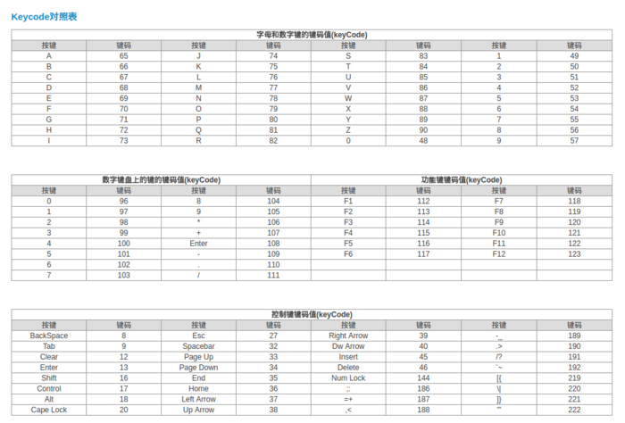

[TOC]


# 详解键盘事件(keydown，keypress，keyup)

### 一、键盘事件基础

###### 1、定义

- `keydown`：按下键盘键
- `keypress`：紧接着`keydown`事件触发（只有按下字符键时触发）
- `keyup`：释放键盘键

**顺序为：keydown -> keypress ->keyup**

###### 2、示例

```
<script>
    function keydown(event) {
        console.log('keydown');
    }
    function keypress(event) {
        console.log(event.keyCode);
        console.log(event.charCode);
        console.log('keypress');
    }
    function keyup(event) {
        console.log('keyup');
    }
</script>
<input type="text" onkeydown="keydown()" onkeypress="keypress()" onkeyup="keyup()" />
```

###### 3、详解

1）用户**按下键盘上的字符键时**

- 首先会触发`keydown`事件
- 然后紧接着触发`keypress`事件
- 最后触发`keyup`事件
- 如果用户按下了一个*字符键*不放，就会重复触发`keydown`和`keypress`事件，直到用户松开该键为止

2）当用户**按下非字符键时**

- 首先会触发`keydown`事件
- 然后就触发`keyup`事件
- 如果用户按下了一个*非字符键*不放，就会重复触发`keydown`事件，直到用户松开该键为止

3）*在keyup 事件中无法阻止浏览器默认事件*，因为在`keypress`时，浏览器默认行为已经完成，即将文字输入文本框（尽管这时还没显示），这个时候不管是`preventDefault`还是`returnValue = false`，都不能阻止在文本框中输入文字的行为，*如要阻止默认行为*，必须在`keydown`或`keypress`时阻止

```
<input id="input" value="default" type="text" />
<script>
var input = document.getElementById('input');
input.onkeydown = function() {
    //return false;
    console.log('onkeydown ' + this.value);
}
input.onkeypress = function() {
    //return false;
    console.log('onkeypress ' + this.value);
}
input.onkeyup = function() {
    return false;
    console.log('onkeyup ' + this.value);
}
</script>
//结果为keydown、keypress事件中return false文本框无法输入文字
//在keyup事件中return false文本框可以输入文字
```

4）发生`keypress`事件意味着按下的键会影响到屏幕中文本的显示，即在所有浏览器中，按下能够*插入或删除字符*的键都会触发`keypress`事件

### 二、键码和键盘事件

- **系统功能键** ：`Esc、Tab、CapsLk、Shift、Ctrl、Alt、Enter、Backspace、Print Screen、Scroll Lock、Pause Break、Insert、Delete、Home、End、Page Up、Page Down， F1 ~ F12，Num Lock、The Arrow Keys`

###### １、键盘中的键

- 分为 **字符键** (可打印) 和 **功能键** (不可打印)
- `keypress`支持的系统*功能键* ：
- **Firefox**：`Esc、Enter、Backspace、Pause Break、Insert、 Delete、Home、End、Page Up、Page Down、F1 through F12、The Arrow Keys`、上下左右键
- **Chrome / Oprea / Safari** ：`Enter`
- **IE**：`Esc、Enter`
- **除了 Firefox，其他chrome、oprea、safari、IE 上下左右键不会触发kepress**

###### 2、**keyCode(键码)、which、charCode(字符编码)**

**简写记忆：**

- `keydown`: 获得`keyCode， charCode=0`
- `keyup`: 获得`keyCode， charCode=0`
- `keypress`: 字符`keyCode`=0，获取`charCode`值，反之获取`keyCode`， `charCode`=0

**详述：**

- `event对象`包含一个`keyCode`属性和一个`charCode`属性
- 当捕捉的是`keydown`和`keyup`事件时，`keyCode`表示的就是你具体按的键(也称为`virtual keycode`)，`charCode`为0
- 当捕捉的是`keypress`事件时，`keyCode`为0，`charCode`指的是你按下的字符（而 IE 只有一个`KeyCode`属性，它指的是你键入的字符(`character code`))
  鉴于 *IE 和 FF* 中的区别，建议只使用`keydow`和`keyup`事件

###### 3、keypress 和 keydown / keyup 的区别

**区别简述**

- 1）`keypress` 对中文输入法支持不好，无法响应中文输入
- 2）`keypress` 无法响应系统功能键（如`delete，backspace`）
- 3）由于前面两个限制，`keydown和keyup`对`keyCode`不敏感

**区别详解**

- 对系统功能键的响应方面
  - `keypress`事件不能对系统功能键(对中文输入法不能有效响应)进行正常的响应
  - `keydown`和`keyup`均可以对系统功能键进行有效的拦截，但事件截获的位置不同
- `keyCode`对字母的大小写敏感程度
- `keypress`事件的`keyCode`对字母的大小写敏感
- `keydown、keyup`事件不敏感
- 主附键盘的数字键敏感程度
- `keypress`事件的`which`值无法区分主键盘上的数字键和附键盘数字键的
- `keydown、keyup`事件的`which`值对*主附键盘的数字键* 敏感

###### 4、需要注意的地方

- 1）英文输入法
- 所有浏览器都支持这三个事件
- 2）中文输入法（浏览器之间表现得不太一致）
- `IE,Chrome,Safari`：触发`keydown和keyup`， 不触发`keypress`
- `Firefox`：
  - 首次按下时触发`keydown`，不触发`keypress`
  - 在停止输入并改变文本框内容(如按下回车或者空格键)后会触发`keyup`（**只有在触发keyup事件才能获得修改后的文本值）**
- `Opera`：`keydown, keypress和keyup`都不触发
- 3）大小写
- 大写：`keydown、keypress`(字母，主键盘数字、回车)、`keyup`的`which`值相等
- 小写：`kepress`获取的`which`不同于`keydown、keyup`

###### 5、keyCode对照表

- ​

  

> 相关文章推荐：
> [JS键盘事件](https://www.jianshu.com/p/8bc67223e7e8)
> [键盘事件keydown，keypress，keyup](https://www.jianshu.com/p/7b3affadfb07)
> [键盘事件keydown,keypress,keyup区别](https://link.jianshu.com/?t=http://www.cnblogs.com/littlelan/archive/2013/03/28/2987851.html)
> [键盘事件keydown、keypress、keyup随笔整理总结](https://link.jianshu.com/?t=http://www.cnblogs.com/silence516/archive/2013/01/25/2876611.html)
> [Javascript跨浏览器处理键盘事件keydown,keypress,keyup](https://link.jianshu.com/?t=http://www.cnblogs.com/leolai/archive/2012/08/01/2618386.html)


https://www.jianshu.com/p/8f839f558319