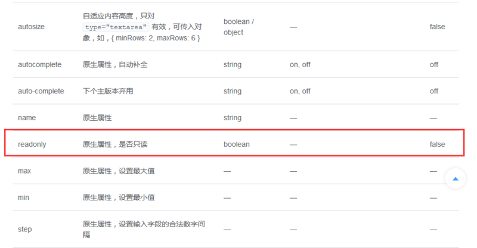

# [Vue warn\]: Invalid prop: type check failed for prop "xxx" readonly="true" 问题

 

### 以下错误都是同样的原因

```
[Vue warn]: Invalid prop: type check failed for prop "readonly". Expected Boolean, got String with value "true".
[Vue warn]: Invalid prop: type check failed for prop "disabled". Expected Boolean, got String with value "true".
……
```

刚刚开始学习vue，为了实现只读展示所以添加readonly属性，查询官方文档发现默认值为false，所以最终代码中为readonly="true"。

### 官方文档



### 我的代码

```html
<el-col :span="8">
    <el-form-item label="客户名称" prop="custName" status-icon>
      <el-input maxlength="100" v-model="custName" readonly="true"></el-input>
    </el-form-item>
</el-col>
```

测试发现虽然实现只读展示，但是在浏览器控制报错。

### 解决方案

直接使用readonly即可，不需要=“ture”。

```html
<el-col :span="8">
    <el-form-item label="客户名称" prop="custName" status-icon>
      <el-input maxlength="100" v-model="custName" readonly></el-input>
    </el-form-item>
</el-col>
```