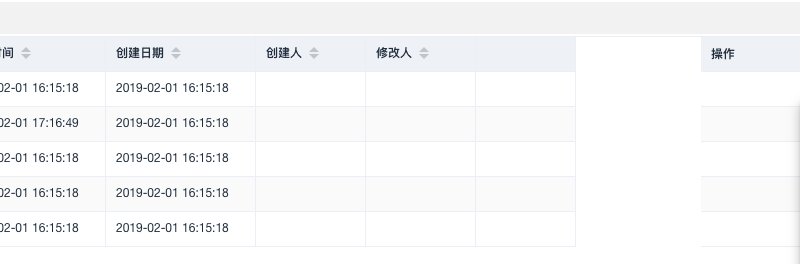

[TOC]


# element-ui el-table el-table-column fixed 固定之后出现列空白

##  问题现象:



## 解决:

 添加\<el-table-column min-width="1"> \</el-table-column>

```html
    <el-table :data="dataList" stripe
              border highlight-current-row
              v-loading="listLoading" :height="childTableDataListHeight"
              @current-change="selsChange">
      <el-table-column type="index" width="60"/>
      <el-table-column width="110" prop="sysNo" :label="this.$t('billDetail.sysNo')" sortable/>
      <el-table-column width="110" prop="updatePin" :label="this.$t('common.lable.updatePin')" sortable/>
      <el-table-column min-width="1"> </el-table-column>
      <el-table-column
        fixed="right"
        label="操作"
        width="100">
        <template slot-scope="scope">
          <div v-if="scope.row.costType == TO_BE_CONFIRMED">
            <el-button @click="handleExtendAudit(scope.row)" type="text" size="small">审批</el-button>
          </div>
        </template>
      </el-table-column>
    </el-table>
```

