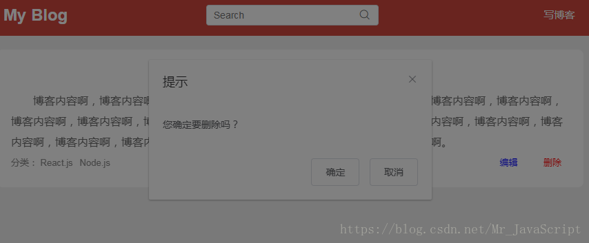
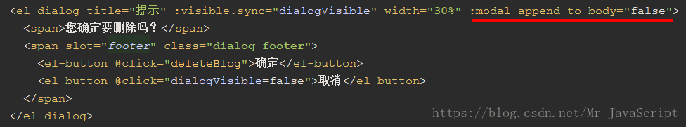
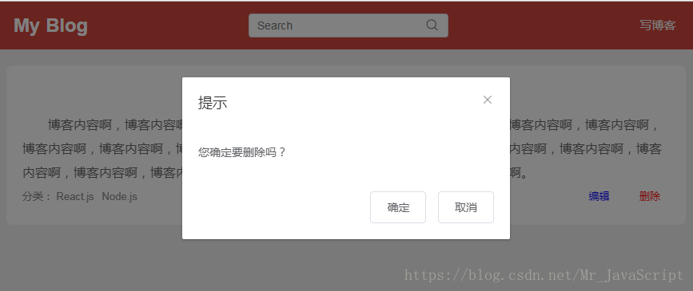
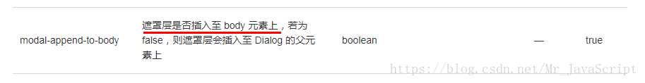
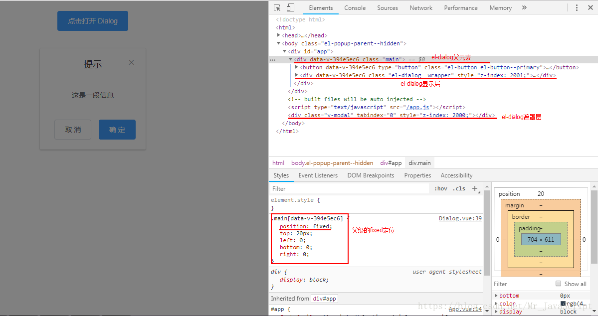
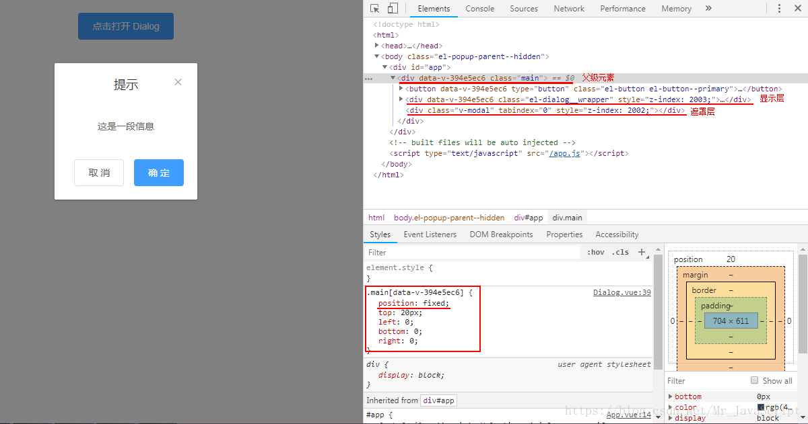

[TOC]

# element-ui框架的el-dialog弹出框被遮罩层挡住了

2018年07月02日 19:24:30 [蔚莱先森](https://me.csdn.net/Mr_JavaScript) 阅读数 18852

## 问题

如图：

解决办法

在el-dialog标签里添加 :modal-append-to-body='false'

实现效果：

## 问题解析

先来看看element-ui官网提供的属性说明文档

文档解释：翻译成大白话就是，若el-dialog弹出框设置了modal-append-to-body='true'（默认）属性，它的遮罩层就会被插入到body标签下（即与组件所在的最外层div同一层级），知道这个原理就好办了。

> 问题分析：经过分析源代码可得，el-dialog的显示层和遮罩层都设置了position:fixed，当然显示层的z-index肯定要比遮罩层的大，才能正常的显示弹出框。问题就出在此处，若el-dialog的父级也设置了position:fixed，并且其z-index比弹出框的遮罩层的小（遮罩层处于更高一层），那么弹出框的内容就会被遮罩层所遮挡住了。

经过分析出问题的代码可得出，el-dialog的父级元素确实设置了position:fixed，并且其z-index比弹出框的遮罩层的小，所以就会出现遮罩层把内容挡住的问题。

## 解决方案

1、给el-dialog设置modal-append-to-body=“false”，使遮罩层插入至 Dialog 的父元素上。如果多层是dialog而不是modal则append-to-body解决（推荐）

2、给position:fixed的父元素设置一个z-index，并且要比遮盖层的大。

3、el-dialog父元素不使用fixed定位。

 

为了验证这个问题，我特地写了个demo，如下图：

图一：modal-append-to-body=“true”

图二：modal-append-to-body=“false”

(完)

<https://blog.csdn.net/Mr_JavaScript/article/details/80888681>