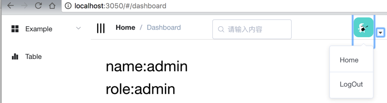
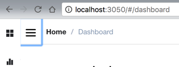
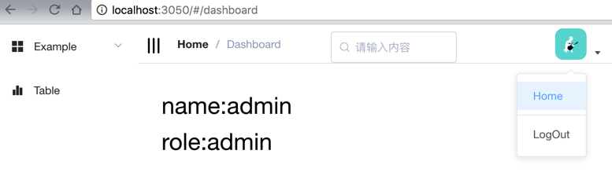
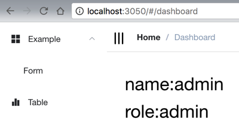

[TOC]


# vue-element-admin升级到Element-UI 2.0.1后：点击按钮有蓝色边框显示

折腾：

[【部分解决】把vue-element-admin的ElementUI的版本从1.4升级到最新的2.0](https://www.crifan.com/vue_element_admin_elementui_upgrade_from_1_4_to_latest_2_0)

期间，点击按钮，会显示蓝色边框，很难看：





需要去解决此问题。

且注意到：之前vue-element-admin中为何没有此问题

而现在升级了element-ui到2.0.1后

以及vue到2.5.2后

出现此问题。

element-ui 按钮 点击 蓝色边框

[Button 按钮的点击时候出现蓝色边框 – CSDN博客](http://blog.csdn.net/qq_26222859/article/details/51516011)

```css
* {
  outline: none;
}

/* remember to define focus styles! */
:focus {
    outline: 0;
}
```

[css去掉button点击后的蓝框 – CSDN博客](http://blog.csdn.net/Inuyasha1121/article/details/51885706)

所以感觉不应该仅仅是去加：

```
button{
  outline:none;
}
```

[Element 2.0 正式发布 · Issue #7755 · ElemeFE/element](https://github.com/ElemeFE/element/issues/7755)

“upload组件在chrome浏览器上点击的时候会出现蓝色的边框。。。这个解决一下啊之前在测试版本就这样。 [@Leopoldthecoder](https://github.com/leopoldthecoder)”

难道是element-ui官网库本身的问题。

先去想办法，找到全局加载css配置的地方，去试试那个配置

看到此处已经在：

src/styles/index.scss

有了配置：

a:focus,a:active {outline: none;}

所以去加上：

:focus {outline: 0;}

结果就可以了：





【总结】

Element-UI的最新的2.0（2.0.1/2.0.2）的按钮，在点击（获得焦点的时候）会出现蓝色边框

解决办法是：

（给此处的

vue-element-admin的模板：

<https://github.com/PanJiaChen/vueAdmin-template/tree/permission-control>

中的

src/styles/index.scss

）

加上css配置：

:focus {  outline: 0;}

即可。

表示：当各种组件，包括此处的按钮，（被点击后）获得焦点时，外部边框为空（不显示蓝色边框）。

## 主要问题

**主要问题是更新了element-ui版本没有升级对应皮肤**


转载请注明：[在路上](https://www.crifan.com/) » [【已解决】vue-element-admin升级到Element-UI 2.0.1后：点击按钮有蓝色边框显示](https://www.crifan.com/vue_element_admin_upgrade_to_element_ui_2_0_1_click_button_show_blue_frame_border/)

继续浏览有关 [vue-element-admin](https://www.crifan.com/tag/vue-element-admin/) 的文章


https://www.crifan.com/vue_element_admin_upgrade_to_element_ui_2_0_1_click_button_show_blue_frame_border/