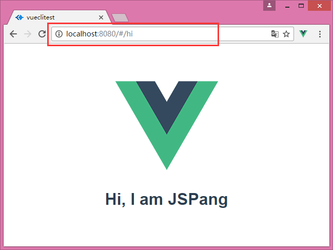

[TOC]


# vue router 教程-image-201804292154

##  简介：

由于Vue在开发时对路由支持的不足，后来官方补充了vue-router插件，它在Vue的生态环境中非常重要，在实际开发中只要编写一个页面就会操作vue-router。要学习vue-router就要先知道这里的路由是什么？这里的路由并不是指我们平时所说的硬件路由器，这里的路由就是SPA（单页应用）的路径管理器。再通俗的说，vue-router就是我们WebApp的链接路径管理系统。

有的小伙伴会有疑虑，为什么我们不能像原来一样直接用<a></a>标签编写链接哪？因为我们用Vue作的都是单页应用，就相当于只有一个主的index.html页面，所以你写的<a></a>标签是不起作用的，你必须使用vue-router来进行管理。

如果你在学习中有什么疑问，欢迎您在博客中留言，或者加入Q群：364140450，有很多Vue的高手在群里互动。

 

## 第1节：Vue-router入门

### 安装vue-router

vue-router是一个插件包，所以我们还是需要用npm来进行安装的。打开命令行工具，进入你的项目目录，输入下面命令。

```
npm install vue-router --save-dev
```

如果你安装很慢，也可以用cnpm进行安装，如果你在使用vue-cli中已经选择安装了vue-router，那这里不需要重复安装了。

### 解读router/index.js文件

我们用vue-cli生产了我们的项目结构，你可以在src/router/index.js文件，这个文件就是路由的核心文件，我们先解读一下它。如果你还不会使用vue-cli，我正好有一套课程是专门讲vue-cli的，你可以学习一下《[技术胖的Vue-cli视频教程](http://jspang.com/2017/04/10/vue-cli/)》。

```
import Vue from 'vue'   //引入Vue
import Router from 'vue-router'  //引入vue-router
import Hello from '@/components/Hello'  //引入根目录下的Hello.vue组件
 
Vue.use(Router)  //Vue全局使用Router
 
export default new Router({
  routes: [              //配置路由，这里是个数组
    {                    //每一个链接都是一个对象
      path: '/',         //链接路径
      name: 'Hello',     //路由名称，
      component: Hello   //对应的组件模板
    }
  ]
})
```

上边的代码中已经对每行都进行了注释，其实在这个路由文件里只配置了一个功能，就是在进入项目时，显示Hello.vue里边的内容代码。

### 增加一个Hi的路由和页面

对路由的核心文件熟悉后，我们试着增加一个路由配置，我们希望在地址栏输入  http://localhost:8080/#/hi   的时候出现一个新的页面，先来看一下我们希望得到的效果。



看到了效果，我们看一下具体的操作步骤：

- 在src/components目录下，新建 Hi.vue 文件。

- 编写文件内容，和我们之前讲过的一样，文件要包括三个部分\<template>\<script>和\<style>。文件很简单，只是打印一句话。

  ```
  <template>
    <div class="hello">
      <h1>{{ msg }}</h1>
    </div>
  </template>
   
  <script>
  export default {
    name: 'hi',
    data () {
      return {
        msg: 'Hi, I am JSPang'
      }
    }
  }
  </script>
   
   
  <style scoped>
   
  </style>
  ```

- 引入 Hi组件：我们在router/index.js文件的上边引入Hi组件

  ```
  import Hi from '@/components/Hi'
  ```

- 增加路由配置：在router/index.js文件的routes[]数组中，新增加一个对象，代码如下。

  ```
  {
    path:'/hi',
    name:'Hi',
    component:Hi
  }
  ```


通过上面的配置已经可以增加一个新的页面了。是不是觉的自己的Vue功力一下子就提升了一个档次。为了方便小伙伴查看，贴出现在的路由配置文件:

```
import Vue from 'vue'   //引入Vue
import Router from 'vue-router'  //引入vue-router
import Hello from '@/components/Hello'  //引入根目录下的Hello.vue组件
import Hi from '@/components/Hi' 
 
Vue.use(Router)  //Vue全局使用Router
 
export default new Router({
  routes: [              //配置路由，这里是个数组
    {                    //每一个链接都是一个对象
      path: '/',         //链接路径
      name: 'Hello',     //路由名称，
      component: Hello   //对应的组件模板
    },{
      path:'/hi',
      name:'Hi',
      component:Hi
    }
  ]
})
```

### router-link制作导航

现在通过在地址栏改变字符串地址，已经可以实现页面内容的变化了。这并不满足需求，我们需要的是在页面上有个像样的导航链接，我们只要点击就可以实现页面内容的变化。制作链接需要\<router-link>标签，我们先来看一下它的语法。

```
<router-link to="/">[显示字段]</router-link>
```


- **to：**是我们的导航路径，要填写的是你在router/index.js文件里配置的path值，如果要导航到默认首页，只需要写成  to=”/”  ，
- **[显示字段] ：**就是我们要显示给用户的导航名称，比如首页  新闻页。

明白了router-link的基本语法，我们在 src/App.vue文件中的template里加入下面代码，实现导航。

```
<p>导航 ：
   <router-link to="/">首页</router-link>
   <router-link to="/hi">Hi页面</router-link>
</p>
```

现在我们访问页面，发现已经多出了导航。


### 总结：

这节课我们在vue-cli的构建下对vue-router有了一个基本的了解，学会了vue-router的核心文件的基本结构，学会了如何添加一个新的模板页面，还学会了用<router-link>标签设置导航。在这里我必须要再强调一遍，路由是Vue中最重点的内容，你必须完全掌握学会。你可以先听一遍视频教程，然后跟着文字教程来作你的练习。一步一个脚印，我们都会成为Vue大神的，小伙伴们加油了！！！

## 第2节：vue-router配置子路由

我们上节课初步了解Vue-router的初步知识，也学会了基本的跳转，那我们这节课学习一下子菜单的路由方式，也叫子路由。子路由的情况一般用在一个页面有他的基础模版，然后它下面的页面都隶属于这个模版，只是部分改变样式。我们接着第一节课的实例，在Hi页面的下面新建两个子页面，分别是 “Hi页面1” 和 “Hi页面2”，来实现子路由。

### 一、改造App.vue的导航代码

我们需要先改造app.vue的导航代码，来实现基本的导航功能。我们用<router-link>标签增加了两个新的导航链接。

#### App.vue代码

```
<p>导航 ：
      <router-link to="/">首页</router-link> | 
      <router-link to="/hi">Hi页面</router-link> |
      <router-link to="/hi/hi1">-Hi页面1</router-link> |
      <router-link to="/hi/hi2">-Hi页面2</router-link>
</p>
```

这时候我们再访问主页的时候导航栏就发生了变化。多出了两个自导航：Hi页面1  和 Hi页面2


### 二、改写components/Hi.vue页面

把Hi.vue改成一个通用的模板，加入\<router-view>标签，给子模板提供插入位置。“Hi页面1”   和 “Hi页面2”  都相当于“Hi页面”的子页面，有点想继承关系。我们在“Hi页面”里加入\<router-view>标签。

#### components/Hi.vue,就是第5行的代码，其他代码不变。

```
<template>
  <div class="hello">
    <h1>{{ msg }}</h1>
 
    <router-view class="aaa"></router-view>
  </div>
</template>
 
<script>
export default {
  name: 'hi',
  data () {
    return {
      msg: 'Hi, I am JSPang'
    }
  }
}
</script>
<style scoped>
 
</style>
```


### 三、在components目录下新建两个组件模板 Hi1.vue 和 Hi2.vue

新建的模板和Hi.vue没有太多的差别，知识改变了data中message的值，也就是输出的结果不太一样了。

Hi1.vue

```
<template>
  <div class="hello">
    <h1>{{ msg }}</h1>
  </div>
</template>
<script>
export default {
  name: 'hi',
  data () {
    return {
      msg: 'Hi, I am Hi1!'
    }
  }
}
</script>
<style scoped>
 
</style>
```

Hi2.vue
```
<template>
  <div class="hello">
    <h1>{{ msg }}</h1>
  </div>
</template>
<script>
export default {
  name: 'hi',
  data () {
    return {
      msg: 'Hi, I am Hi2'
    }
  }
}
</script>
<style scoped>
</style>
```


### 四、修改router/index.js代码

我们现在导航有了，母模板和子模板也有了，只要改变我们的路由配置文件就可以了。子路由的写法是在原有的路由配置下加入children字段。

```
children:[
{path:'/',component:xxx},
{path:'xx',component:xxx},
]
```

children字段后边跟的是个数组，数组里和其他配置路由基本相同，需要配置path和component。具体看一下这个子路由的配置写法。

```
import Vue from 'vue'   
import Router from 'vue-router'  
import Hello from '@/components/Hello'  
import Hi from '@/components/Hi' 
import Hi1 from '@/components/Hi1' 
import Hi2 from '@/components/Hi2' 
 
Vue.use(Router) 
 
export default new Router({
  routes: [             
    {                    
      path: '/',        
      name: 'Hello',     
      component: Hello   
    },{
      path:'/hi',
      component:Hi,
      children:[
        {path:'/',component:Hi},
        {path:'hi1',component:Hi1},
        {path:'hi2',component:Hi2},
      ]
    }
  ]
})
```

需要注意的是，在配置路由文件前，需要先用import引入Hi1和Hi2。

### 总结：

这节课学的内容在路由配置里经常用到，比如我们作一个购物模块，购物模块里有很多相同的元素，我们就会利用这种子路由的形式，先定一个父页面，然后再修改子页面。希望这节课对你有帮助，其实子路由的步骤还是有些繁琐的，所以希望你们多练习几遍，能够完全掌握。

------

## 第3节：vue-router如何参数传递

新的项目开始了，工作量很大，所以更新会比较慢，希望小伙伴们多多包涵。

开发中，参数的传递是个最基本的业务需求。通过URL地址来传递参数是一个形式，这节课我们就看看vue-router为我们提供了那些传递参数的功能。我们先想象一个基本需求，就是在我们点击导航菜单时，跳转页面上能显示出当前页面的路径，来告诉用户你想在所看的页面位置（类似于面包屑导航）。

### 一、用name传递参数 很少用不推荐

前两节课一直出现name的选项，但是我们都没有讲，这节课我们讲name的一种作用，传递参数。接着上节课的程序继续编写。

两步完成用name传值并显示在模板里：

1. 在路由文件src/router/index.js里配置name属性。

   ```
    routes: [
       {
         path: '/',
         name: 'Hello',
         component: Hello
       }
    ]
   ```


2. 模板里(src/App.vue)用$router.name的形势接收，比如直接在模板中显示：

   ```
    <p> {{ $route.name}} </p>
   ```


### 二、通过\<router-link> 标签中的to传参

也许你也会觉的上边的传参很不正规，也不方便，其实我们多数传参是不用name进行传参的，我们用\<router-link>标签中的to属性进行传参，需要您注意的是这里的to要进行一个绑定，写成:to。先来看一下这种传参方法的基本语法：

```
<router-link :to="{name:xxx,params:{key:value}}">valueString</router-link>
```

这里的to前边是带冒号的，然后后边跟的是一个对象形势的字符串.

- name：就是我们在路由配置文件中起的name值。
- params：就是我们要传的参数，它也是对象形势，在对象里可以传递多个值。

了解基本的语法后，我们改造一下我们的src/App.vue里的<router-link>标签,我们把hi1页面的<router-link>进行修改。

```
 <router-link :to="{name:'hi1',params:{username:'jspang'}}">Hi页面1</router-link>
```

把src/reouter/index.js文件里给hi1配置的路由起个name,就叫hi1.

```
 {path:'/hi1',name:'hi1',component:Hi1},
```

最后在模板里(src/components/Hi1.vue)用$route.params.username进行接收. 

```
{{$route.params.username}}
```

#### 总结：

今天我们学习了两种传参的方法，一般会使用第二种方法。我们通过学习也知道了name的用途，一种作用是传参，一种作用是在传参时起到名称作用。传参的操作在实际开发中是基本的需求，我们一定要掌握好啊。

------

## 第4节：单页面多路由区域操作

**致歉：**对不起大家，一周没有更新课程，因为公司开始了一个新项目，人手比较少，所以一直处于高压下工作，回家后什么都不想干，只想躺在床上闭目养神听会音乐。今天休息，我才有时间上博客逛一下，开始继续更新。

这节课我们讲“**单页面多路由区域操作**”，实际需求是这样的，在一个页面里我们有2个以上<router-view>区域，我们通过配置路由的js文件，来操作这些区域的内容。例如我们在src/App.vue里加上两个<router-view>标签。我们用vue-cli建立了新的项目，并打开了src目录下的App.vue文件，在<router-view>下面新写了两行<router-view>标签,并加入了些CSS样式。

```
<router-view ></router-view>
 <router-view name="left" style="float:left;width:50%;background-color:#ccc;height:300px;"></router-view>
 <router-view name="right" style="float:right;width:50%;background-color:#c0c;height:300px;"></router-view>
```

现在的页面中有了三个<router-view>标签，也就是说我们需要在路由里配置这三个区域，配置主要是在components字段里进行。

```
import Vue from 'vue'
import Router from 'vue-router'
import Hello from '@/components/Hello'
import Hi1 from '@/components/Hi1'
import Hi2 from '@/components/Hi2'
 
Vue.use(Router)
 
export default new Router({
  routes: [
    {
      path: '/',
      components: {
        default:Hello,
        left:Hi1,
        right:Hi2
      }
    },{
      path: '/Hi',
      components: {
        default:Hello,
        left:Hi2,
        right:Hi1
      }
    }
 
  ]
})
```

上边的代码我们编写了两个路径，一个是默认的'/’，另一个是’/Hi’.在两个路径下的components里面，我们对三个区域都定义了显示内容。

定义好后，我们需要在component文件夹下，新建Hi1.vue和Hi2.vue页面就可以了。

Hi1.vue

```
<template>
    <div>
        <h2>{{ msg }}</h2> 
    </div>
</template>
 
<script>
export default {
  name: 'hi1',
  data () {
    return {
      msg: 'I am Hi1 page.'
    }
  }
}
</script>
```

Hi2.vue

```
<template>
    <div>
        <h2>{{ msg }}</h2>
    </div>
</template>
 
<script>
export default {
  name: 'hi2',
  data () {
    return {
      msg: 'I am Hi2 page.'
    }
  }
}
</script>
```

最后在App.vue中配置我们的<router-link>就可以了

```
<router-link to="/">首页</router-link> | 
<router-link to="/hi">Hi页面</router-link> |
```


## 第5节：vue-router 利用url传递参数

我们在第3节虽然已经学会传递参数，但是我们这些老程序员的情怀还是利用url来传值，因为我们以前在前后端没有分开开发的时候，经常这样做。在实际开发也是有很多用URL传值的需求，比如我们在新闻列表中有很多新闻标题整齐的排列，我们需要点击每个新闻标题打开不同的新闻内容，这时在跳转路由时跟上新闻编号就十分实用。

### :冒号的形式传递参数

我们可以在理由配置文件里以:冒号的形式传递参数，这就是对参数的绑定。

1. 在配置文件里以冒号的形式设置参数。我们在/src/router/index.js文件里配置路由。

   ```
   {
       path:'/params/:newsId/:newsTitle',
        component:Params
   }
   ```


   我们需要传递参数是新闻ID（newsId）和新闻标题（newsTitle）.所以我们在路由配置文件里制定了这两个值。

2. 在src/components目录下建立我们params.vue组件，也可以说是页面。我们在页面里输出了url传递的的新闻ID和新闻标题。

   ```
   <template>
       <div>
           <h2>{{ msg }}</h2>
           <p>新闻ID：{{ $route.params.newsId}}</p>
           <p>新闻标题：{{ $route.params.newsTitle}}</p>
       </div>
   </template>
    
   <script>
   export default {
     name: 'params',
     data () {
       return {
         msg: 'params page'
       }
     }
   }
   </script>
   ```


3. 在App.vue文件里加入我们的\<router-view>标签。这时候我们可以直接利用url传值了。

   ```
   <router-link to="/params/198/jspang website is very good">params</router-link> 
   ```


我们已经实现了以url方式进行传值，这在实际开发中经常使用，必须完全了解。我希望你看完视频后或者学完文章后能多练习两边，并在实际项目中充分使用。

### 正则表达式在URL传值中的应用

上边的例子，我们传递了新闻编号，现在需求升级了，我们希望我们传递的新闻ID只能是数字的形式，这时候我们就需要在传递时有个基本的类型判断，vue是支持正则的。

加入正则需要在路由配置文件里（/src/router/index.js）以圆括号的形式加入。

```
path:'/params/:newsId(\\d+)/:newsTitle',
```


加入了正则，我们再传递数字之外的其他参数，params.vue组件就没有办法接收到。

------

## 第6节：vue-router 的重定向-redirect

开发中有时候我们虽然设置的路径不一致，但是我们希望跳转到同一个页面，或者说是打开同一个组件。这时候我们就用到了路由的重新定向redirect参数。

### redirect基本重定向

我们只要在路由配置文件中（/src/router/index.js）把原来的component换成redirect参数就可以了。我们来看一个简单的配置。

```
export default new Router({
  routes: [
    {
      path: '/',
      component: Hello
    },{
      path:'/params/:newsId(\\d+)/:newsTitle',
      component:Params
    },{
      path:'/goback',
      redirect:'/'
    }
 
  ]
})
```

这里我们设置了goback路由，但是它并没有配置任何component（组件），而是直接redirect到path:’/’下了，这就是一个简单的重新定向。

### 重定向时传递参数

我们已经学会了通过url来传递参数，那我们重定向时如果也需要传递参数怎么办？其实vue也已经为我们设置好了，我们只需要在ridirect后边的参数里复制重定向路径的path参数就可以了。可能你看的有点晕，我们来看一段代码： 

```
{
  path:'/params/:newsId(\\d+)/:newsTitle',
  component:Params
},{
  path:'/goParams/:newsId(\\d+)/:newsTitle',
  redirect:'/params/:newsId(\\d+)/:newsTitle'
}
```

已经有了一个params路由配置，我们在设置一个goParams的路由重定向，并传递了参数。这时候我们的路由参数就可以传递给params.vue组件了。参数接收方法和正常的路由接收方法一样。

------

## 第7节：alias别名的使用

上节学习了路由的重定向，我相信大家已经可以熟练使用redirect进行重定向了。使用alias别名的形式，我们也可以实现类似重定向的效果。

1.首先我们在路由配置文件里（/src/router/index.js），给上节课的Home路径起一个别名，jspang。

```
{
    path: '/hi1',
    component: Hi1,
    alias:'/jspang'
 }
```

2.配置我们的<router-link>，起过别名之后，可以直接使用<router-link>标签里的to属性，进行重新定向。 

```
<router-link to="/jspang">jspang</router-link>
```


### redirect和alias的区别

- redirect：仔细观察URL，redirect是直接改变了url的值，把url变成了真实的path路径。
- alias：URL路径没有别改变，这种情况更友好，让用户知道自己访问的路径，只是改变了<router-view>中的内容。

**填个小坑：**

别名请不要用在path为’/’中，如下代码的别名是不起作用的。

```
{
  path: '/',
  component: Hello,
  alias:'/home'
}
```

在实际项目中我们遇到了这样的坑，开始以为是自己的代码写的有问题，找了两个小时作用。后来发现不是代码问题，只是vue不支持这样使用。我们犯过错误，踩过了坑，希望大家就不要踩了。

------

## 第8节：路由的过渡动画

在开发中有一种需求叫高端、大气、上档次。所以作为一个大前端有责任让你的程序开起来更酷炫。可以在页面切换时我们加入一些动画效果，提升我们程序的动效设计。这节课我们就学习一下路由的过渡动画效果制作。

### <transition>标签

想让路由有过渡动画，需要在<router-view>标签的外部添加<transition>标签，标签还需要一个name属性。

```
<transition name="fade">
  <router-view ></router-view>
</transition>
```


我们在/src/App.vue文件里添加了<transition>标签，并给标签起了一个名字叫fade。

### css过渡类名：

组件过渡过程中，会有四个CSS类名进行切换，这四个类名与transition的name属性有关，比如name=”fade”,会有如下四个CSS类名：

1. fade-enter:进入过渡的开始状态，元素被插入时生效，只应用一帧后立刻删除。
2. fade-enter-active:进入过渡的结束状态，元素被插入时就生效，在过渡过程完成后移除。
3. fade-leave:离开过渡的开始状态，元素被删除时触发，只应用一帧后立刻删除。
4. fade-leave-active:离开过渡的结束状态，元素被删除时生效，离开过渡完成后被删除。

从上面四个类名可以看出，fade-enter-active和fade-leave-active在整个进入或离开过程中都有效，所以CSS的transition属性在这两个类下进行设置。

那我们就在App.vue页面里加入四种CSS样式效果，并利用CSS3的transition属性控制动画的具体效果。代码如下：

```
.fade-enter {
  opacity:0;
}
.fade-leave{
  opacity:1;
}
.fade-enter-active{
  transition:opacity .5s;
}
.fade-leave-active{
  opacity:0;
  transition:opacity .5s;
}
```

上边的代码设置了改变透明度的动画过渡效果，但是默认的mode模式in-out模式，这并不是我们想要的。下面我们学一下mode模式。

### 过渡模式mode：

- in-out:新元素先进入过渡，完成之后当前元素过渡离开。
- out-in:当前元素先进行过渡离开，离开完成后新元素过渡进入。

这节课只能算是一个简单的过渡入门，教会大家原理，如果想做出实用酷炫的过渡效果，你需要有较强的动画制作能力，我们下节课继续学习动画的知识。

------

## 第9节：mode的设置和404页面的处理

在学习过渡效果的时候，我们学了mode的设置，但是在路由的属性中还有一个mode。这节课我们就学习一下另一个mode模式和404页面的设置。

### mode的两个值

1. histroy:当你使用 history 模式时，URL 就像正常的 url，例如 http://jsapng.com/lms/，也好看！
2. hash:默认’hash’值，但是hash看起来就像无意义的字符排列，不太好看也不符合我们一般的网址浏览习惯。

具体的效果我在视频中会有所掩饰，不理解的小伙伴可以到视频中进行查看。

 /src/router/index.js

```
import Vue from 'vue'   //引入Vue
import Router from 'vue-router' //引入vue-router
import HelloWorld from '@/components/HelloWorld' //引入根目录下的Hello.vue组件 


Vue.use(Router) //Vue全局使用Router

export default new Router({
  mode : "history",
  routes: [                 //配置路由，这里是个数组
    {                       //每一个链接都是一个对象
      path: '/',            //链接路径
      name: 'HelloWorld',   //路由名称，
      component: HelloWorld //对应的组件模板
    } 
})


```


### 404页面的设置：

用户会经常输错页面，当用户输错页面时，我们希望给他一个友好的提示，为此美工都会设计一个漂亮的页面，这个页面就是我们常说的404页面。vue-router也为我们提供了这样的机制.

1.设置我们的路由配置文件（/src/router/index.js）：

```
{
   path:'*',
   component:Error
}
```

这里的path:’*’就是找不到页面时的配置，component是我们新建的一个Error.vue的文件。

2.新建404页面：

在/src/components/文件夹下新建一个Error.vue的文件。简单输入一些有关错误页面的内容。

```
<template>
    <div>
        <h2>{{ msg }}</h2>
    </div>
</template>
<script>
export default {
  data () {
    return {
      msg: 'Error:404'
    }
  }
}
</script>
```

 

3.我们在用<router-link>瞎写一个标签的路径。

 

```
 <router-link to="/bbbbbb">我是瞎写的</router-link> |
```

预览一下我们现在的结果，就已经实现404页面的效果。

------

## 第10节：路由中的钩子

我们知道一个组件从进入到销毁有很多的钩子函数，同样在路由中也设置了钩子函数。路由的钩子选项可以写在路由配置文件中，也可以写在我们的组件模板中。我们这节课就介绍这两种钩子函数的写法。

### 路由配置文件中的钩子函数  不推荐 一般都在模板中写

我们可以直接在路由配置文件（/src/router/index.js）中写钩子函数。但是在路由文件中我们只能写一个beforeEnter,就是在进入此路由配置时。先来看一段具体的代码：

```
{
      path:'/params/:newsId(\\d+)/:newsTitle',
      component:Params,
      beforeEnter:(to,from,next)=>{
        console.log('我进入了params模板');
        console.log(to);
        console.log(from);
        next();
},
```

我们在params路由里配置了bdforeEnter得钩子函数，函数我们采用了ES6的箭头函数，需要传递三个参数。我们并在箭头函数中打印了to和from函数。具体打印内容可以在控制台查看object。

三个参数：

1. to:路由将要跳转的路径信息，信息是包含在对像里边的。
2. from:路径跳转前的路径信息，也是一个对象的形式。
3. next: 是否继续跳转,next(/)里面也可以写路径, 路由的控制参数，常用的有next(true)和next(false)。

### 写在模板中的钩子函数

在配置文件中的钩子函数，只有一个钩子-beforeEnter，如果我们写在模板中就可以有两个钩子函数可以使用：

- beforeRouteEnter：在路由进入前的钩子函数。
- beforeRouteLeave：在路由离开前的钩子函数。


```
export default {
  name: 'params',
  data () {
    return {
      msg: 'params page'
    }
  },
  beforeRouteEnter:(to,from,next)=>{
    console.log("准备进入路由模板");
    next();
  },
  beforeRouteLeave: (to, from, next) => {
    console.log("准备离开路由模板");
    next();
  }
}
</script>
```


这是我们写在params.vue模板里的路由钩子函数。它可以监控到路由的进入和路由的离开，也可以轻易的读出to和from的值。

------

## 第11节：编程式导航

这是这篇文章的最后一节，前10节课的导航都是用<router-link>标签或者直接操作地址栏的形式完成的，那如果在业务逻辑代码中需要跳转页面我们如何操作？这就是我们要说的编程式导航，顾名思义，就是在业务逻辑代码中实现导航。

```
this.$router.go(-1) 和 this.$router.go(1)
```

这两个编程式导航的意思是后退和前进，功能跟我们浏览器上的后退和前进按钮一样，这在业务逻辑中经常用到。比如条件不满足时，我们需要后退。

router.go(-1)代表着后退，我们可以让我们的导航进行后退，并且我们的地址栏也是有所变化的。

1.我们先在app.vue文件里加入一个按钮，按钮并绑定一个goback( )方法。

```
<button @click="goback">后退</button>
```

2.在我们的script模块中写入goback()方法，并使用this.$router.go(-1),进行后退操作。

```
<script>
export default {
  name: 'app',
  methods:{
    goback(){
      this.$router.go(-1);
    }
  }
}
</script>
```

打开浏览器进行预览，这时我们的后退按钮就可以向以前的网页一样后退了。

router.go(1):代表着前进，用法和后退一样，我在这里就不重复码字了（码字辛苦希望大家理解）。

```
this.$router.push('/xxx')
```

这个编程式导航都作用就是跳转，比如我们判断用户名和密码正确时，需要跳转到用户中心页面或者首页，都用到这个编程的方法来操作路由。

我们设置一个按钮，点击按钮后回到站点首页。

1.先编写一个按钮，在按钮上绑定goHome( )方法。

```
<button @click="goHome">回到首页</button>
```

2.在<script>模块里加入goHome方法，并用this.$router.push('/’)导航到首页

```
export default {
  name: 'app',
  methods:{
    goback(){
      this.$router.go(-1);
    },
    goHome(){
      this.$router.push('/');
    }
  }
}
```

 


总结：我们利用11节课把vue-router的知识学习了一遍，因为个人能力有限，知识点难免有所遗漏，希望小伙伴们多多谅解，通过这套课程我对vue-router的知识有了更深的了解，对教是最好的学习也体会更深了。这套课程录制也是比较曲折的，新项目的开始，耽误了一周多的时间，刚进入正常阶段准备继续录制时，家里的键盘又坏掉了，也利用这个机会给家里也还上了机械键盘，可谓因祸得福。

http://jspang.com/2017/04/13/vue-router/