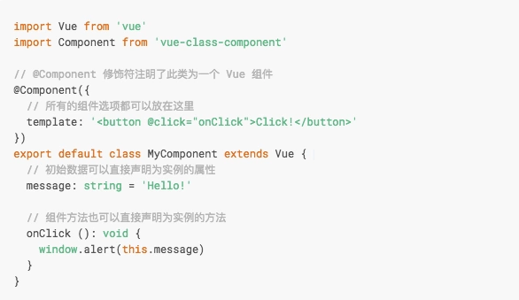

[TOC]


# vue + typescript 新项目起手式

**最后更新于2018-06-30，技术文具有时效性，请知悉**

> 我知道你们早就想用上 vue + ts 强类型了

[还有后续 vue + typescript 进阶篇](https://segmentfault.com/a/1190000011878086)

- *安装vue-cli*
- *安装ts依赖*
- *配置 webpack*
- *添加 tsconfig.json*
- *添加 tslint.json*
- *让 ts 识别 .vue*
- *改造 .vue文件*

## 什么是typescript

`TypeScript` 是 `JavaScript` 的强类型版本。然后在编译期去掉类型和特有语法，生成纯粹的 `JavaScript` 代码。由于最终在浏览器中运行的仍然是 `JavaScript`，所以 `TypeScript` 并不依赖于浏览器的支持，也并不会带来兼容性问题。

`TypeScript` 是 `JavaScript` 的超集，这意味着他支持所有的 `JavaScript` 语法。并在此之上对 `JavaScript` 添加了一些扩展，如 `class` / `interface` / `module` 等。这样会大大提升代码的可阅读性。

与此同时，`TypeScript` 也是 `JavaScript ES6` 的超集，`Google` 的 `Angular 2.0` 也宣布采用 `TypeScript`进行开发。这更是充分说明了这是一门面向未来并且脚踏实地的语言。

强类型语言的优势在于静态类型检查，具体可以参见 [http://www.zhihu.com/question...](http://www.zhihu.com/question/28016252/answer/39056940) 的回答。概括来说主要包括以下几点：

1. 静态类型检查
2. IDE 智能提示
3. 代码重构
4. 可读性

> 静态类型检查可以避免很多不必要的错误, 不用在调试的时候才发现问题

## 前言

随着`vue2.5` 更好的 `TypeScript` 集成，同时因为新开项目的契机，故准备动手尝试一下`typescript` + `vue`

都说`ts`万般好，不如一个段子来的直观，一个程序员自从用上了`ts`之后，连续写了`3000+`行代码一次编译通过一气呵成，然后很激动的打电话跟老婆炫耀这件事情，老婆回了一句 `哦`

之前看文章或者 demo 一直认为 `vue` + `typescript` 之后就不能友好的写`.vue`单文件，并且我也在各种 live 中问`vue` + `ts` 或者 `flow`的集成，也一直没有问出什么好的实践，但是本上强上`ts`的念头，一个字，就是干！

**终于决定自己动手，那接下来从 vue-cli 开始配置 ts，看看事实上集成 ts 的体验到底是如何呢？**

------

先贴一张最后配置完毕的.vue文件 ，template 和 style 跟以前的写法保持一致，只有 script 的变化

## 起手vue-cli

这步应该不用写了

## Vue 引入 TypeScript

首先Cli之后，接下来需要安装一些必要/以后需要的插件

```sh
安装vue的官方插件
npm i vue-class-component vue-property-decorator --save

// ts-loader typescript 必须安装，其他的相信你以后也会装上的
npm i ts-loader typescript tslint tslint-loader tslint-config-standard --save-dev
```

注意如果启动报错要求webpack升级到4只需要 修改ts-loader版本

```
 "ts-loader": "^3.5.0",
```

这些库大体的作用，可以按需引入：

- [vue-class-component](https://github.com/vuejs/vue-class-component)：强化 Vue 组件，使用 TypeScript/装饰器 增强 Vue 组件
- [vue-property-decorator](https://github.com/kaorun343/vue-property-decorator)：在 `vue-class-component` 上增强更多的结合 Vue 特性的装饰器
- [ts-loader](https://github.com/TypeStrong/ts-loader)：TypeScript 为 Webpack 提供了 `ts-loader`，其实就是为了让webpack识别 .ts .tsx文件
- [tslint-loader](https://github.com/wbuchwalter/tslint-loader)跟[tslint](https://github.com/palantir/tslint)：我想你也会在`.ts` `.tsx`文件 约束代码格式（作用等同于eslint）
- [tslint-config-standard](https://github.com/blakeembrey/tslint-config-standard)：`tslint` 配置 `standard`风格的约束

## 配置 webpack

首先找到`./build/webpack.base.conf.js`

- 找到`entry.app` 将`main.js` 改成 `main.ts`, 顺便把项目文件中的`main.js`也改成`main.ts`, 里面内容保持不变

```
entry: {
  app: './src/main.ts'
}
```

- 找到`resolve.extensions` 里面加上`.ts` 后缀 （是为了之后引入.ts的时候不写后缀）

```
  resolve: {
    extensions: ['.js', '.vue', '.json', '.ts'],
    alias: {
      '@': resolve('src')
    }
  }
```

- 找到`module.rules` 添加webpack对`.ts`的解析

```
module: {
  rules: [
    {
      test: /\.(js|vue)$/,
      loader: 'eslint-loader',
      enforce: 'pre',
      include: [resolve('src'), resolve('test')],
      options: {
        formatter: require('eslint-friendly-formatter')
      }
    },
// 从这里复制下面的代码就可以了
    {
      test: /\.ts$/,
      exclude: /node_modules/,
      enforce: 'pre',
      loader: 'tslint-loader'
    },
    {
      test: /\.tsx?$/,
      loader: 'ts-loader',
      exclude: /node_modules/,
      options: {
        appendTsSuffixTo: [/\.vue$/],
      }
    },
// 复制以上的
  }
}
```

是不是加完了，那现在来解释一下

`ts-loader` 会检索当前目录下的 `tsconfig.json` 文件，根据里面定义的规则来解析`.ts`文件（就跟`.babelrc`的作用一样）

```
tslint-loader` 作用等同于 `eslint-loader
```

## 添加 tsconfig.json

接下来在根路径下创建`tsconfig.json`文件

这里有一份参考的 `tsconfig.json` 配置，完成的配置请点击 [tsconfig.json](http://json.schemastore.org/tsconfig)：

```
{
  // 编译选项
  "compilerOptions": {
    // 输出目录
    "outDir": "./output",
    // 是否包含可以用于 debug 的 sourceMap
    "sourceMap": true,
    // 以严格模式解析
    "strict": true,
    // 采用的模块系统
    "module": "esnext",
    // 如何处理模块
    "moduleResolution": "node",
    // 编译输出目标 ES 版本
    "target": "es5",
    // 允许从没有设置默认导出的模块中默认导入
    "allowSyntheticDefaultImports": true,
    // 将每个文件作为单独的模块
    "isolatedModules": false,
    // 启用装饰器
    "experimentalDecorators": true,
    // 启用设计类型元数据（用于反射）
    "emitDecoratorMetadata": true,
    // 在表达式和声明上有隐含的any类型时报错
    "noImplicitAny": false,
    // 不是函数的所有返回路径都有返回值时报错。
    "noImplicitReturns": true,
    // 从 tslib 导入外部帮助库: 比如__extends，__rest等
    "importHelpers": true,
    // 编译过程中打印文件名
    "listFiles": true,
    // 移除注释
    "removeComments": true,
    "suppressImplicitAnyIndexErrors": true,
    // 允许编译javascript文件
    "allowJs": true,
    // 解析非相对模块名的基准目录
    "baseUrl": "./",
    // 指定特殊模块的路径
    "paths": {
      "jquery": [
        "node_modules/jquery/dist/jquery"
      ]
    },
    // 编译过程中需要引入的库文件的列表
    "lib": [
      "dom",
      "es2015",
      "es2015.promise"
    ]
  }
}
```

**顺便贴一份自己的配置**

```
{
  "include": [
    "src/**/*"
  ],
  "exclude": [
    "node_modules"
  ],
  "compilerOptions": {
    "allowSyntheticDefaultImports": true,
    "experimentalDecorators": true,
    "allowJs": true,
    "module": "esnext",
    "target": "es5",
    "moduleResolution": "node",
    "isolatedModules": true,
    "lib": [
      "dom",
      "es5",
      "es2015.promise"
    ],
    "sourceMap": true,
    "pretty": true
  }
}
```

## 添加 tslint.json

在根路径下创建`tslint.json`文件

这里就很简单了，就是 引入 `ts` 的 `standard` 规范

```
{
  "extends": "tslint-config-standard",
  "globals": {
    "require": true
  }
}
```

## 让 ts 识别 .vue

由于 `TypeScript` 默认并不支持 `*.vue` 后缀的文件，所以在 `vue` 项目中引入的时候需要创建一个 `vue-shim.d.ts` 文件，放在项目项目对应使用目录下，例如 `src/vue-shim.d.ts`

```
declare module "*.vue" {
  import Vue from "vue";
  export default Vue;
}
```

> 敲黑板，下面有重点！

意思是告诉 `TypeScript` `*.vue` 后缀的文件可以交给 `vue` 模块来处理。

而在代码中导入 `*.vue` 文件的时候，需要写上 `.vue` 后缀。原因还是因为 `TypeScript` 默认只识别 `*.ts`文件，不识别 `*.vue` 文件：

```
import Component from 'components/component.vue'
```

## 改造 `.vue` 文件

在这之前先让我们了解一下所需要的插件（下面的内容需要掌握`es7`的[装饰器](http://taobaofed.org/blog/2015/11/16/es7-decorator/), 就是下面使用的@符号）

### vue-class-component

[vue-class-component](https://github.com/vuejs/vue-class-component) 对 `Vue` 组件进行了一层封装，让 `Vue` 组件语法在结合了 `TypeScript` 语法之后更加扁平化：

```html
<template>
  <div>
    <input v-model="msg">
    <p>msg: {{ msg }}</p>
    <p>computed msg: {{ computedMsg }}</p>
    <button @click="greet">Greet</button>
  </div>
</template>

<script lang="ts">
  import Vue from 'vue'
  import Component from 'vue-class-component'

  @Component
  export default class App extends Vue {
    // 初始化数据
    msg = 123

    // 声明周期钩子
    mounted () {
      this.greet()
    }

    // 计算属性
    get computedMsg () {
      return 'computed ' + this.msg
    }

    // 方法
    greet () {
      alert('greeting: ' + this.msg)
    }
  }
</script>
```

上面的代码跟下面的代码作用是一样的

```js
export default {
  data () {
    return {
      msg: 123
    }
  }

  // 声明周期钩子
  mounted () {
    this.greet()
  }

  // 计算属性
  computed: {
    computedMsg () {
      return 'computed ' + this.msg
    }
  }

  // 方法
  methods: {
    greet () {
      alert('greeting: ' + this.msg)
    }
  }
}
```

### vue-property-decorator

[vue-property-decorator](https://github.com/kaorun343/vue-property-decorator) 是在 `vue-class-component` 上增强了更多的结合 `Vue` 特性的装饰器，新增了这 7 个装饰器：

- `@Emit`
- `@Inject`
- `@Model`
- `@Prop`
- `@Provide`
- `@Watch`
- `@Component` (从 `vue-class-component` 继承)

在这里列举几个常用的`@Prop/@Watch/@Component`, 更多信息，详见[官方文档](https://github.com/kaorun343/vue-property-decorator)

```js
import { Component, Emit, Inject, Model, Prop, Provide, Vue, Watch } from 'vue-property-decorator'

@Component
export class MyComponent extends Vue {
  
  @Prop()
  propA: number = 1

  @Prop({ default: 'default value' })
  propB: string

  @Prop([String, Boolean])
  propC: string | boolean

  @Prop({ type: null })
  propD: any

  @Watch('child')
  onChildChanged(val: string, oldVal: string) { }
}
```

上面的代码相当于：

```js
export default {
  props: {
    checked: Boolean,
    propA: Number,
    propB: {
      type: String,
      default: 'default value'
    },
    propC: [String, Boolean],
    propD: { type: null }
  }
  methods: {
    onChildChanged(val, oldVal) { }
  },
  watch: {
    'child': {
      handler: 'onChildChanged',
      immediate: false,
      deep: false
    }
  }
}
```

### 开始修改`App.vue`文件

1. 在`script` 标签上加上 `lang="ts"`, 意思是让`webpack`将这段代码识别为`typescript` 而非`javascript`
2. 修改vue组件的构造方式( 跟`react`组件写法有点类似, 详见[官方](https://cn.vuejs.org/v2/guide/typescript.html#%E5%9F%BA%E4%BA%8E%E7%B1%BB%E7%9A%84-Vue-%E7%BB%84%E4%BB%B6) )， 如下图
3. 用`vue-property-decorator`语法改造之前代码



当然也可以直接复制下面的代码替换就可以了

```js
<template>
  <div id="app">
    
    <router-view/>
  </div>
</template>

<script lang="ts">
import Vue from 'vue'
import Component from 'vue-class-component'

@Component({})
export default class App extends Vue {
}
</script>

<style>
#app {
  font-family: 'Avenir', Helvetica, Arial, sans-serif;
  -webkit-font-smoothing: antialiased;
  -moz-osx-font-smoothing: grayscale;
  text-align: center;
  color: #2c3e50;
  margin-top: 60px;
}

</style>
```

接下来用相同的方式修改HelloWorld.vue即可

## npm run dev

这个时候运行项目就应该能正常跑起来了

到这里我们的配置就已经结束了

## 最后

如果按照文章没有配置出来，可以参考此`repo` [vue-typescript-starter](https://github.com/ws456999/vue-typescript-starter) (安全按照文章一步一步操作的版本)

总的来说，就如本文最初讲，ts 从数据类型、结构入手，通过静态类型检测来增强你代码的健壮性，从而避免 bug 的产生。

同时可以继续使用`.vue`单文件

而且我个人认为加上了`typescript`，项目逼格提升2个level，也能让后端大哥们不吐槽js弱语言的诟病了

相信之后 `vue` 对于 `ts` 的集成会更加友善，期待尤大之后的动作

[还有后续 vue + typescript 进阶篇](https://segmentfault.com/a/1190000011878086)

## 参考链接/推荐阅读

- [TypeScript](https://www.tslang.cn/)
- [vue typescript 支持](https://cn.vuejs.org/v2/guide/typescript.html)
- [从 JavaScript 到 TypeScript 6 - Vue 引入 TypeScript](https://segmentfault.com/a/1190000011520912)
- [Vue with TypeScript](https://segmentfault.com/a/1190000010641821#articleHeader4)
- [ES7 Decorator 装饰者模式](http://taobaofed.org/blog/2015/11/16/es7-decorator/)

阅读 118.9k更新于 2018-08-27


<https://segmentfault.com/a/1190000011744210#item-1-4> 