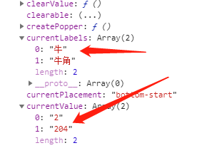
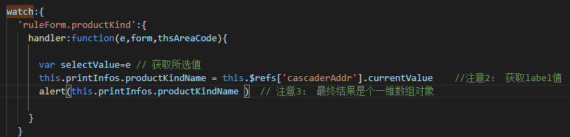

[TOC]


# vue 中获取下拉框的文本及选项值

原创andy5520 最后发布于2019-05-30 09:42:46 阅读数 3383  收藏
展开

## 方法1：

```html
<!-- element表单组件 -->
<el-form :model="ruleForm" label-position="right" ref="ruleForm"   status-icon size="small" inline :rules="rules" label-width="150px" class="demo-ruleForm"> 
  <el-form-item class="addProductA b" label="产品名称" prop="productKind">
    <!-- <el-input v-model.number="ruleForm.productKind" maxlength="11" :disabled="isScan" placeholder="请输入产品名称"></el-input> -->
    <el-cascader :options="productsDataOptions" v-model="ruleForm.productKind" :disabled="isScan" style="width:300px;" size="small" clearable placeholder="试试搜索：指南" filterable 
                 ref="cascaderAddr"   @change="handlerSelectProductsWithUnit" :show-all-levels="false"/>
  </el-form-item>
</el-form>
```

以上的Form 表单 及其嵌套的联级下拉框都被ref标记 之后形成了refs的组件集合

添加监视可以获取当前的refs集合中包含表单ruleForm及cascaderAddr 两个组件集合

下拉框所选择值value =v-model="ruleForm.productKind" 可以获取 或者使用

```js
var text=this.$refs['cascaderAddr'].currentLabels
var value =this.$refs['cascaderAddr'].currentValue
```





 

## 方法2：

给下拉框或者联级菜单下拉框定义id 

```js
this.printInfos.transportDate=document.getElementById('transportDate').value; // 下拉框取值方式

this.printInfos.productKindName=document.getElementById("productKind").innerText; // 文本框取值方式
```

 


原文链接：https://blog.csdn.net/andy5520/article/details/90691254