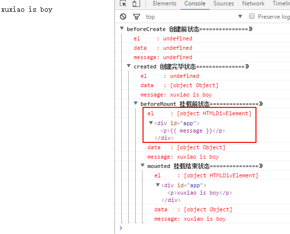
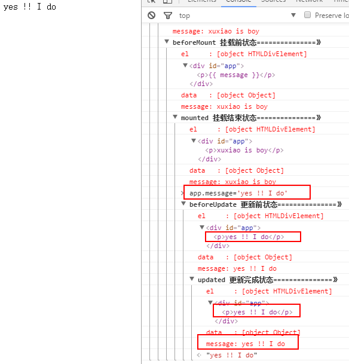
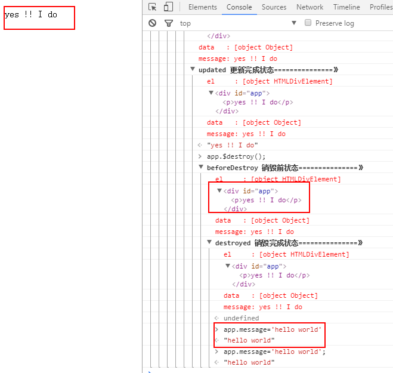

[TOC]


# Vue2.0 探索之路——生命周期和钩子函数的一些理解

## 前言

在使用vue一个多礼拜后，感觉现在还停留在初级阶段，虽然知道怎么和后端做数据交互，但是对于`mounted`这个挂载还不是很清楚的。放大之，对`vue`的生命周期不甚了解。只知道简单的使用，而不知道为什么，这对后面的踩坑是相当不利的。

因为我们有时候会在几个钩子函数里做一些事情，什么时候做，在哪个函数里做，我们不清楚。

于是我开始先去搜索，发现`vue2.0`的生命周期没啥文章。大多是`1.0`的版本介绍。最后还是找到一篇不错的（会放在最后）

## vue生命周期简介


咱们从上图可以很明显的看出现在`vue2.0`都包括了哪些生命周期的函数了。

## 生命周期探究

对于执行顺序和什么时候执行，看上面两个图基本有个了解了。下面我们将结合代码去看看钩子函数的执行。

> ps:下面代码可以直接复制出去执行

```html
<!DOCTYPE html>
<html lang="en">
<html>
<head>
    <meta charset="UTF-8">
    <title></title>
    <!--<script type="text/javascript" src="https://cdn.jsdelivr.net/vue/2.1.3/vue.js"></script>-->
    <script type="text/javascript" src="../assets/js/vue.js"></script>
</head>
<body>

<div id="app">
    <p>{{ message }}</p>
</div>

<script type="text/javascript">

    var app = new Vue({
        el: '#app',
        data: {
            message: "xuxiao is boy"
        },
        beforeCreate: function () {
            console.group('beforeCreate 创建前状态===============》');
            console.log("%c%s", "color:red", "el     : " + this.$el); //undefined
            console.log("%c%s", "color:red", "data   : " + this.$data); //undefined
            console.log("%c%s", "color:red", "message: " + this.message)
        },
        created: function () {
            console.group('created 创建完毕状态===============》');
            console.log("%c%s", "color:red", "el     : " + this.$el); //undefined
            console.log("%c%s", "color:red", "data   : " + this.$data); //已被初始化
            console.log("%c%s", "color:red", "message: " + this.message); //已被初始化
        },
        beforeMount: function () {
            console.group('beforeMount 挂载前状态===============》');
            console.log("%c%s", "color:red", "el     : " + (this.$el)); //已被初始化
            console.log(this.$el);
            console.log("%c%s", "color:red", "data   : " + this.$data); //已被初始化
            console.log("%c%s", "color:red", "message: " + this.message); //已被初始化
        },
        mounted: function () {
            console.group('mounted 挂载结束状态===============》');
            console.log("%c%s", "color:red", "el     : " + this.$el); //已被初始化
            console.log(this.$el);
            console.log("%c%s", "color:red", "data   : " + this.$data); //已被初始化
            console.log("%c%s", "color:red", "message: " + this.message); //已被初始化
        },
        beforeUpdate: function () {
            console.group('beforeUpdate 更新前状态===============》');
            console.log("%c%s", "color:red", "el     : " + this.$el);
            console.log(this.$el);
            console.log("%c%s", "color:red", "data   : " + this.$data);
            console.log("%c%s", "color:red", "message: " + this.message);
        },
        updated: function () {
            console.group('updated 更新完成状态===============》');
            console.log("%c%s", "color:red", "el     : " + this.$el);
            console.log(this.$el);
            console.log("%c%s", "color:red", "data   : " + this.$data);
            console.log("%c%s", "color:red", "message: " + this.message);
        },
        beforeDestroy: function () {
            console.group('beforeDestroy 销毁前状态===============》');
            console.log("%c%s", "color:red", "el     : " + this.$el);
            console.log(this.$el);
            console.log("%c%s", "color:red", "data   : " + this.$data);
            console.log("%c%s", "color:red", "message: " + this.message);
        },
        destroyed: function () {
            console.group('destroyed 销毁完成状态===============》');
            console.log("%c%s", "color:red", "el     : " + this.$el);
            console.log(this.$el);
            console.log("%c%s", "color:red", "data   : " + this.$data);
            console.log("%c%s", "color:red", "message: " + this.message)
        }
    })
</script>
</body>
</html>
```

### create 和 mounted 相关

咱们在`chrome`浏览器里打开，`F12`看`console`就能发现

> beforecreated：el 和 data 并未初始化 
> created:完成了 data 数据的初始化，el没有
> beforeMount：完成了 el 和 data 初始化 
> mounted ：完成挂载
>
> 另外在标红处，我们能发现el还是 {{message}}，这里就是应用的 `Virtual DOM`（虚拟Dom）技术，先把坑占住了。到后面`mounted`挂载的时候再把值渲染进去。



### update 相关

这里我们在 chrome console里执行以下命令

```
app.message= 'yes !! I do';
```

下面就能看到data里的值被修改后，将会触发update的操作。



### destroy 相关

有关于销毁，暂时还不是很清楚。我们在console里执行下命令对 vue实例进行销毁。销毁完成后，我们再重新改变message的值，vue不再对此动作进行响应了。但是原先生成的dom元素还存在，可以这么理解，执行了destroy操作，后续就不再受vue控制了。

```
app.$destroy();
```



## 生命周期总结

这么多钩子函数，我们怎么用呢，我想大家可能有这样的疑问吧，我也有，哈哈哈。

> `beforecreate` : 举个栗子：可以在这加个loading事件 
> `created` ：在这结束loading，还做一些初始化，实现函数自执行 
> `mounted` ： 在这发起后端请求，拿回数据，配合路由钩子做一些事情
> `beforeDestroy`： 你确认删除XX吗？ destroyed ：当前组件已被删除，清空相关内容

当然，还有更多，继续探索中......

## 写在最后

本文是一个vue的生命周期的理解，如有错误还请大牛指正，让小子也有得进步。
如果对你有所帮助，那是我最大的荣幸。

对了，兄台，对你有帮助的话不妨点个收藏或者推荐再走。 

## 参考文献

> [https://segmentfault.com/q/10...](https://segmentfault.com/q/1010000007704114?_ea=1431323)
> [http://www.cnblogs.com/gagag/...](http://www.cnblogs.com/gagag/p/6246493.html)

感谢上面几位兄台的文章和提问。

> 另外新写了篇 `vuex` 的文章，欢迎各位给点意见。传送门：[Vue2.0 探索之路——vuex入门教程和思考](https://segmentfault.com/a/1190000008861913)
>
> 新写了篇 `vue-router`的文章，也欢迎各位给点意见。传送门:[Vue2.0 探索之路——vue-router入门教程和总结](https://segmentfault.com/a/1190000009651628)
>
> **最近更新文章:**
> [**Node环境变量 process.env 的那些事儿**](https://segmentfault.com/a/1190000011683741?_ea=2727402)


https://segmentfault.com/a/1190000008010666