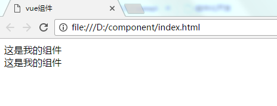
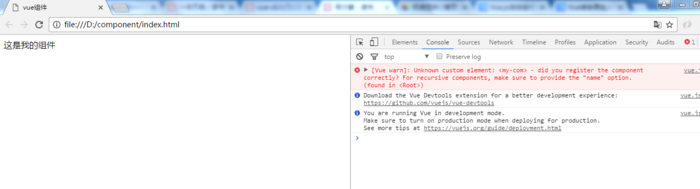
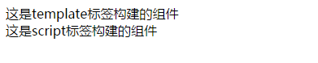
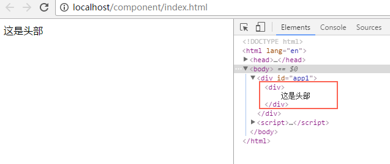

[TOC]


# vue.js原生组件化开发（一）——组件开发基础

# 前言

vue作为一个轻量级前端框架，其核心就是组件化开发。我们一般常用的是用脚手架vue-cli来进行开发和管理，一个个组件即为一个个vue页面，这种叫单文件组件。我们在引用组件之时只需将组件页面引入，再注册即可使用。那么不用脚手架，如何进行组件开发呢，本文先介绍一下基础知识吧。

# 组件使用流程

## 1.组件构建

### 1.1 extend构建法

调用Vue.extend()方法，构建一个名字为myCom的组件

```
var myCom = Vue.extend({
    template: '<div>这是我的组件</div>'
})
```

其中template定义模板的标签，模板的内容需写在该标签下

### 1.2 template标签构建法

template标签构建，需在标签上加id属性用以后期注册

```
<template id="myCom">
    <div>这是template标签构建的组件</div>
</template>
```

### 1.3 script标签构建法

script标签同样需加id属性，同时还得加type="text/x-template"，加这个是为了告诉浏览器不执行编译里面的代码

```
<script type="text/x-template" id="myCom1">
    <div>这是script标签构建的组件</div>
</script>
```

## 2.注册组件

**（1）全局注册：**一次注册，可在多个vue实例中使用，需调用Vue.component()方法，这个方法需传2个参数，第一个参数为组件名称，第二个参数为组件构造时定义的变量。

我们先用全局注册注册上面例子中创建的myCom组件

```
Vue.component('my-com',myCom)
```

**还有一种不需构建直接注册的写法——注册语法糖**

```
Vue.component('my-com',{
    'template':'<div>这是我的组件</div>'
})
```

'my-com'为给组件自定义的名字，在使用时会用到，后面myCom对应的就是上面构建的组件变量。

> 注意命名规范，一般组件名字以短横线分隔或一个小写单词。
> 例：footer-nav，footernav

如果是用template及script标签构建的组件，第二个参数就改为它们标签上的id值

```
Vue.component('my-com',{
    template: '#myCom'
})
```

**（2）局部注册：**只能在注册该组件的实例中使用

```
var app = new Vue({
    el: '#app',
    components: {
        'my-com': myCom
    }
})
```

**注册语法糖**

```js
var app = new Vue({
    el: '#app',
    components: {
        'my-com': {
           template: '<div>这是我的组件</div>'
        }
    }
})
```

**template及script构建的组件**

```js
var app = new Vue({
    el: '#app',
    components: {
        'my-com': {
           template: '#myCom'
        }
    }
})
```

## 3.调用组件

我们只需在需要调用组件的地方写上组件名字的标签即可

```
<div>
    /*调用组件*/
    <my-com></my-com>
</div>
```

## 4.例子

### 4.1 全局注册

新建一个html文件，引入vue.js，并且定义2个vue实例app1和app2

```Html
<!DOCTYPE html>
<html lang="en">
<head>
    <meta charset="UTF-8">
    <title>vue组件</title>
    <script src="js/vue.js"></script>
</head>
<body>
    <div id="app1">
        <my-com></my-com>
    </div>
    <div id="app2">
        <my-com></my-com>
    </div>

    <script>
        /*构建组件*/
        var myCom = Vue.extend({
            template: '<div>这是我的组件</div>'
        });
        /*全局注册组件*/
        Vue.component('my-com',myCom);

        /*定义vue实例app1*/
        var app1 = new Vue({
            el: '#app1'
        });

        /*定义vue实例app2*/
        var app2 = new Vue({
            el: '#app2'
        });
    </script>
</body>
</html>
```

打开浏览器查看效果



可以看到全局注册的组件在实例app1和实例app2中都可以被调用

> 一次注册，多处使用

### 4.2 局部注册

修改上面例子的html代码，将全局注册的组件改为局部注册，注册到实例app1下

```html
<!DOCTYPE html>
<html lang="en">
<head>
    <meta charset="UTF-8">
    <title>vue组件</title>
    <script src="js/vue.js"></script>
</head>
<body>
    <div id="app1">
        <my-com></my-com>
    </div>
    <div id="app2">
        <my-com></my-com>
    </div>

    <script>
        var myCom = Vue.extend({
            template: '<div>这是我的组件</div>'
        });

        // Vue.component('my-com',myCom);
        /*局部注册组件*/
        var app1 = new Vue({
            el: '#app1',
            components:{
                'my-com':myCom
            }
        });

        var app2 = new Vue({
            el: '#app2'
        });
    </script>
</body>
</html>
```

打开浏览器查看效果



可以看到只渲染了app1实例下的组件，app2实例虽然调用了该组件，但是因为这个组件没有在其内部注册，也没有全局注册，所以报错说找不到该组件。

> 一次注册，一处使用

### 4.3 template及script标签构建组件

```html
<!DOCTYPE html>
<html lang="en">
<head>
    <meta charset="UTF-8">
    <title>vue组件</title>
    <script src="js/vue.js"></script>
</head>
<body>
    <div id="app1">
        <my-com></my-com>
        <my-com1></my-com1>
    </div>

    <template id="myCom">
        <div>这是template标签构建的组件</div>
    </template>

    <script type="text/x-template" id="myCom1">
        <div>这是script标签构建的组件</div>
    </script>

    <script>
        Vue.component('my-com1',{
            template: '#myCom1'
        });

        var app1 = new Vue({
            el: '#app1',
            components:{
                'my-com':{
                    template: '#myCom'
                }
            }
        });
    </script>
</body>
</html>
```

打开浏览器查看效果



# 异步组件

当项目比较大型，结构比较复杂时，我们一般选用vue-cli脚手架去构建项目。因为vue-cli集成了webpack环境，使用单文件组件，开发更简单，易上手，尤其是在对组件的处理上。对于原生vue.js，我们就得将组件构建在同一个html的script标签下或者html的外部js中，所有组件集中在一块，不容易管理，这也是原生vue,js的一点不便之处。
当然，在不使用脚手架的情况下想将一个个组件分别独立成一个个html文件，再去引用注册它们，也是可以实现的，但一般不推荐这样做。
vue.js可以将异步组件定义为一个工厂函数。
**例子**
新建一个head.html

```
<div>
    这是头部
</div>
```

在index.html中异步引入head.html作为组件

```Html
<!DOCTYPE html>
<html lang="en">
<head>
    <meta charset="UTF-8">
    <title>vue组件</title>
    <script src="js/vue.js"></script>
    <script src="js/jquery.min.js"></script>
</head>
<body>
    <div id="app1">
        <head-com></head-com>
    </div>
    <script>
        Vue.component('head-com', function (resolve, reject) {
            $.get("./head.html").then(function (res) {
                resolve({
                    template: res
                })
            });
        });

        var app1 = new Vue({
            el: '#app1'
        });

    </script>
</body>
</html>
```

> 当然要注意一点，使用$.get获取本地文件是会跨域的，所以我们要把项目部署到服务器环境中。

我这里用的是xampp集成环境，将项目文件夹component放置在xampp/htdocs下，然后访问localhost/component/index.html，
效果如下



可以看到在index.html中引入的head.html里的内容已经被添加进去


https://www.jianshu.com/p/3504a1edba42