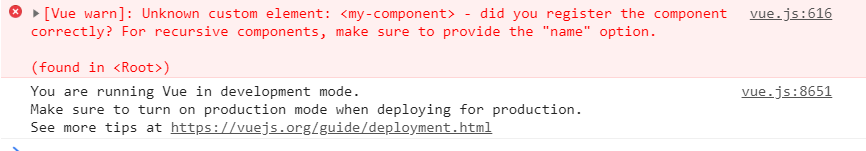
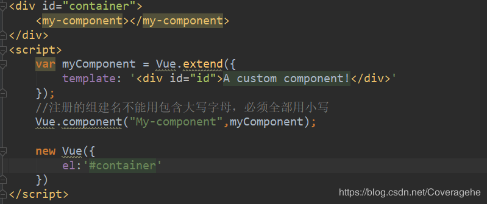

# Vue注册组件名称大小写之坑

今天在项目中用到了vue,但是不是按照webpack组建化形式开发的，只能按照在全局引入vue.js这种方式进行开发，但是在注册组建的时候发生了错误，一直找不出问题所在，错误信息如下：

我的代码如下：

通过报的错误发现我注册的组建名和报错的组建名不一致，报错的组建名全是小写(my-component)，而我注册的组建名中包含大写字母（My-component），从而在编译的时候找不到组建，发生了错误，因此在注册组建名时不能时候大写名称，必须全部使用小写。

https://blog.csdn.net/Coveragehe/article/details/86538162