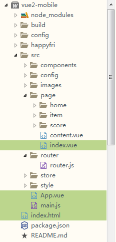
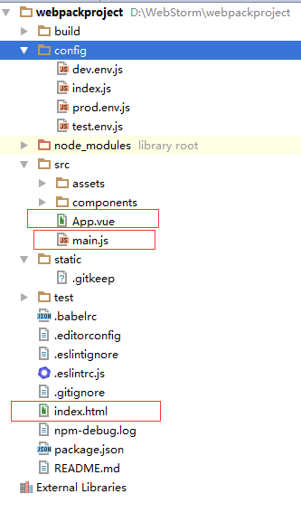

# vue.js项目main.js、App.vue、page/index.vue的引用调用关系是怎样的?

## 问题

问题对人有帮助，内容完整，我也想知道答案0问题没有实际价值，缺少关键内容，没有改进余地



问题如下：

- vue.js项目的入口文件是`index.html`还是`App.vue`文件？入口文件关联`main.js`和`router.js`等文件的引用/调用关系是怎么样的？
- 运行`npm run dev`后，过程中读取了哪些文件，经过了哪些步骤后，最终访问到入口文件？

（本人初学`Vue.js`，对`webpack`也不是很熟悉，希望各位大神多多指教！）

## 回答



1. main.js 是我们的入口文件，主要作用是初始化vue实例并使用需要的插件

```js
import Vue from 'vue'
import App from './App'

/* eslint-disable no-new */
new Vue({
  el: '#app',
  template: '<App/>',
  components: { App }
})
```

1. App.vue是我们的主组件，所有页面都是在App.vue下进行切换的。其实你也可以理解为所有的路由也是App.vue的子组件。所以我将router标示为App.vue的子组件。

```vue
<template>
  <div id="app">
    
    <hello></hello>
  </div>
</template>

<script>
import Hello from './components/Hello'

export default {
  name: 'app',
  components: {
    Hello
  }
}
</script>

<style>
#app {
  font-family: 'Avenir', Helvetica, Arial, sans-serif;
  -webkit-font-smoothing: antialiased;
  -moz-osx-font-smoothing: grayscale;
  text-align: center;
  color: #2c3e50;
  margin-top: 60px;
}
</style>
```

1. index.html文件入口
2. src放置组件和入口文件
3. node_modules为依赖的模块
4. config中配置了路径端口值等
5. build中配置了webpack的基本配置、开发环境配置、生产环境配置等


https://segmentfault.com/q/1010000008863946