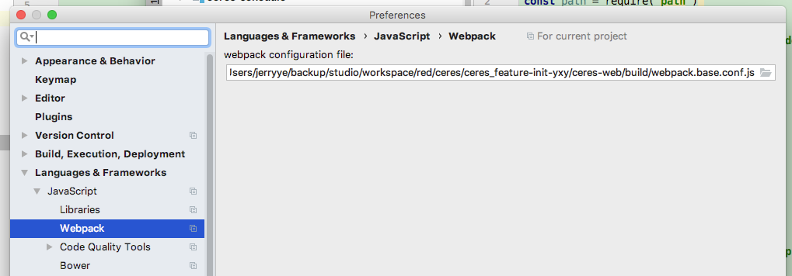

# idea 识别webpackage配置  vue @路径识别

webpack4 配置路径:

/Users/jerryye/backup/studio/AvailableCode/web/javascript/vue/vue2_webpack_demo/node_modules/@vue/cli-service/webpack.config.js

webpack3 配置路径:

/Users/jerryye/backup/studio/workspace/red/ceres/ceres_feature-init-yxy/ceres-web/build/webpack.base.conf.js

