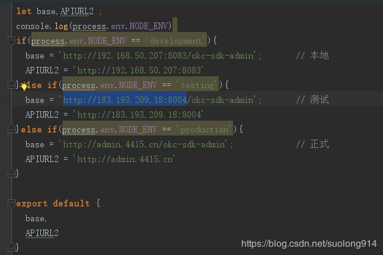

[TOC]


# vue项目通过cross-env配置三种环境(开发，测试，生产)打包


**- 安装**

```
npm install cross-env -D
```

**- 修改config 里面的参数，这里只展示一个test,其他类似**

```
'use strict'
const merge = require('webpack-merge')
const prodEnv = require('./prod.env')

module.exports = merge(prodEnv, {
  ENV_CONFIG: '"dev"'
})

```

**注意单双引号**

**- 修改package.json 文件**

```
  "scripts": {
    "dev": "webpack-dev-server --inline --progress --config build/webpack.dev.conf.js",
    "start": "npm run dev",
    "lint": "eslint --ext .js,.vue src",
    "build": "cross-env env_config=prod node build/build.js",
    "build:test": "cross-env env_config=test node build/build.js",
    "build:dev": "cross-env env_config=dev node build/build.js",
    "build:prod": "cross-env env_config=prod node build/build.js"
  },
```

注意去掉原有的build，NODE_ENV最好都设成production，因为在utils.js只做了production一种判定，有人已亲测不影响各环境API参数

**- config/index.js （如果用到vue-resource,第四步和第七步可以省略，它会自动匹配域名配置）**

```
  build: {
    devEnv:require('./dev.env.js'),
    testEnv:require('./test.env.js'),
    prodEnv:require('./prod.env.js'),
    // Template for index.html
    index: path.resolve(__dirname, '../dist/index.html'),
```

**- 在webpack.prod.conf.js中使用构建环境参数**

```
//<editor-fold desc="获取环境配置">
// const env = require('../config/prod.env')
let env
let envConfig = process.env.env_config
if (envConfig === 'dev'){
  env = require('../config/dev.env')
} else if (envConfig === 'test'){
  env = require('../config/test.env')
}else {
  env = require('../config/prod.env')
}
console.log(process.env.env_config)
//</editor-fold>
```

**- 调整build/build.js**

```
// const spinner = ora('building for production...')
var spinner = ora('building for ' + process.env.NODE_ENV + ' of ' + process.env.env_config+ ' mode...' )
spinner.start()
```

**- 怎么使用到不同的api呢？**

```
console.log(process.env.ENV_CONFIG)
```



代码github地址：<https://github.com/lixinchao0914/test-cross-env>


https://blog.csdn.net/suolong914/article/details/85681900