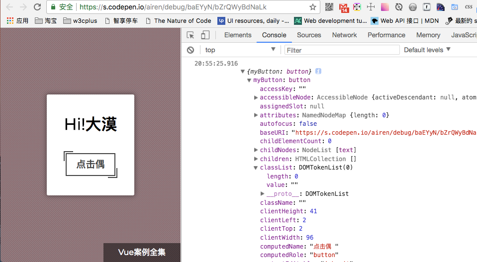
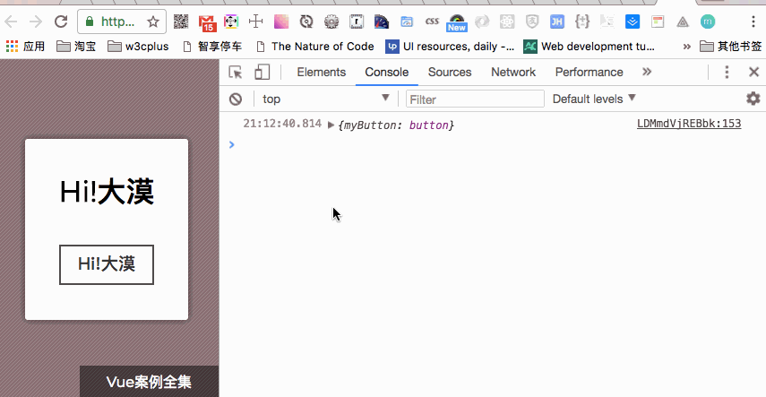
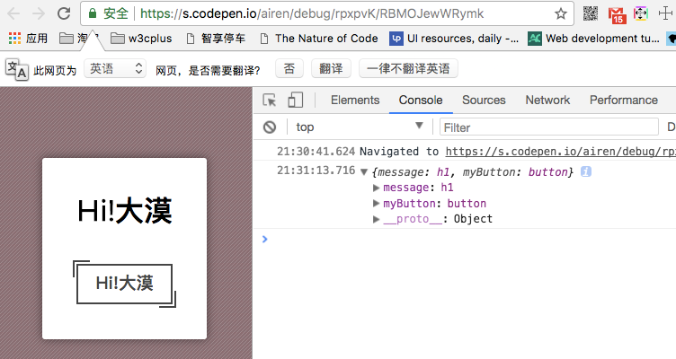
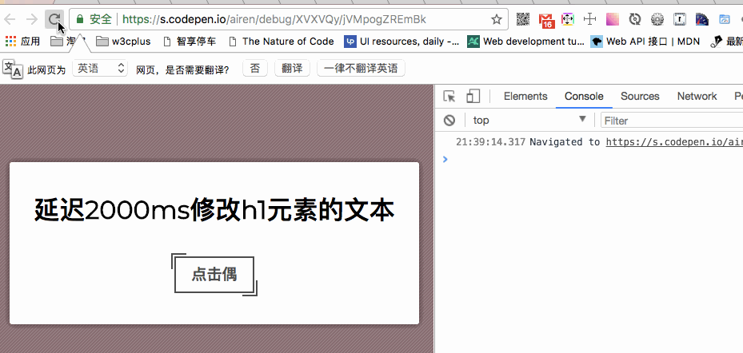
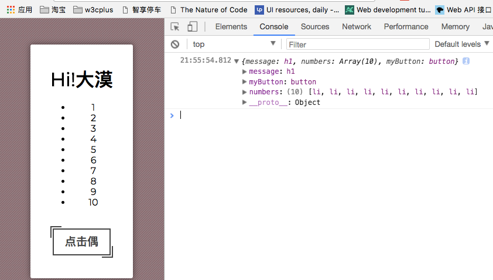
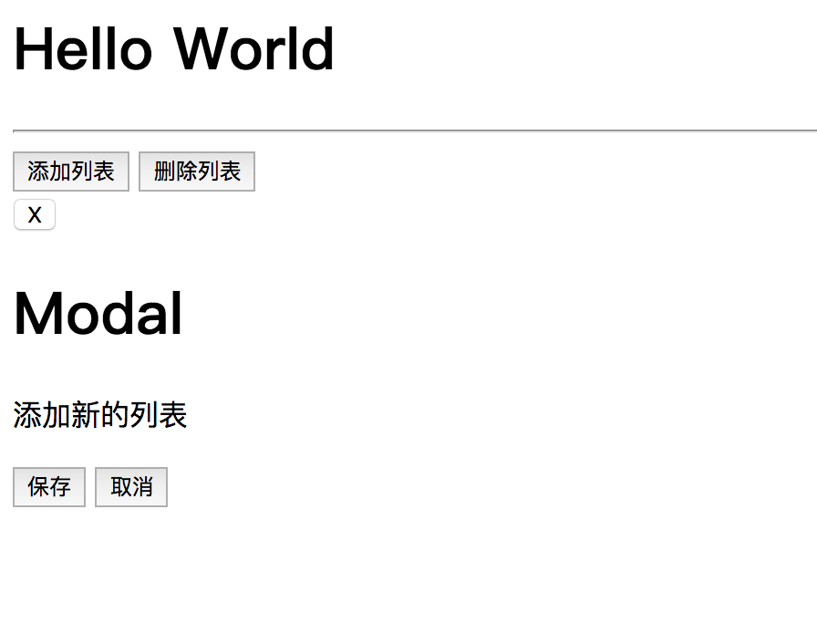

[TOC]


# Vue 2.0学习笔记：使用$refs访问Vue中的DOM

/Users/jerryye/backup/studio/AvailableCode/web/javascript/vue/vue2_orgi_demo/example/$refs

通过前面对Vue的学习，到现在我们很有必要进一步了解Vue实例中的一些特殊的属性和方法。首先要了解的是`$refs`属性。但是在深入到JavaScript部分之前，我们先看看模板。

```html
<div id="app">
    <h1>{{ message }}</h1>
    <button @click="clickedButton">点击偶</button>
</div>

let app = new Vue({
    el: '#app',
    data () {
        return {
            message: 'Hi，大漠！'
        }
    },
    methods: {
        clickedButton: function () {
            console.log('Hi,大漠！')
        }
    }
})
```

在Vue的模板中，我们可以在模板中的任何元素中添加`ref`属性，这样就可以在Vue实例中引用这些元素。更具体地说，可以访问DOM元素。在上面的示例中的`<button>`中添加`ref`属性试试。这个按钮上已有绑定了一个`click`事件，这个事件让我们在浏览器的控制面板中打印出`Hi, 大漠！`信息。

```
<button ref="myButton" @click="clickedButton">点击偶</button>
```

注意，`ref`属性不是一个标准的HTML属性，只是Vue中的一个属性。实际上，它甚至不会是DOM的一部分，所以在浏览器中你查看渲染的HTML，你是看不到有关于`ref`的任何东西。因为在它前面没有添加`:`，而且它也不是一个指令。

在Vue实例上使用`$refs`属性可以通过`myButton`来引用这个按钮。来看看在浏览器的控制台中打印出来，它将是什么样子。

```Js
let app = new Vue({
    el: '#app',
    data () {
        return {
            message: 'Hi!大漠'
        }
    },
    methods: {
        clickedButton: function () {
            console.log(this.$refs);
        }
    }
})
```

如果你打开浏览器的控制台，我们可以看到这个属性是一个JavaScript的对象，它包含了`ref`属性的所有元素的引用。



注意，这个对象中的键名（`key`）与我们在`ref`属性中指定的名称（`name`）相匹配，而其值（`value`）是DOM元素。在这种情况下，我们可以看到键名是`myButton`，而其值是`button`元素。而且这也和Vue没有任何关系。

所以在Vue中，可以通过在`$refs`对象上访问`ref`的名称来访问DOM元素。来看下面这个示例。我们点击按钮后，这个按钮的文本将会更改`message`数据中的值。

```js
let app = new Vue({
    el: '#app',
    data () {
        return {
            message: 'Hi!大漠'
        }
    },
    methods: {
        clickedButton: function () {
            console.log(this.$refs)
            this.$refs.myButton.innerText = this.message
        }
    }
})
```

点击按钮之后，按钮的文本将更改变“**Hi,!大漠**”：



当然，我们也可以通过使用查询选择器来访问DOM元素来实现这样的效果，但是使用`ref`属性更简洁，而且这也是Vue中的方法。它也将更安全，因为你不会依赖于`class`和`id`。因此，几乎不会因为更改了HTML的标签或者CSS样式受到影响。

**像Vue这样的JavaScript框架的主要目的之一就是让开发人员不必去处理DOM**。所以你应该避免去做这样的事情，除非你真的需要去做。还应该要注意一个潜在的问题。

首先来看一个简单的示例，给`h1`元素添加一个`ref`属性。

```
<div id="app">
    <h1 ref="message">{{ message }}</h1>
    <button ref="myButton" @click="clickedButton">点击偶</button>
</div>
```

当我们点击按钮之后，浏览器控制台输出的值将会得到改变：



由于我们把Vue的实例赋值值了变量`app`，所以我们可以继续使用它。现在要做的是改变元素的文本。最初`<h1>`元素的内容是`message`的值，在下面这个示例中，通过一个`setTimeout`来看看元素`<h1>`发生的变化：

```js
let app = new Vue({
    el: '#app',
    data () {
        return {
            message: 'Hi!大漠'
        }
    },
    methods: {
        clickedButton: function () {
            console.log(this.$refs);
            this.$refs.myButton.innerText = this.message
        }
    }
})

setTimeout(function() {
    app.$refs.message.innerText = '延迟2000ms修改h1元素的文本';
}, 2000);
```



正如你所看到的，我们在更新数据属性时覆盖了我们对DOM所做的更改。这样做的原因是，当访问DOM元素并直接操作它们时，实际上跳过了前面文章中讨论到的虚拟DOM。因此，Vue仍然控制着`h1`元素，甚至当Vue对数据中的做出更新时，它会更新虚拟DOM，然后更新DOM本身。因此，你应该小心使用对DOM的直接更改，就算是你不小心做了相应的修改，你所做的任何更改都将可能会被覆盖。虽然在使用`refs`时应该小心更改DOM，但是做只读操作相对来说比较安全，比如从DOM中读取值。

另外来看看`v-for`指令中使用`refs`属性的效果。比如下面这个示例，给一个无序列表`ul`，通过`v-for`指令输出`1`至`10`的数字。

```
<ul>
    <li v-for="n in 10" ref="numbers">{{ n }}</li>
</ul>
```

当你点击按钮时，`$refs`属性将在浏览器控制台中输出：



正如上图所看到的一样，把`numbers`属性添加到了对象中，但需要注意该值的类型。与之前看到的DOM元素不同，它实际上是一个数组，一个DOM元素的数组。当使用`ref`属性和`v-for`指令时，Vue会迭代所有DOM元素，并将它们放置在数组中。在这种情况下，这就输出了`10`个`li`的DOM元素的数组，因为我们迭代了`10`次。每个元素都可以像我们之前看到的那样使用。

上面通过简单的示例了解了Vue中的`$refs`在Vue中是怎么访问到DOM元素的。接下来看一个简单的示例。

在Web中Modal组件是经常可见的一个组件。来看看`$refs`怎么来来控制Modal的打开和关闭。

```html
<!DOCTYPE html>
<html lang="en">
<head>
    <meta charset="UTF-8">
    <script type="text/javascript" src="../../assets/js/vue.js"></script>
    <title>Helloworld</title>
</head>
<body>
<h1>Hello World</h1>
<hr>
<div id="app">
    <div class="actions">
        <button @click="toggleModal('new-item')">添加列表</button>
        <button @click="toggleModal('confirm')">删除列表</button>
    </div>

    <modal ref="new-item">
        <p>添加新的列表</p>
        <div slot="actions">
            <button>保存</button>
            <button>取消</button>
        </div>
    </modal>
    <modal ref="confirm">
        <p>删除列表？</p>
        <div slot="actions">
            <button>删除</button>
            <button>取消</button>
        </div>
    </modal>

    <script type="x-template" id="modal-template">
        <transition name="modal-toggle">
            <div class="modal" v-show="toggle">
                <button class="modal__close" @click="close">X</button>
                <div class="modal__body">
                    <h1>Modal</h1>
                    <slot>这是一个Modal，是否需要添加新的内容?</slot>
                </div>
                <div class="modal__actions">
                    <slot name="actions">
                        <button @click="close">关闭</button>
                    </slot>
                </div>
            </div>
        </transition>
    </script>
</div>

<script type="text/javascript">
    let Modal = Vue.component('modal', {
        template: "#modal-template",
        data() {
            return {
                toggle: false
            }
        },
        methods: {
            close: function () {
                this.toggle = false;
            }
        }
    });
    let app = new Vue({
        el: "#app",
        methods: {
            toggleModal(modal) {
                this.$refs[modal].toggle = !this.$refs[modal].toggle;
            }
        }
    });
</script>
</body>
</html>
```

效果如下：




如需转载，烦请注明出处：<https://www.w3cplus.com/vue/accessing-dom-refs.html>

著作权归作者所有。

商业转载请联系作者获得授权,非商业转载请注明出处。

原文: 

https://www.w3cplus.com/vue/accessing-dom-refs.html

 

 