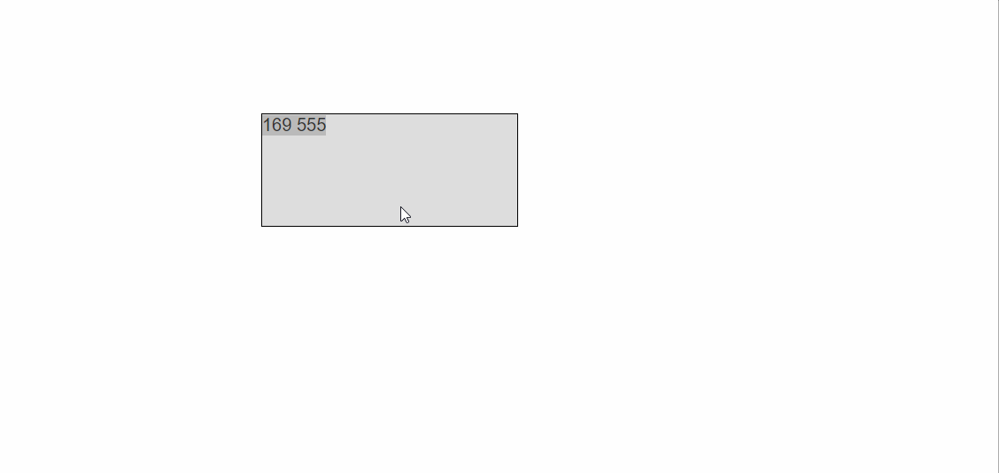
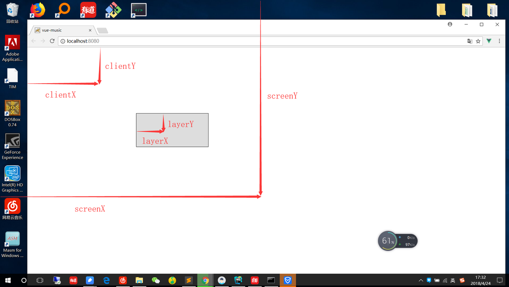
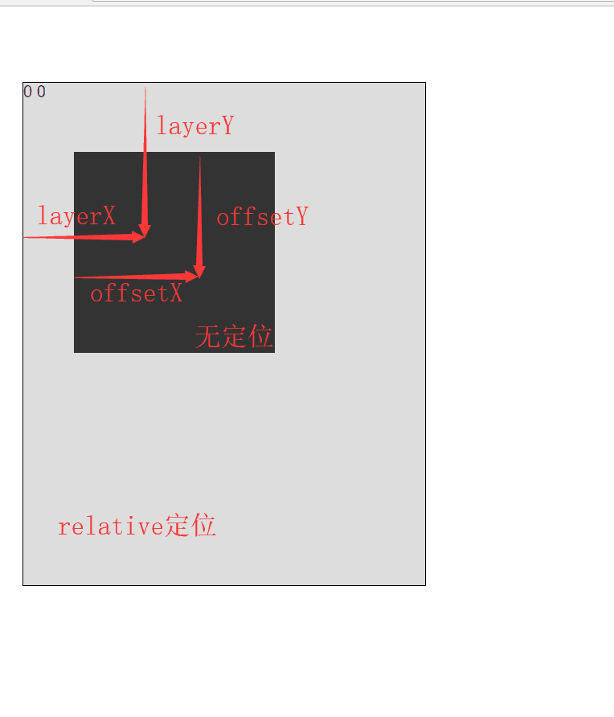

[TOC]


# vue实现拖拽效果

## 效果图



## 分清clientY pageY screenY layerY offsetY的区别

在我们想要做出拖拽这个效果的时候，我们需要分清这几个属性的区别，这几个属性都是计算鼠标点击的偏移值，我们需要对其进行了解才可以继续实现我们的拖拽效果

- clientY 指的是距离可视页面左上角的距离
- pageY 指的是距离可视页面左上角的距离(不受页面滚动影响)
- screenY 指的是距离屏幕左上角的距离
- layerY 指的是找到它或它父级元素中最近具有定位的左上角距离
- offsetY 指的是距离它自己左上角的距离

一张图带大家简单了解了解



在我们简单了解完这些个属性以后，有几个属性需要分清。

|         | 相同点               | 不同点           |
| ------- | -------------------- | ---------------- |
| clientY | 距离页面左上角距离   | 受页面滚动的影响 |
| pageY   | 距离页面左上角的距离 | 不受页面滚动影响 |

|         | 相同点               | 不同点                                                       |
| ------- | -------------------- | ------------------------------------------------------------ |
| layerY  | 距离元素的左上角距离 | 受元素的定位的影响，会从本元素往上找到第一个定位的元素的左上角 |
| offsetY | 距离元素左上角的距离 | 计算相对于本元素的左上角，不在乎定位问题，计算的是内交点。是IE浏览器的特有属性 |



## 实现拖拽功能

我们既然熟悉了这几个偏移属性的意思，那么我们就进入我们的重点。话不多说直接上代码

```vue
// darg.html

<style>
    #app{
        position: relative;     /*定位*/
        top: 10px;
        left: 10px;
        width: 200px;
        height: 200px;
        background: #666;       /*设置一下背景*/
    }
</style>
<body>
    <div id="app" @mousedown="move">       <!--绑定按下事件-->
        {{positionX}}
        {{positionY}}
    </div>
</body>
//main.js
let app = new Vue({
    el:'#app',
    data:{
        positionX:0,
        positionY:0,
    },
    methods:{
        move(e){
            let odiv = e.target;        //获取目标元素
            
            //算出鼠标相对元素的位置
            let disX = e.clientX - odiv.offsetLeft;
            let disY = e.clientY - odiv.offsetTop;
            document.onmousemove = (e)=>{       //鼠标按下并移动的事件
                //用鼠标的位置减去鼠标相对元素的位置，得到元素的位置
                let left = e.clientX - disX;    
                let top = e.clientY - disY;
                
                //绑定元素位置到positionX和positionY上面
                this.positionX = top;
                this.positionY = left;
                
                //移动当前元素
                odiv.style.left = left + 'px';
                odiv.style.top = top + 'px';
            };
            document.onmouseup = (e) => {
                document.onmousemove = null;
                document.onmouseup = null;
            };
        }    
    
    },
    computed:{},
});
```

当然，我们可以将它绑定为一个自定义指令，这样的话就可以用调用指令的形式来实现拖拽效果，下面是定义自定义指令的代码

```js
// darg.html

<style>
    #app{
        position: relative;     /*定位*/
        top: 10px;
        left: 10px;
        width: 200px;
        height: 200px;
        background: #666;       /*设置一下背景*/
    }
</style>
<body>
    <div id="app" v-drag>       <!--实现用指令形式实现拖拽效果-->
        
    </div>
</body>
//main.js

let app = new Vue({
    el:'#app',
    data:{},
    methods:{},
    directives: {
        drag: {
            // 指令的定义
            bind: function (el) {
                let odiv = el;   //获取当前元素
                oDiv.onmousedown = (e) => {
                    //算出鼠标相对元素的位置
                    let disX = e.clientX - odiv.offsetLeft;
                    let disY = e.clientY - odiv.offsetTop;
                    
                    document.onmousemove = (e)=>{
                        //用鼠标的位置减去鼠标相对元素的位置，得到元素的位置
                        let left = e.clientX - disX;    
                        let top = e.clientY - disY;
                      
                        //绑定元素位置到positionX和positionY上面
                        this.positionX = top;
                        this.positionY = left;
                
                        //移动当前元素
                        odiv.style.left = left + 'px';
                        odiv.style.top = top + 'px';
                    };
                    document.onmouseup = (e) => {
                        document.onmousemove = null;
                        document.onmouseup = null;
                    };
                };
            }
        }
    }
});
```

## 最后

到这里我们就已经把拖拽效果用Vue实现了，我们用了两种不同的方式实现了拖拽，但实际上换汤不换药，我们需要弄清楚pageY、screenY、clientY、layerY、offsetY等区别。当然我们同时也学习了Vue的一些方法，例如自定义指令等。

成功不在一朝一夕间，我们都需要努力

原创文章，转载需联系


https://segmentfault.com/a/1190000014572113