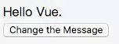
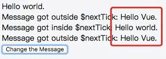
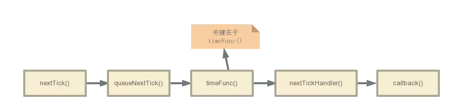

[TOC]


# 简单理解Vue中的nextTick

> Vue中的`nextTick`涉及到Vue中DOM的异步更新，感觉很有意思，特意了解了一下。其中关于`nextTick`的源码涉及到不少知识，很多不太理解，暂且根据自己的一些感悟介绍下`nextTick`。

## 一、示例

先来一个示例了解下关于Vue中的DOM更新以及`nextTick`的作用。

**模板**

```html
<div class="app">
  <div ref="msgDiv">{{msg}}</div>
  <div v-if="msg1">Message got outside $nextTick: {{msg1}}</div>
  <div v-if="msg2">Message got inside $nextTick: {{msg2}}</div>
  <div v-if="msg3">Message got outside $nextTick: {{msg3}}</div>
  <button @click="changeMsg">
    Change the Message
  </button>
</div>
```

**Vue实例**

```js
new Vue({
  el: '.app',
  data: {
    msg: 'Hello Vue.',
    msg1: '',
    msg2: '',
    msg3: ''
  },
  methods: {
    changeMsg() {
      this.msg = "Hello world."
      this.msg1 = this.$refs.msgDiv.innerHTML
      this.$nextTick(() => {
        this.msg2 = this.$refs.msgDiv.innerHTML
      })
      this.msg3 = this.$refs.msgDiv.innerHTML
    }
  }
})
```

**点击前**



**点击后**



从图中可以得知：msg1和msg3显示的内容还是变换之前的，而msg2显示的内容是变换之后的。其根本原因是因为Vue中DOM更新是异步的（详细解释在后面）。

## 二、应用场景

下面了解下`nextTick`的主要应用的场景及原因。

- 在Vue生命周期的`created()`钩子函数进行的DOM操作一定要放在`Vue.nextTick()`的回调函数中

在`created()`钩子函数执行的时候DOM 其实并未进行任何渲染，而此时进行DOM操作无异于徒劳，所以此处一定要将DOM操作的js代码放进`Vue.nextTick()`的回调函数中。与之对应的就是`mounted()`钩子函数，因为该钩子函数执行时所有的DOM挂载和渲染都已完成，此时在该钩子函数中进行任何DOM操作都不会有问题 。

- 在数据变化后要执行的某个操作，而这个操作需要使用随数据改变而改变的DOM结构的时候，这个操作都应该放进`Vue.nextTick()`的回调函数中。

具体原因在Vue的官方文档中详细解释：

> Vue 异步执行 DOM 更新。只要观察到数据变化，Vue 将开启一个队列，并缓冲在同一事件循环中发生的所有数据改变。如果同一个 watcher 被多次触发，只会被推入到队列中一次。这种在缓冲时去除重复数据对于避免不必要的计算和 DOM 操作上非常重要。然后，在下一个的事件循环“tick”中，Vue 刷新队列并执行实际 (已去重的) 工作。Vue 在内部尝试对异步队列使用原生的 `Promise.then` 和`MessageChannel`，如果执行环境不支持，会采用 `setTimeout(fn, 0)`代替。

> 例如，当你设置`vm.someData = 'new value'`，该组件不会立即重新渲染。当刷新队列时，组件会在事件循环队列清空时的下一个“tick”更新。多数情况我们不需要关心这个过程，但是如果你想在 DOM 状态更新后做点什么，这就可能会有些棘手。虽然 Vue.js 通常鼓励开发人员沿着“数据驱动”的方式思考，避免直接接触 DOM，但是有时我们确实要这么做。为了在数据变化之后等待 Vue 完成更新 DOM ，可以在数据变化之后立即使用`Vue.nextTick(callback)` 。这样回调函数在 DOM 更新完成后就会调用。

## 三、`nextTick`源码浅析

**作用**

`Vue.nextTick`用于延迟执行一段代码，它接受2个参数（回调函数和执行回调函数的上下文环境），如果没有提供回调函数，那么将返回`promise`对象。

**源码**

```js
/**
 * Defer a task to execute it asynchronously.
 */
export const nextTick = (function () {
  const callbacks = []
  let pending = false
  let timerFunc

  function nextTickHandler () {
    pending = false
    const copies = callbacks.slice(0)
    callbacks.length = 0
    for (let i = 0; i < copies.length; i++) {
      copies[i]()
    }
  }

  // the nextTick behavior leverages the microtask queue, which can be accessed
  // via either native Promise.then or MutationObserver.
  // MutationObserver has wider support, however it is seriously bugged in
  // UIWebView in iOS >= 9.3.3 when triggered in touch event handlers. It
  // completely stops working after triggering a few times... so, if native
  // Promise is available, we will use it:
  /* istanbul ignore if */
  if (typeof Promise !== 'undefined' && isNative(Promise)) {
    var p = Promise.resolve()
    var logError = err => { console.error(err) }
    timerFunc = () => {
      p.then(nextTickHandler).catch(logError)
      // in problematic UIWebViews, Promise.then doesn't completely break, but
      // it can get stuck in a weird state where callbacks are pushed into the
      // microtask queue but the queue isn't being flushed, until the browser
      // needs to do some other work, e.g. handle a timer. Therefore we can
      // "force" the microtask queue to be flushed by adding an empty timer.
      if (isIOS) setTimeout(noop)
    }
  } else if (!isIE && typeof MutationObserver !== 'undefined' && (
    isNative(MutationObserver) ||
    // PhantomJS and iOS 7.x
    MutationObserver.toString() === '[object MutationObserverConstructor]'
  )) {
    // use MutationObserver where native Promise is not available,
    // e.g. PhantomJS, iOS7, Android 4.4
    var counter = 1
    var observer = new MutationObserver(nextTickHandler)
    var textNode = document.createTextNode(String(counter))
    observer.observe(textNode, {
      characterData: true
    })
    timerFunc = () => {
      counter = (counter + 1) % 2
      textNode.data = String(counter)
    }
  } else {
    // fallback to setTimeout
    /* istanbul ignore next */
    timerFunc = () => {
      setTimeout(nextTickHandler, 0)
    }
  }

  return function queueNextTick (cb?: Function, ctx?: Object) {
    let _resolve
    callbacks.push(() => {
      if (cb) {
        try {
          cb.call(ctx)
        } catch (e) {
          handleError(e, ctx, 'nextTick')
        }
      } else if (_resolve) {
        _resolve(ctx)
      }
    })
    if (!pending) {
      pending = true
      timerFunc()
    }
    if (!cb && typeof Promise !== 'undefined') {
      return new Promise((resolve, reject) => {
        _resolve = resolve
      })
    }
  }
})() 
```

首先，先了解`nextTick`中定义的三个重要变量。

- `callbacks`

用来存储所有需要执行的回调函数

- `pending`

用来标志是否正在执行回调函数

- `timerFunc`

用来触发执行回调函数

接下来，了解`nextTickHandler()`函数。

```js
function nextTickHandler () {
    pending = false
    const copies = callbacks.slice(0)
    callbacks.length = 0
    for (let i = 0; i < copies.length; i++) {
      copies[i]()
    }
  } 
```

这个函数用来执行`callbacks`里存储的所有回调函数。

接下来是将触发方式赋值给`timerFunc`。

- 先判断是否原生支持promise，如果支持，则利用promise来触发执行回调函数；
- 否则，如果支持MutationObserver，则实例化一个观察者对象，观察文本节点发生变化时，触发执行所有回调函数。
- 如果都不支持，则利用setTimeout设置延时为0。

最后是`queueNextTick`函数。因为`nextTick`是一个即时函数，所以`queueNextTick`函数是返回的函数，接受用户传入的参数，用来往callbacks里存入回调函数。



上图是整个执行流程，关键在于`timeFunc()`，该函数起到延迟执行的作用。

从上面的介绍，可以得知`timeFunc()`一共有三种实现方式。

- `Promise`
- `MutationObserver`
- `setTimeout`

其中`Promise`和`setTimeout`很好理解，是一个异步任务，会在同步任务以及更新DOM的异步任务之后回调具体函数。

下面着重介绍一下`MutationObserver`。

`MutationObserver`是HTML5中的新API，是个用来监视DOM变动的接口。他能监听一个DOM对象上发生的子节点删除、属性修改、文本内容修改等等。 调用过程很简单，但是有点不太寻常：你需要先给他绑回调：

```
var mo = new MutationObserver(callback)
复制代码
```

通过给`MutationObserver`的构造函数传入一个回调，能得到一个`MutationObserver`实例，这个回调就会在`MutationObserver`实例监听到变动时触发。

这个时候你只是给`MutationObserver`实例绑定好了回调，他具体监听哪个DOM、监听节点删除还是监听属性修改，还没有设置。而调用他的`observer`方法就可以完成这一步:

```
var domTarget = 你想要监听的dom节点
mo.observe(domTarget, {
      characterData: true //说明监听文本内容的修改。
}) 
```


在`nextTick`中 `MutationObserver`的作用就如上图所示。在监听到DOM更新后，调用回调函数。

其实使用 `MutationObserver`的原因就是 `nextTick`想要一个异步API，用来在当前的同步代码执行完毕后，执行我想执行的异步回调，包括`Promise`和 `setTimeout`都是基于这个原因。其中深入还涉及到`microtask`等内容，暂时不理解，就不深入介绍了。


https://juejin.im/post/5a6fdb846fb9a01cc0268618