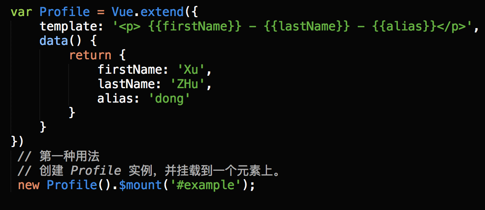
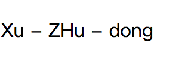
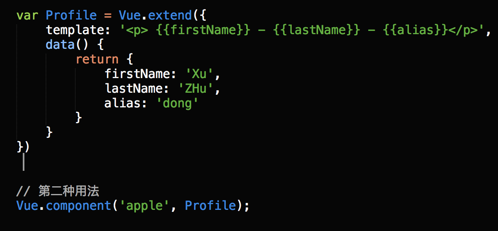
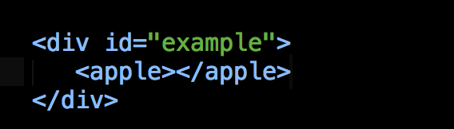
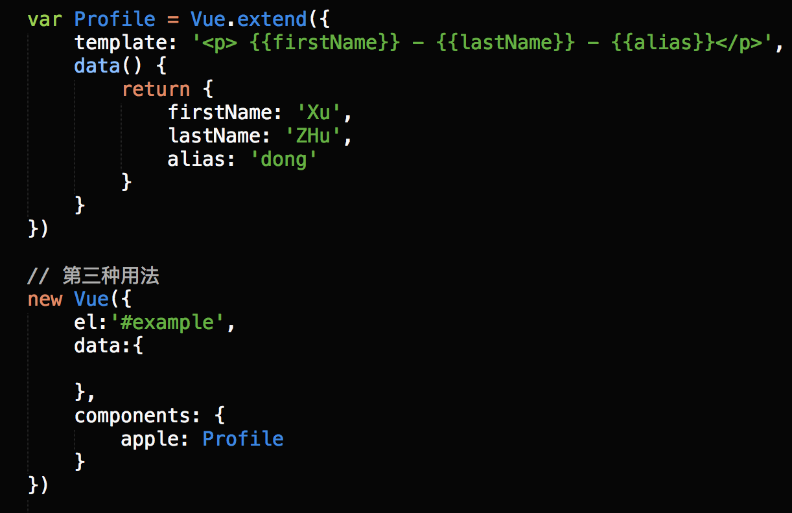

[TOC]

# Vue.extend用法 注册组件

`Vue.extend` 是构造一个组件的语法器。

## 用法

Vue.extend ( options )，options 是对象；
使用基础Vue构造器，创建一个子类，参数是一个包含组件选项的对象，data选项是特例，它必须是函数。

## 1. 第一种用法--挂在到元素上

​     

输出如下： 

   

## 2. 第二种用法--将组件注册到`Vue.component` 全局方法里面

## 3. 第三种方法--将组件注册为局部组件

<https://www.cnblogs.com/xuzhudong/p/8631088.html>