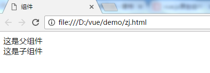
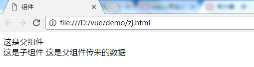
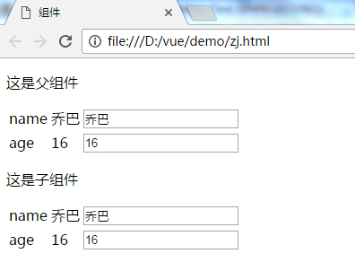
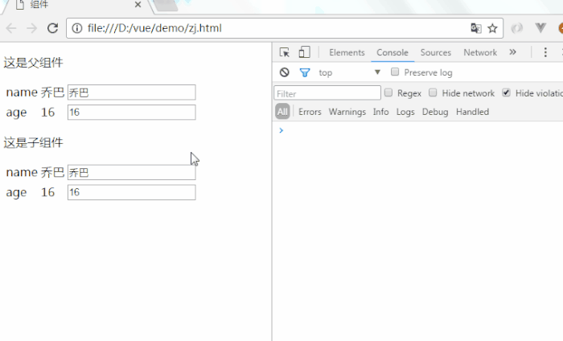
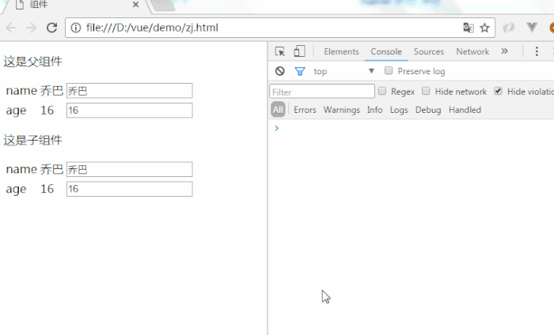
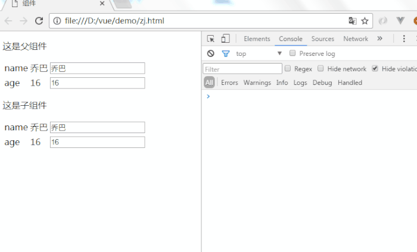
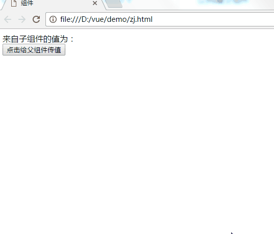
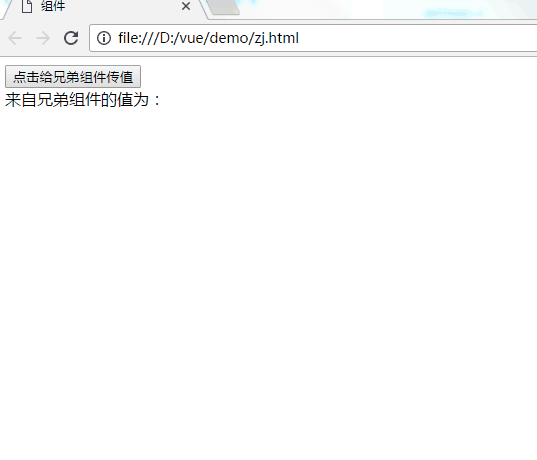

# vue.js原生组件化开发（二）——父子组件

# 前言

在了解父子组件之前应先掌握[组件开发基础](https://www.jianshu.com/p/3504a1edba42)。在实际开发过程中，组件之间可以嵌套，也因此生成父子组件。

# 父子组件创建流程

## 1.构建父子组件

### 1.1 全局注册

**(1)构建注册子组件**

```
//构建子组件child
var child = Vue.extend({
    template: '<div>这是子组件</div>'
});
//注册名为'child'的组件
Vue.component('child',child);
```

**(2)构建注册父组件**

```
//构建父组件parent,在其中嵌套child组件
var parent = Vue.extend({
    template: '<div>这是父组件<child></child></div>'
});

Vue.component('parent',parent);
```

**(3)定义vue实例**

```
var app = new Vue({
    el: '#app'
})
```

**(4)使用父组件**

```
<div id="app">
    <parent></parent>
</div>
```

打开浏览器查看



### 1.2 局部注册

**(1)构建子组件**

```
var child = Vue.extend({
    template: '<div>这是子组件</div>'
});
```

**(2)构建父组件**
在父组件中局部注册子组件

```
var parent = Vue.extend({
    template: '<div>这是父组件<child></child></div>',
    components:{
        'child':child
    }
});
```

**(3)定义vue实例**
在vue实例中局部注册父组件

```
var app = new Vue({
    el: '#app',
    components:{
        'parent':parent
    }
})
```

**(4)使用父组件**

```
<div id="app">
    <parent></parent>
</div>
```

## 2.父子组件间通信

### 2.1 父传子

父组件传消息到子组件使用props，并且这传递是单向的，只能由父组件传到子组件。我们将上面例子中的父组件增加一个数据传递到子组件中渲染显示。如果父组件需要传多个数据给子组件，依次在后面加即可。
**(1)在父组件中增加data，并绑定到子组件上**

```
var parent = Vue.extend({
    template: '<div>这是父组件<child :pdata=data></child></div>',
    data(){
        return{
            data:'这是父组件传来的数据'
        }
    },
    components:{
        'child':child
    }
});
```

其中<child :pdata=data></child>，:pdata是v-bind:pdata的缩写，pdata是自定义传递数据的命名，子组件中也是用该名字获取数据，data是父组件中数据的命名。
**(2)在子组件中通过props获取数据，并渲染出来**

```
var child = Vue.extend({
    template: '<div>这是子组件 {{pdata}}</div>',
    props:['pdata']
});
```

查看浏览器



> 父组件中数据发生变化，子组件中自动更新
> 子组件不可直接修改通过props获取到的父组件中的数据

下面我们通过一个例子更好的理解上面两句话
**(1)使用\<template>标签创建子组件**
为方便书写，我们使用\<template>标签创建组件

```
<template id="child">
    <div>
        <p>这是子组件</p>
        <table>
            <tr>
                <td>name</td>
                <td>{{name}}</td>
                <td><input type="text" v-model="name"></td>
            </tr>
            <tr>
                <td>age</td>
                <td>{{age}}</td>
                <td><input type="text" v-model="age"></td>
            </tr>
        </table>
    </div>
</template>
```

这里使用v-model指令来双向绑定从父组件中获取到的数据
**(2)使用<template>标签创建父组件**

```
<template id="parent">
    <div>
        <p>这是父组件</p>
        <table>
            <tr>
                <td>name</td>
                <td>{{name}}</td>
                <td><input type="text" v-model="name"></td>
            </tr>
            <tr>
                <td>age</td>
                <td>{{age}}</td>
                <td><input type="text" v-model="age"></td>
            </tr>
        </table>
        //给子组件传递2个数据
        <child :name="name" :age="age"></child>
    </div>
</template>
```

**(3)构建子组件**

```
var child = Vue.extend({
    template: '#child',
    props:['name','age']
});
```

**(4)构建父组件**

```
var parent = Vue.extend({
    template: '#parent',
    data(){
        return{
            age:16,
            name:'乔巴'
        }
    },
    components:{
        'child':child
    }
});
```

查看浏览器



接着，我们在父组件中修改输入框的值，这会引起v-model绑定的值变化，同时也会改变子组件中的值



然后我们试着修改子组件中输入框的值，vue会警告不能直接修改父组件传过来的值。



```js
<template id="child">
    <div>
        <p>这是子组件</p>
        <table>
            <tr>
                <td>name</td>
                <td>{{name1}}</td>
                <td><input type="text" v-model="name1"></td>
            </tr>
            <tr>
                <td>age</td>
                <td>{{age1}}</td>
                <td><input type="text" v-model="age1"></td>
            </tr>
        </table>
    </div>
</template>


var child = Vue.extend({
    template: '#child',
    props:['name','age'],
    data(){
        return{
            name1: '',
            age1: ''
        }
    },
    //页面挂载时将props的值赋给子组件中的data
    mounted:function(){
        this.name1 = this.name
        this.age1 = this.age
    },
    //同时增加监听，当props的值发生变化时，也立即赋值给子组件的data
    watch:{
        name:function(val){
            this.name1 = this.name
        },
        age:function(val){
            this.age1 = this.name
        }
    }
});
```

同时修改v-model绑定的name值为name1，age为age1
现在修改子组件中的值，就不会报错了，这是因为子组件中修改的是name1，并不是props传递过来的name值



### 2.1 子传父

子组件给父组件传值通过emit。父组件需在子组件标签上绑定emit事件。
例子：
**(1)构建子组件**

```
var child = Vue.extend({
    template: '<div><button @click="change">点击给父组件传值</button></div>',
    methods:{
        change: function(){
            this.$emit('posttoparent',10)
        }
    }
});
```

子组件按钮绑定了一个click事件，当点击按钮执行change方法，该方法触发emit事件，事件名为posttoparent，并且带了一个参数10。
(2)构建父组件

```
var parent = Vue.extend({
    template: '<div>来自子组件的值为：{{datafromchild}} <child v-on:posttoparent="getfromchild"></child></div>',
    data(){
        return{
            datafromchild:''
        }
    },
    components:{
        'child':child
    },
    methods: {
        getfromchild: function(val){
            this.datafromchild = val
        }
    }
});
```

父组件接收emit事件通过v-on指令，格式为：

> v-on:emit方法名="父组件方法"

父组件将接收到的参数赋值给datafromchild 
查看浏览器



## 3.兄弟组件间通信

兄弟组件间通信也是用的emit。但原生vue.js需要新建一个空的vue实例来当桥梁。
下面直接贴代码

```Js
//新建一个空的vue实例bus
var bus = new Vue();

var myCom1 = Vue.extend({
    template: '<div><button @click="change">点击给兄弟组件传值</button></div>',
    methods:{
        change: function(){
            //通过空实例去触发emit
            bus.$emit('posttobro',10)
        }
    }
});

var myCom2 = Vue.extend({
    template: '<div>来自兄弟组件的值为：{{datafrombro}}</div>',
    data(){
        return{
            datafrombro:''
        }
    },
    mounted:function(){
      //接收emit事件
        bus.$on('posttobro',function(val){
            this.datafrombro = val
        }.bind(this))
    }
});

Vue.component('my-com1',myCom1);
Vue.component('my-com2',myCom2);

var app = new Vue({
    el: '#app'
});
```

使用组件

```
<div id="app">
    <my-com1></my-com1>
    <my-com2></my-com2>
</div>
```

查看浏览器



小礼物走一走，来简书关注我

赞赏支持


https://www.jianshu.com/p/c74556c8a4c3