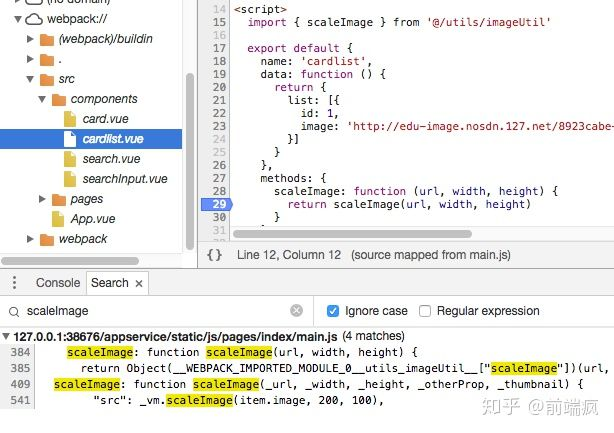

# mpvue如何进行断点调试？

因为经过mpvue打包后的代码和源代码差异很大，所以大家都是怎么调试用mpvue写的小程序的？或者说mpvue不适合从头做一个大型项目？

 

## 前提

1. mpvue-loader 1.0.7+
2. **关闭微信开发者工具的 ES6 转 ES5**

**关闭微信开发者工具的 ES6 转 ES5** 

## 使用

打开微信开发者工具调试器的Sources，然后展开webpack:// 选择对应文件打断点就行了。或者直接全局搜关键字(command+p)，打上断点会自动跳转到源码对应位置

 

https://www.zhihu.com/question/275710540

http://mpvue.com/build/#debug