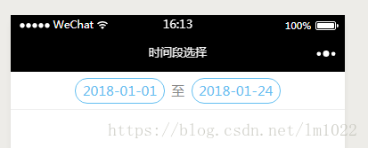

# 微信小程序 - 日期时间段选择 - picker之日期选择器

效果图如下： 


wxml:

```
<view class="page">  
   <!-- 时间段 -->  
    <view class="picker_group">  
      <picker mode="date" value="{{date}}"  end="{{date2}}" bindchange="bindDateChange">  
        <view class="picker">  
          {{date}}  
        </view>  
      </picker>  
      至  
      <picker mode="date" value="{{date2}}" start="{{date}}" end="2050-01-01" bindchange="bindDateChange2">  
        <view class="picker">  
          {{date2}}  
        </view>  
      </picker>        
    </view>  
  </view>  
 
```

js:

```
const util = require('../../utils/util.js')

Page({
  data: {
    date: '2018-01-01',//默认起始时间  
    date2: '2018-01-24',//默认结束时间 

  },

  // 时间段选择  
  bindDateChange(e) {
    let that = this;
    console.log(e.detail.value)
    that.setData({
      date: e.detail.value,
    })
  },
  bindDateChange2(e) {
    let that = this;
    that.setData({
      date2: e.detail.value,
    })

  }, 
```

wxss:

```
/* 日期选择 */
.picker_group {
  height: 85rpx;
  line-height: 85rpx;
  justify-content: center;
  display: flex;
  align-items: center;
  font-size: 30rpx;
  color: #888;
  border-bottom: 1rpx solid #efefef;

}

.picker_group picker {
  /* background-color: yellow; */
  color: #64bff1;
  height: 55rpx;
  line-height: 55rpx;
  margin: 0 2%;
  padding: 0 2%;
  border: 1rpx solid #64bff1;
  border-radius: 30rpx;
}
```


https://blog.csdn.net/lm1022/article/details/80109706