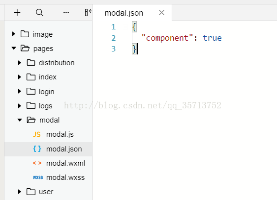
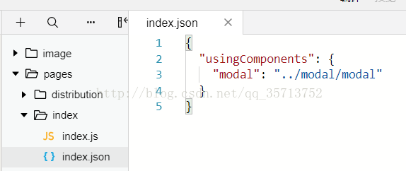
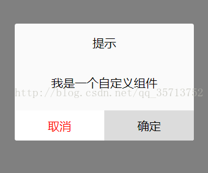

[TOC]


# 微信小程序  组件化开发入门,以一个自定义模块框组件当做示例 

## 前言

自定义组件我把它分为简单的三个步骤, 1.创建组件 --- 2.编写组件  ---   3.调用,使用组件. 

## 第一步:创建组件

创建一个modal文件夹,里面包含 josn.wxml.wcss.js 四个文件,然后在josn里面添加 "component":true (作用是声明这一组文件为自定义组件)



## 第二步. 编写组件代码

在modal.wxml :

```
<view hidden='{{modalHidden}}'>  
  <view class='mask_layer' bindtap='modal_click_Hidden' />  
  <view class='modal_box'>  
    <view class="title">提示</view>  
    <view class='content'>  
      <text class='modalMsg'>{{modalMsg}}</text>  
    </view>  
    <view class='btn'>  
      <view bindtap='modal_click_Hidden' class='cancel'>取消</view>  
      <view bindtap='Sure' class='Sure'>确定</view>  
    </view>  
  </view>  
</view>  
```

在modal.wxss:

```
.mask_layer {  
  width: 100%;  
  height: 100%;  
  position: fixed;  
  z-index: 1000;  
  background: #000;  
  opacity: 0.5;  
  overflow: hidden;  
}  
.modal_box {  
  width: 76%;  
  overflow: hidden;  
  position: fixed;  
  top: 50%;  
  left: 0;  
  z-index: 1001;  
  background: #fafafa;  
  margin: -150px 12% 0 12%;  
  border-radius: 3px;  
}  
  
.title {  
  padding: 15px;  
  text-align: center;  
  background-color: gazure;  
}  
  
.content {  
  overflow-y: scroll; /*超出父盒子高度可滚动*/  
}  
  
.btn {  
  width: 100%;  
  margin-top: 65rpx;  
  display: flex;  
  flex-direction: row;  
  align-items: center;  
  justify-content: space-between;  
  box-sizing: border-box;  
  background-color: white;  
}  
  
.cancel {  
  width: 100%;  
  padding: 10px;  
  text-align: center;  
  color: red;  
}  
  
.Sure {  
  width: 100%;  
  padding: 10px;  
  background-color: gainsboro;  
  text-align: center;  
}  
  
.modalMsg {  
  text-align: center;  
  margin-top: 45rpx;  
  display: block;  
}  
```

在modal.js

```
Component({  
  properties: {  
    modalHidden: {  
      type: Boolean,  
      value: true  
    }, //这里定义了modalHidden属性，属性值可以在组件使用时指定.写法为modal-hidden  
    modalMsg: {  
      type: String,  
      value: ' ',  
    }  
  },  
  data: {  
    // 这里是一些组件内部数据  
    text: "text",  
  },  
  methods: {  
    // 这里放置自定义方法  
    modal_click_Hidden: function () {  
      this.setData({  
        modalHidden: true,  
      })  
    },  
    // 确定  
    Sure: function () {  
      console.log(this.data.text)  
    }  
  }  
})  
```

## 第三步, 使用组件

 

这里我是在 pages/index/index 页面调用 pages/modal/modal 自定义组件

首先在index.json中进行引用说明, 这里是设置自定义组件的标签名和引用路径

```
{  
  "usingComponents": {  
    "modal": "../modal/modal"  
  }  
}  
```



然后在index.wxml调用组件

```
<!-- 调用modal组件 -->  
<modal modal-hidden="{{is_modal_Hidden}}" modal-msg="{{is_modal_Msg}}"/>  
```

在index.js绑定数据,

```
Page({  
  data: {  
    is_modal_Hidden:false,  
    is_modal_Msg:'我是一个自定义组件'  
  }  
})  
```

效果图:




如果需要查看更加详细的文档,可以在官方文档查看, 地址为:  

https://developers.weixin.qq.com/miniprogram/dev/framework/custom-component/


https://blog.csdn.net/qq_35713752/article/details/78523239