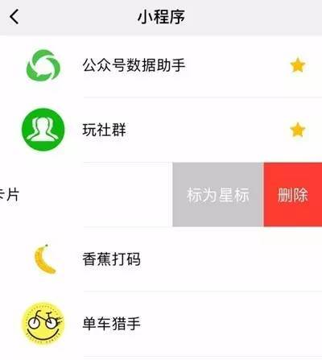
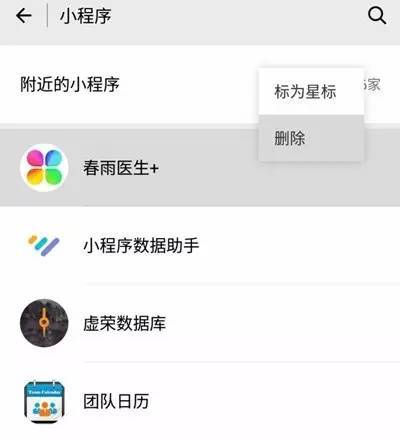

# 微信小程序内的缓存到底如何清除？

有一些经常使用小程序的人问小编：**小程序内的缓存到底如何清除？**

一些小程序可能会**内置缓存清理功能**，使用这种清除缓存功能，小程序可以安全地将已在服务器中的数据进行清除，达到减少小程序占用存储、加快小程序运行速度的目的。

但有些小程序暂时还没有缓存清理的机制，这时我们可以直接删除小程序，达到缓存清理的目的。

**具体的删除方法是：**

**iOS 微信：**进入微信中的「发现」-「小程序」，将不想要的小程序从右往左划动，然后点击红色的「删除」按钮即可。

**Android 微信：**进入微信中的「发现」-「小程序」，长按不想要的小程序，然后点击「删除」按钮即可。

需要注意的是，**删除小程序，会将对应小程序的本体、本地数据以及权限偏好删除，但不会删除小程序服务器上的数据。**

也就是说，**删除小程序后，你将永久丢失小程序中未备份、未上传的数据。在删除小程序之前，记得做好备份工作哦~**

删除之后，如果想再次使用这个小程序，只需重新搜索、扫码，再打开小程序，就可以啦。

 

http://m.sohu.com/a/162044232_489250