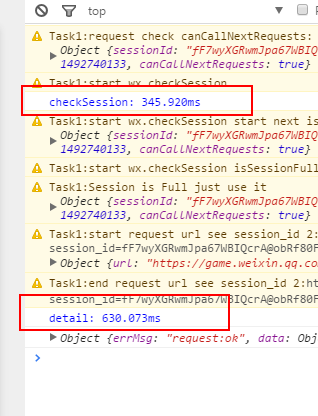

[TOC]

# 微信小程序性能优化——checkSession

## 分析

一直发现小程序好慢，尤其是第一次打开的时候。因为第一次会涉及到登录的授权，官方文档是这么说的：

通过 wx.login() 获取到用户登录态之后，需要维护登录态。开发者要注意不应该直接把 session_key、openid 等字段作为用户的标识或者 session 的标识，而应该自己派发一个 session 登录态（请参考登录时序图）。

所以后台存储了一个session标识，和微信的session_key 是独立的。而且业务自身的session也有设置有效期，和微信的session_key 是一致的。

我们的业务处理流程是：

1、前端检测有无session，没有的话wx.login()，获取session_key 。
2、通过session_key 调用后台接口，换取session。
3、前端缓存session。
4、如果前端检测有session，调用wx.checkSession()，判断session_key 有效期，然后请求业务CGI。

上面有个问题，只要成功获取session_key后，后续的请求都会先调用wx.checkSession()来判断它的有效期。但是wx.checkSession()是一个耗时的过程，有没有必要每次请求CGI都去校验呢？

因为session也存在有效，一旦我们请求业务的CGI后台判断登录态失效了，那么前端可以根据后台返回的错误码来判断是否重新登录。

所以就没有必要每次wx.checkSession，而且wx.checkSession几乎是没有用的到必要，因为登录态可以由我们业务维护，一旦失效，wx.login()重新换回一个session_key 就ok了嘛。

## 结论

结论是：wx.checkSession几乎没有必要调用，而且他本身耗时，长达300+ms。

by [addy](http://www.iamaddy.net/)原创文章，欢迎转载，但希望全文转载，注明本文地址。
本文地址：[http://www.iamaddy.net/2017/0...](http://www.iamaddy.net/2017/05/wexin-app-performance-checksession/)

https://segmentfault.com/a/1190000009658302