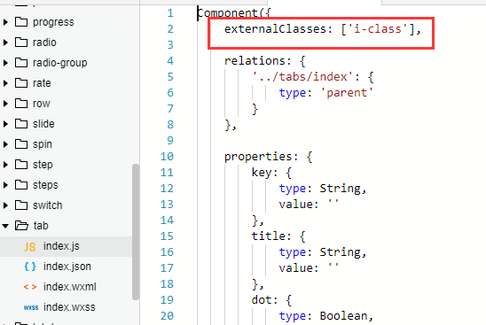
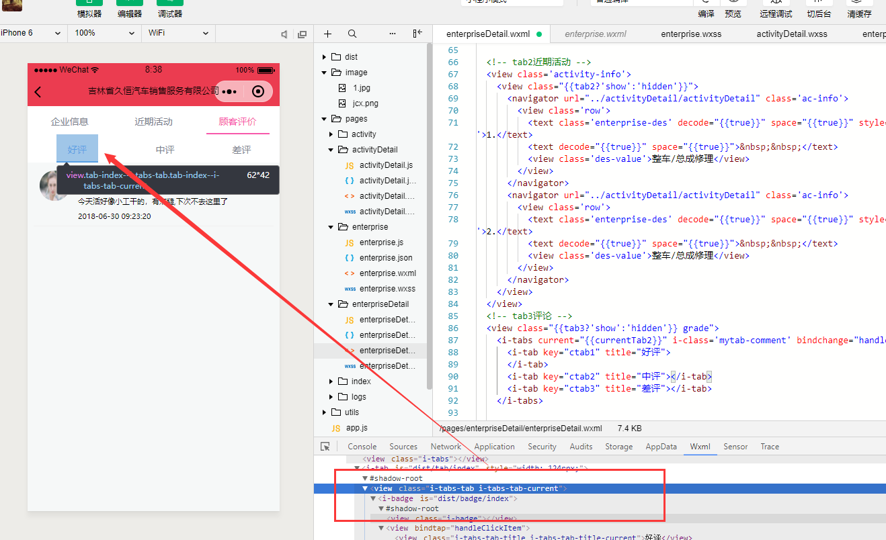

# 微信小程序覆盖自定义组件样式

## 局限性的覆盖

小程序官方文档明确指出，引入的第三方自定义组件，是不可以对其进行CSS样式覆盖的，但是我们还想要修改怎么办呢？自定义组件时会之定义个外部类，通过这个外部类来修改样式。

修改https://weapp.iviewui.com/所提供的组件样式为例，它定义了一个外部类接口：


**1. 通过第三方组件给出的externalClasses: ['i-class'],来指定自己的样式类**

自己的wxml
i-class="myrate"

```html
<i-rate i-class="myrate" bind:change="onChange5" count="5" value="3" size="15"></i-rate>
<!-- i-class 通过外部类定义自己的类（像别名一样），来修改样式-->
```



**2. 修改自己的css文件**
i-badge是第三方样式类，接下来使用自定义的类（第三方组价的别名）修改样式

```
.mytab i-badge {
  width: 189rpx;
}
```


成功覆盖样式！

对于本博客有疑问联系：tuna_dai@163.com 共同进步


## 官网自定义组件的 externalClass 优先级说明:

小程序自定义组件的 externalClass 优先级问题

问题

小程序自定义组件的 externalClass 的 CSS 优先级比内部组件的低，然后自身又不能通过更多的类来提高样式优先级，只能用 !important 这种方式提高优先级来覆盖内部样式。


既然提供了外部样式类，那是否以外部配置的优先级更高为主呢？

 


3个回答

LastLeaf LastLeaf 官方
你好，因为实现上的限制，这个优先级是不确定的。

赞同 0 没有帮助 评论 复制 05月11日
Yika Yika 楼主
那就是等同于 externalClass ，基本只能通过 important 去覆盖样式了。

赞同 0 没有帮助 评论 复制 05月13日
土豆豆 土豆豆
目前我们就是用important覆盖的，恶心点，也没啥好方法

赞同 0 没有帮助 评论 复制

https://www.cnblogs.com/xiaolinstudy/p/9401541.html