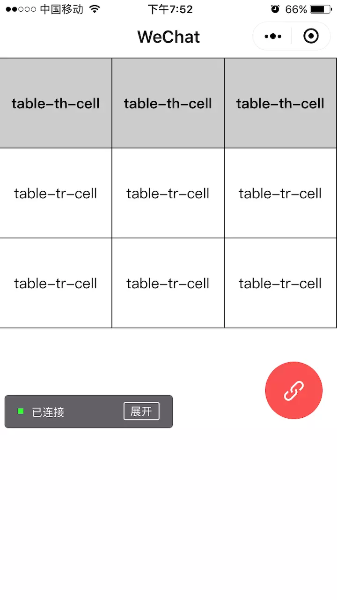
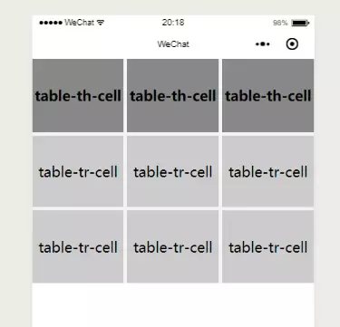

# 微信小程序之获取后台动态数据表格布局display:table-image-201811191726

本文没有采用flex布局和grid布局来设置表格的，而是通过 `display: table;`来设置。一方面工作中经常用到这种自适应表格排版布局方式（包括方框列表及九宫格式），但是flex布局和grid布局来设置的话就很容易了，这次想通过另一种方法来实现，而且这种方法比较少用，所以想尝试一下，分享给大家。

如果对这个属性不熟的可以参考这篇文章，介绍的很详细：[css Table布局-display:table](https://link.juejin.im/?target=http%3A%2F%2Fwww.css88.com%2Farchives%2F6308)

### （一）实现效果

1、第一种实现效果： 



**注意：这是截图才看得到左边或右边的边框的，真机环境是看不到的哈** 
2、第二种实现效果： 


### （二）实现过程

以第一种实现效果代码为准说明： CSS属性的情况：

> table：指定对象作为块元素级的表格。类同于html标签`<table>`（CSS2） 
> inline-table：指定对象作为内联元素级的表格。类同于html标签`<table>`（CSS2） 
> table-caption：指定对象作为表格标题。类同于html标签`<caption>`（CSS2） 
> table-cell：指定对象作为表格单元格。类同于html标签`<td>`（CSS2） 
> table-row：指定对象作为表格行。类同于html标签`<tr>`（CSS2） 
> table-row-group：指定对象作为表格行组。类同于html标签`<tbody>`（CSS2） 
> table-column：指定对象作为表格列。类同于html标签`<col>`（CSS2） 
> table-column-group：指定对象作为表格列组显示。类同于html标签 
> `<colgroup>`（CSS2） 
> table-header-group：指定对象作为表格标题组。类同于html标签 
> `<thead>`（CSS2） 
> table-footer-group：指定对象作为表格脚注组。类同于html标签`<tfoot>`（CSS2）

1、通过设置js里面的数组对象格式模拟动态后台获取的数据，然后将数组对象内容以三个元素为一组组成数组对象格式再合并成一个新的数组对象格式，之所以这样做就是为了，一行有三个单元格设计的:

```
Page({
  data: {
    tableData: [{ //模拟动态获取到的后台数据：数组对象格式
        id: 0,
        name: 'table-th-cell'
      },
      {
        id: 1,
        name: 'table-th-cell'
      },
      {
        id: 2,
        name: 'table-th-cell'
      },
      {
        id: 3,
        name: 'table-tr-cell'
      },
      {
        id: 4,
        name: 'table-tr-cell'
      },
      {
        id: 5,
        name: 'table-tr-cell'
      },
      {
        id: 6,
        name: 'table-tr-cell'
      },
      {
        id: 7,
        name: 'table-tr-cell'
      },
      {
        id: 8,
        name: 'table-tr-cell'
      },

    ],
    threeArray: '', //模拟将后台获取到的数组对象数据按照一行3个的单元数据的格式切割成新的数组对象（简单的说：比如获取到数组是9个元素，切分成，3个元素一组的子数组）
  },
  onLoad: function() {
    let that = this;
    let threeArray = [];
    // 使用for循环将原数据切分成新的数组
    for (let i = 0, len = that.data.tableData.length; i < len; i += 3) {
      threeArray.push(that.data.tableData.slice(i, i + 3));
    }
    console.log(threeArray);
    that.setData({
      threeArray: threeArray
    })
  },
})
```

2、设置wxml:

```
<view class="table">

  <block wx:for='{{threeArray}}' wx:key='*this' wx:for-item='oneArray'>
<!-- 注意嵌套的数组对象 -->
    <view class="table-tr" wx:if='{{index<1}}'>
      <block wx:for='{{oneArray}}' wx:key='id'>
        <view class="table-th">{{item.name}}</view>
      </block>
    </view>
    <view class="table-tr" wx:else>
      <block wx:for='{{oneArray}}' wx:key='id'>
        <view class="table-td">{{item.name}}</view>
      </block>
    </view>
  </block>
</view>
```

3、设置wxss:

```
.table {
  display: table;
  width: 100%;
  /* border-collapse 属性设置表格的边框是否被合并为一个单一的边框，解决相邻单元格边框未合并导致有些边框变粗的视觉效果 */
  border-collapse: collapse;
  overflow-x: hidden;
}

.table-tr {
  display: table-row;
  width: 100%;
  height: 200rpx;
}

.table-th {
  display: table-cell;
  font-weight: bold;
  border: 1px solid black;
  text-align: center;
  vertical-align: middle;
  background-color: #ccc;
}

.table-td {
  display: table-cell;
  border: 1px solid black;
  text-align: center;
  vertical-align: middle;
}
```

总的来说，实现过程并不复杂，学会了可以使用很熟练的使用，这个方法实现表格布局还是挺有用的，在一些页面无缝接触的时候很常用。


https://juejin.im/entry/5b8c8c82e51d4538e331bf09