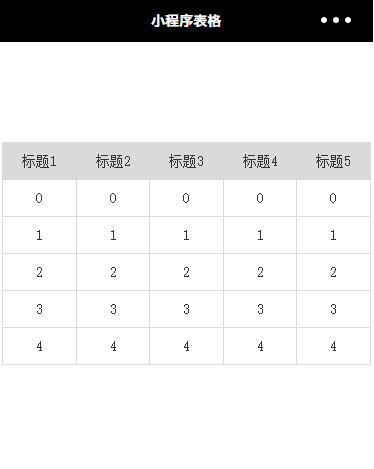

# 微信小程序怎么做出前端table的效果



/Users/jerryye/backup/studio/AvailableCode/web/css/css-demo/table/flex方式实现/flex方式实现table.html

wxml代码：

```
<view class="container">
    <view class="table">
        <view class="tr">
            <view class="th">标题1</view>
            <view class="th">标题2</view>
            <view class="th">标题3</view>
            <view class="th">标题4</view>
            <view class="th">标题5</view>
        </view>
        <view class="tr" wx:for="{{5}}">
            <view class="td">{{内容}}</view>
            <view class="td">{{内容}}</view>
            <view class="td">{{内容}}</view>
            <view class="td">{{内容}}</view>
            <view class="td">{{内容}}</view>
        </view>
    </view>
</view>
```

 

wxss代码：

```
/* pages/table/table.wxss */
page {
　　font-size: 14px;
　　color: #333
}
.table {
　　border:1px solid #dadada;
　　border-right: 0;
　　border-bottom: 0;
　　width: 98%;
}
.tr {
　　width: 100%;
　　display: flex;
　　justify-content: space-between;
}
.th,.td {
　　padding: 10px;
　　border-bottom: 1px solid #dadada;
　　border-right: 1px solid #dadada;
　　text-align: center;
　　width:100%
}
.th {
　　font-weight: 400;
　　background-color: #dadada
}
```


https://www.cnblogs.com/h5kang/p/6247603.html