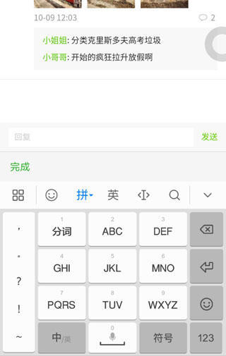
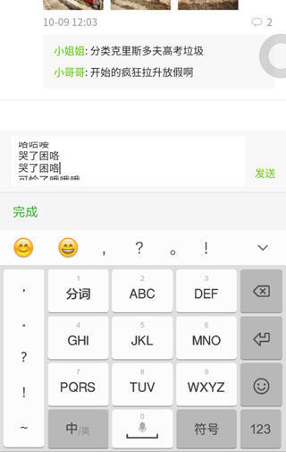

# 小程序评论框实现

wxml

```
<view class="talk" bindtap="bindReply">回复</view>
<view class="release" hidden="{{!releaseFocus}}">
    <textarea class="text"
          placeholder-class="input_null" 
          fixed="true" 
          maxlength="-1" 
          show-confirm-bar="false" 
          cursor-spacing="15" 
          auto-height="true" 
          focus="{{releaseFocus}}"
          placeholder="回复 {{releaseName}}"></textarea>
    <view class="submit">发送</view>
</view>
```

wxss

```
.input_null{
    color: #C9C9C9;
}
.release{
    display: flex;
    align-items: flex-end; /*底部对齐*/
    justify-content: space-between; /*两端对齐*/
    box-sizing: border-box;
    position: fixed;
    left: 0;
    bottom: 0;
    width: 100%;
    padding: 18rpx 0 18rpx 30rpx;
    background-color: #F7F8F7;
    font-size: 28rpx;
    z-index: 999;
}
.release .text{
    width: 604rpx;
    min-height: 34rpx;
    max-height: 102rpx; /*最多显示三行*/
    border-width: 15rpx 20rpx; /*使用padding与预期留白不一致，故使用border*/
    border-style: solid;
    border-color:  #ffffff;
    line-height: 34rpx;
    font-size: 28rpx;
    background-color: #ffffff;
    border-radius: 4rpx;
}
.release .submit{
    width: 116rpx;
    height: 64rpx;
    line-height: 64rpx;
    text-align: center;
    color: #66CC00;
}
```

js

```
Page({
    /**
     * 页面的初始数据
     */
    data: {
        releaseFocus: false,
    },
    /**
     * 生命周期函数--监听页面加载
     */
    onLoad: function (options) {
    },
    /**
     * 点击回复
     */
    bindReply: function(e){
        this.setData({
            releaseFocus: true
        })
    }
})
```

预览



显示



http://www.wxapp-union.com/portal.php?mod=view&aid=3234