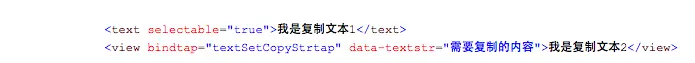
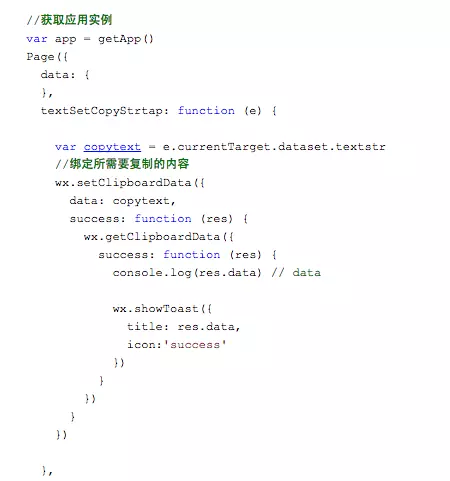
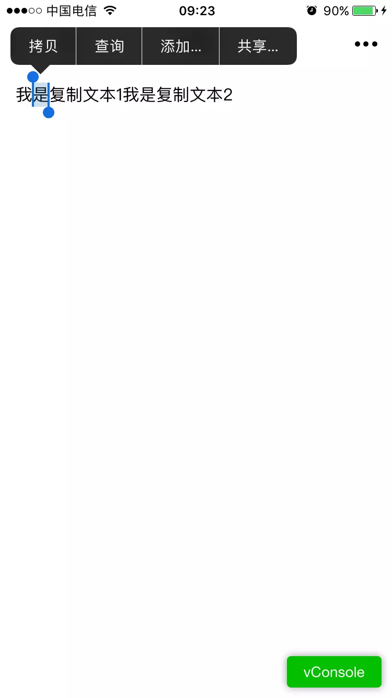
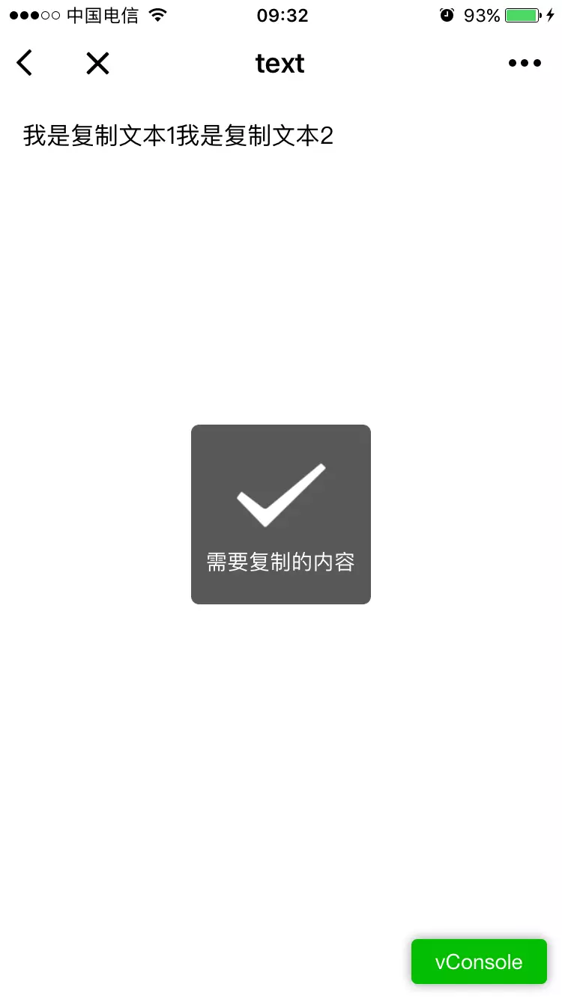

# 微信小程序开发之text copy

因为微信小程序项目需要点击复制text内容，所以Google一下，发现没有一个正确的方法，只好回到微信官方开发文档查询资料，看到俩个解决方法。

第一种：实现点击文本调用网页复制功能。设置text 属性 selectableBoolean 为true。

第二种：绑定数据调用粘贴板赋值方法。

.WXML

.JS

赋值效果如下图：

第一种显示效果

第二种显示效果