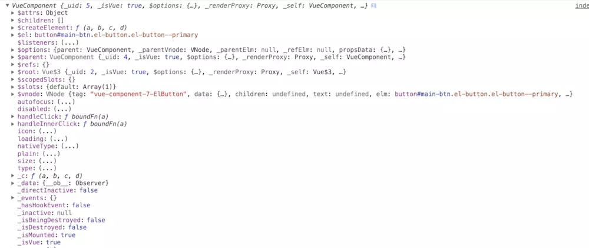
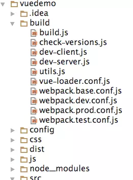
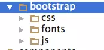
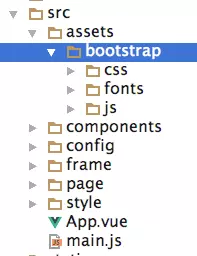
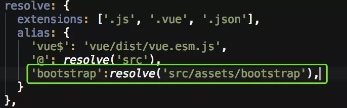

[TOC]

# vuejs jquery混合并存使用

## 在vuejs中是否还需要jquery

        如果你作为前端有一段时间的话一定会很熟悉jquery，作为前端的开发神器我们无法想象没有jquery将会写多少繁琐的原生js。在angularjs,react,vue当道的年代里，或许你不在需要jquery了。
        当你刚开始使用vue的时候，你很有可能想“如果我用jquery的做的话这将非常简单”，或许这是因为刚接触vue的你还没有了解他。

### 1.操作DOM

使用jQuery可以编写var myElement = $（'＃my-element'）。 我承认，这真的很酷，它可以处理你想要处理的CSS选择器。

您可以使用document.getElementById（'my-element'）访问此元素，但这不适合Vue的虚拟DOM机制，因为此元素可以随时重新呈现。

幸运的是，Vue提供了访问某个DOM元素的API。 您的HTML将如下所示：

```html
<template>
<div>
...
<p ref = "myElement">This is the content of my element</p>
...
</div>
</template>
<script>
export default {
        mounted(){
                  console.log(this.$refs.myElement)
         }
}
</script>

输出： <p>This is the content of my element</p>
```

如果将 ref 挂到组件上，回显示出组件的属性和事件等信息



### 2.更加有效的函数

我知道$.each()函数能够很方便的遍历一个数组...但现在有ES2015和很多更有效的库，如lodash。

我们使用如下的数组：

> var myArray = ['we', 'love', 'javascript']

将数组中的值变成大写

```js
//jquery
$.each(myArray , function(value, index)){
    myArray[index] = value.toUppercase();
}
// ES2015
myArray.forEach((value, index) =>
    myArray[index] = value.toUppercase()
)
//ES2015 (map)
    myArray = myArray.map(value => value.toUppercase())
// lodash
var _ = require('lodash');
myArray = _.map(myArray, function(value){
    return value.toUppercase();
})
```


## 2.如何在vuejs 中引入jquery

Vue 的官方是不建议直接操作 DOM 的，**Vue 的用途在于视图和数据的绑定**。如果通过JQuery 直接操作 DOM 的话，势必会造成视图数据和模型数据的不匹配，这样 Vue 就失去它存在的意义了。

**JQuery 和 VueJS 合理使用并不会造成冲突**，因为他们的侧重点不同，**VueJS 侧重数据绑定和视图组件，JQuery 侧重异步请求和动画效果**。如果使用JQuery + VueJS 开发，一定要在 Vue 渲染完所有的 HTML组件之后再通过 JQuery 处理，而**使用 JQuery 时应避免直接操作 DOM**，但是应用动画是允许的。

**JQuery 与 VueJS 相互配合可以非常高效的完成异步任务**，首先通过 JQuery 发出 Ajax 请求，接受到服务端传递的 JSON 数据后，再通过 Vue 将数据绑定到组件上，最后由 JQuery 进行动画处理，整个过程就如行云流水般自然。

说句题外话，**Vue 的目的不是取代 JQuery，它是为了解决前后端分离而出现的**。如果没有数据变化，只是单纯的样式变化，则没有必要去大费周章进行视图模型的绑定，并且还不利于 SEO 优化。

### 1.webpack全局引入jquery

\1. 下载jquery

> npm install jquery --save-dev

\2. 在项目的webpack.base.conf.js里做如下配置



webpack.base.conf.js

加入

> var webpack = require("webpack");

在module.exports的最后加入

```js
plugins: [
  new webpack.optimize.CommonsChunkPlugin('common.js'),
  newwebpack.ProvidePlugin({
    jQuery:"jquery",
    $:"jquery"
  })
]
```

\3. 执行 npm run dev

4.在入口文件main.js中引入

> import $ from 'jquery'

然后就可以正常使用jquery了。

### 3.如何在vuejs 中引入bootstrap 

bootstrap 中包含以下三个部分



其中bootstrap是依赖于jquery的，所以想要使用bootstrap的完整功能特别是动态的效果一定要先安装jquery

1.在bootstrap官网下载bootstrap文件，并放入相应的目录（根据自己的实际需求来，我放入src/assets/bootstrap）



2.修改webpack.base.conf.js,添加如下配置



3.在main.js中引入

> import 'bootstrap/js/bootstrap.min.js'
> import 'bootstrap/css/bootstrap.min.css'

然后就可以正常使用bootstrap了。


https://www.jianshu.com/p/0005487ee299