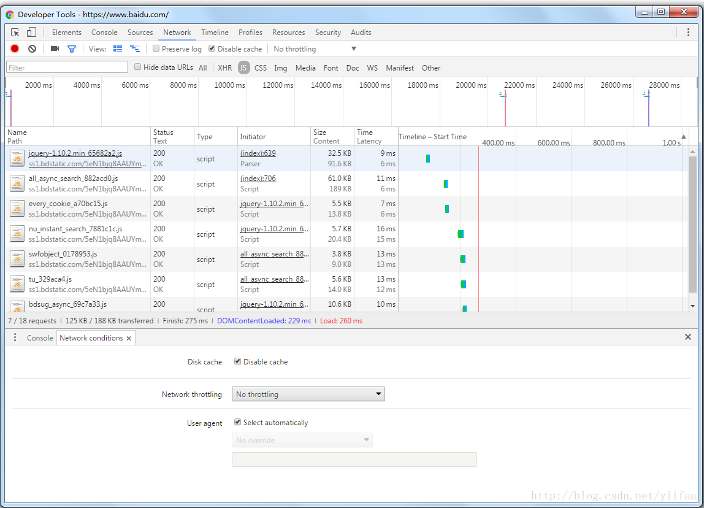

# 快速禁止Chrome浏览器缓存

2017年01月09日 16:19:41

阅读数：18641

在前端的开发中，最麻烦的莫过于浏览器的缓存，经常需要清理缓存文件，导致开发效率较低。

但Chrome可以一键禁止浏览器缓存，并且在后续的操作中，无论相同的资源请求多少次，都不会缓存到本地，一起来体验下吧。

按F12打开调试者工具，在调试者工具的右上角打开菜单选项，选择更多工具（More tools）->网络限制(Network conditions，在界面中勾选“Disable cache”选项，即可禁用浏览器缓存，注意是浏览器缓存，而不是相关页面的浏览器缓存，见下图： 

https://blog.csdn.net/yiifaa/article/details/54290047