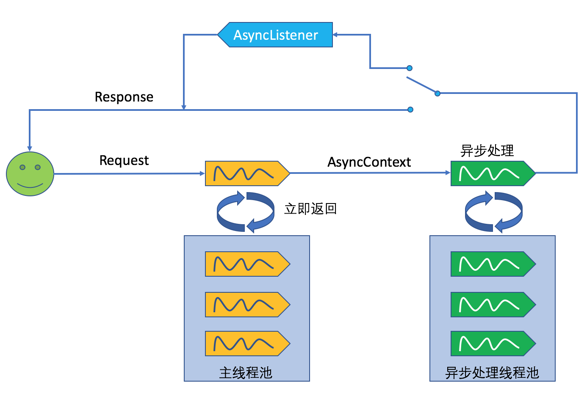

[TOC]


# Servlet 3.0/3.1 中的异步处理

/Users/jerryye/backup/studio/AvailableCode/web/servlet_jsp/async/servlce_async_demo

 在Servlet 3.0之前，Servlet采用Thread-Per-Request的方式处理请求，即每一次Http请求都由某一个线程从头到尾负责处理。如果一个请求需要进行IO操作，比如访问数据库、调用第三方服务接口等，那么其所对应的线程将同步地等待IO操作完成， 而IO操作是非常慢的，所以此时的线程并不能及时地释放回线程池以供后续使用，在并发量越来越大的情况下，这将带来严重的性能问题。即便是像Spring、Struts这样的高层框架也脱离不了这样的桎梏，因为他们都是建立在Servlet之上的。为了解决这样的问题，Servlet 3.0引入了异步处理，然后在Servlet 3.1中又引入了非阻塞IO来进一步增强异步处理的性能。

 

本文源代码：<https://github.com/davenkin/servlet-3-async-learning>

 

在Servlet 3.0中，我们可以从HttpServletRequest对象中获得一个AsyncContext对象，该对象构成了异步处理的上下文，Request和Response对象都可从中获取。AsyncContext可以从当前线程传给另外的线程，并在新的线程中完成对请求的处理并返回结果给客户端，初始线程便可以还回给容器线程池以处理更多的请求。如此，通过将请求从一个线程传给另一个线程处理的过程便构成了Servlet 3.0中的异步处理。

## SyncHelloServlet

举个例子，对于一个需要完成长时处理的Servlet来说，其实现通常为：

```
package davenkin.servlet;

import javax.servlet.ServletException;
import javax.servlet.annotation.WebServlet;
import javax.servlet.http.HttpServlet;
import javax.servlet.http.HttpServletRequest;
import javax.servlet.http.HttpServletResponse;
import java.io.IOException;

@WebServlet("/syncHello")
public class SyncHelloServlet extends HttpServlet {

    protected void doGet(HttpServletRequest request,
                         HttpServletResponse response) throws ServletException, IOException {
        new LongRunningProcess().run();
        response.getWriter().write("Hello World!");
    }
}
```

 

为了模拟长时处理过程，我们创建了一个LongRunningProcess类，其run()方法将随机地等待2秒之内的一个时间：

 

```
package davenkin.servlet;

import java.util.concurrent.ThreadLocalRandom;

/**
 * Created by yteng on 3/14/17.
 */
public class LongRunningProcess {

    public void run() {
        try {

            int millis = ThreadLocalRandom.current().nextInt(2000);
            String currentThread = Thread.currentThread().getName();
            System.out.println(currentThread + " sleep for " + millis + " milliseconds.");
            Thread.sleep(millis);

        } catch (InterruptedException e) {
            e.printStackTrace();
        }
    }
}
```

 

此时的SyncHelloServlet将顺序地先执行LongRunningProcess的run()方法，然后将将HelloWorld返回给客户端，这是一个典型的同步过程。

##  SimpleAsyncHelloServlet

在Servlet 3.0中，我们可以这么写来达到异步处理：

 

```
package davenkin.servlet;

import javax.servlet.AsyncContext;
import javax.servlet.ServletException;
import javax.servlet.annotation.WebServlet;
import javax.servlet.http.HttpServlet;
import javax.servlet.http.HttpServletRequest;
import javax.servlet.http.HttpServletResponse;
import java.io.IOException;

@WebServlet(value = "/simpleAsync", asyncSupported = true)
public class SimpleAsyncHelloServlet extends HttpServlet {

    protected void doGet(HttpServletRequest request, HttpServletResponse response) throws ServletException, IOException {
        AsyncContext asyncContext = request.startAsync();

        asyncContext.start(() -> {
            new LongRunningProcess().run();
            try {
                asyncContext.getResponse().getWriter().write("Hello World!");
            } catch (IOException e) {
                e.printStackTrace();
            }
            asyncContext.complete();
        });

    }

}
```

 

此时，我们先通过request.startAsync()获取到该请求对应的AsyncContext，然后调用AsyncContext的start()方法进行异步处理，处理完毕后需要调用complete()方法告知Servlet容器。start()方法会向Servlet容器另外申请一个新的线程（可以是从Servlet容器中已有的主线程池获取，也可以另外维护一个线程池，不同容器实现可能不一样），然后在这个新的线程中继续处理请求，而原先的线程将被回收到主线程池中。事实上，这种方式对性能的改进不大，因为如果新的线程和初始线程共享同一个线程池的话，相当于闲置下了一个线程，但同时又占用了另一个线程。

## NewThreadAsyncHelloServlet 

当然，除了调用AsyncContext的start()方法，我们还可以通过手动创建线程的方式来实现异步处理：

```
package davenkin.servlet;

import javax.servlet.AsyncContext;
import javax.servlet.ServletException;
import javax.servlet.annotation.WebServlet;
import javax.servlet.http.HttpServlet;
import javax.servlet.http.HttpServletRequest;
import javax.servlet.http.HttpServletResponse;
import java.io.IOException;

@WebServlet(value = "/newThreadAsync", asyncSupported = true)
public class NewThreadAsyncHelloServlet extends HttpServlet {

    protected void doGet(HttpServletRequest request, HttpServletResponse response) throws ServletException, IOException {

        AsyncContext asyncContext = request.startAsync();

        Runnable runnable = () -> {
            new LongRunningProcess().run();
            try {
                asyncContext.getResponse().getWriter().write("Hello World!");
            } catch (IOException e) {
                e.printStackTrace();
            }
            asyncContext.complete();
        };

        new Thread(runnable).start();

    }

}
```

 

 

自己手动创建新线程一般是不被鼓励的，并且此时线程不能重用。因此，一种更好的办法是我们自己维护一个线程池。这个线程池不同于Servlet容器的主线程池，如下图： 

 

## ThreadPoolAsyncHelloServlet

在上图中，用户发起的请求首先交由Servlet容器主线程池中的线程处理，在该线程中，我们获取到AsyncContext，然后将其交给异步处理线程池。可以通过Java提供的Executor框架来创建线程池： 

```
package davenkin.servlet;

import javax.servlet.AsyncContext;
import javax.servlet.ServletException;
import javax.servlet.annotation.WebServlet;
import javax.servlet.http.HttpServlet;
import javax.servlet.http.HttpServletRequest;
import javax.servlet.http.HttpServletResponse;
import java.io.IOException;
import java.util.concurrent.ArrayBlockingQueue;
import java.util.concurrent.ThreadPoolExecutor;
import java.util.concurrent.TimeUnit;

@WebServlet(value = "/threadPoolAsync", asyncSupported = true)
public class ThreadPoolAsyncHelloServlet extends HttpServlet {

    private static ThreadPoolExecutor executor = new ThreadPoolExecutor(100, 200, 50000L, TimeUnit.MILLISECONDS, new ArrayBlockingQueue<>(100));

    protected void doGet(HttpServletRequest request, HttpServletResponse response) throws ServletException, IOException {

        AsyncContext asyncContext = request.startAsync();

        executor.execute(() -> {

            new LongRunningProcess().run();

            try {
                asyncContext.getResponse().getWriter().write("Hello World!");
            } catch (IOException e) {
                e.printStackTrace();
            }

            asyncContext.complete();

        });
    }

}
```

## NonBlockingAsyncHelloServlet

 Servlet 3.0对请求的处理虽然是异步的，但是对InputStream和OutputStream的IO操作却依然是阻塞的，对于数据量大的请求体或者返回体，阻塞IO也将导致不必要的等待。因此在Servlet 3.1中引入了非阻塞IO（参考下图红框内容），通过在HttpServletRequest和HttpServletResponse中分别添加ReadListener和WriterListener方式，只有在IO数据满足一定条件时（比如数据准备好时），才进行后续的操作。


 

对应的代码示:

```
package davenkin.servlet;

import javax.servlet.AsyncContext;
import javax.servlet.ReadListener;
import javax.servlet.ServletException;
import javax.servlet.ServletInputStream;
import javax.servlet.annotation.WebServlet;
import javax.servlet.http.HttpServlet;
import javax.servlet.http.HttpServletRequest;
import javax.servlet.http.HttpServletResponse;
import java.io.IOException;
import java.util.concurrent.ArrayBlockingQueue;
import java.util.concurrent.ThreadPoolExecutor;
import java.util.concurrent.TimeUnit;

@WebServlet(value = "/nonBlockingThreadPoolAsync", asyncSupported = true)
public class NonBlockingAsyncHelloServlet extends HttpServlet {

    private static ThreadPoolExecutor executor = new ThreadPoolExecutor(100, 200, 50000L, TimeUnit.MILLISECONDS, new ArrayBlockingQueue<>(100));

    protected void doGet(HttpServletRequest request, HttpServletResponse response) throws ServletException, IOException {

        AsyncContext asyncContext = request.startAsync();

        ServletInputStream inputStream = request.getInputStream();

        inputStream.setReadListener(new ReadListener() {
            @Override
            public void onDataAvailable() throws IOException {

            }

            @Override
            public void onAllDataRead() throws IOException {
                executor.execute(() -> {
                    new LongRunningProcess().run();

                    try {
                        asyncContext.getResponse().getWriter().write("Hello World!");
                    } catch (IOException e) {
                        e.printStackTrace();
                    }

                    asyncContext.complete();

                });
            }

            @Override
            public void onError(Throwable t) {
                asyncContext.complete();
            }
        });


    }

}
```

在上例中，我们为ServletInputStream添加了一个ReadListener，并在ReadListener的onAllDataRead()方法中完成了长时处理过程。


http://www.cnblogs.com/davenkin/p/async-servlet.html