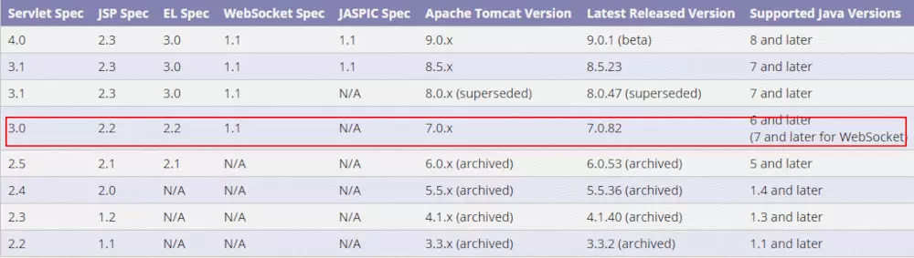
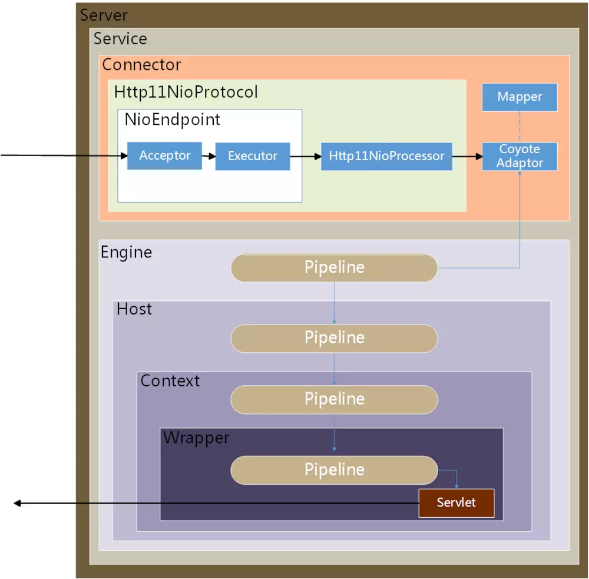
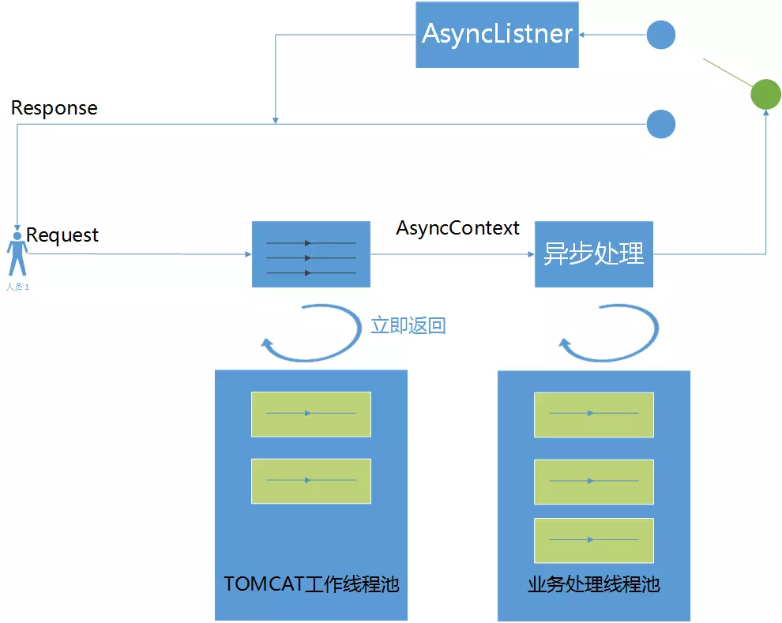
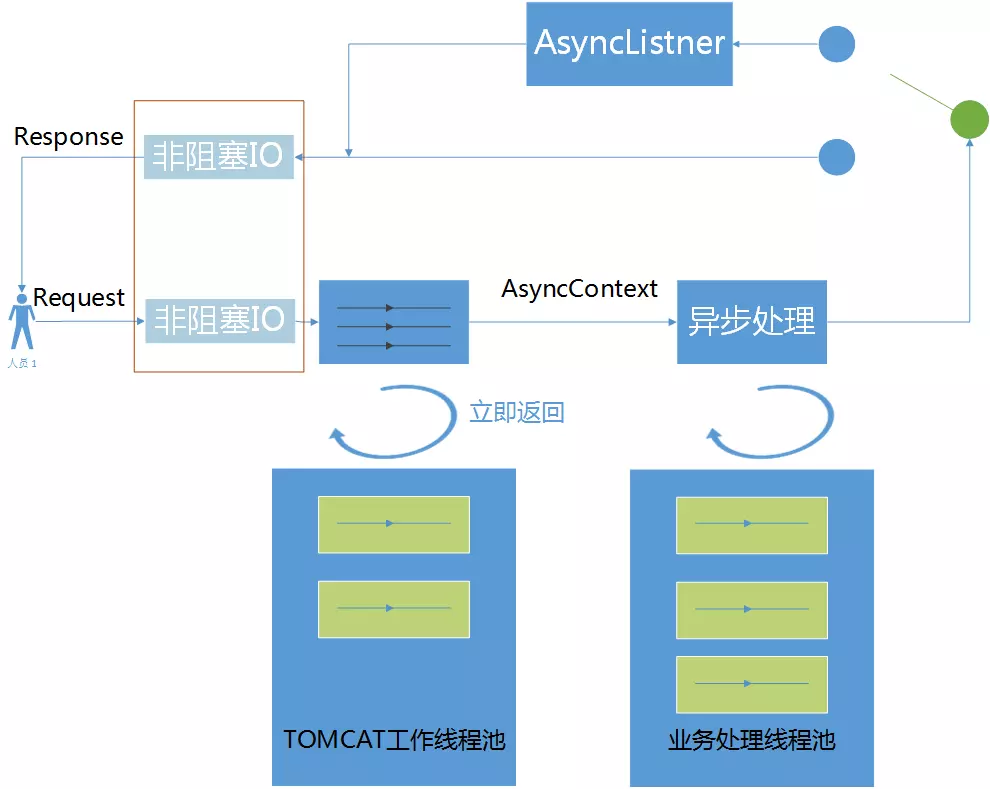

[TOC]


# servlet3异步原理与实践

#### 一、什么是Servlet

servlet 是基于 Java 的 Web 组件，由容器进行管理，来生成动态内容。像其他基于 Java 的组件技术一样，servlet 也是基于平台无关的 Java 类格式，被编译为平台无关的字节码，可以被基于 Java 技术的 Web 服务器动态加载并运行。容器（Container），有时候也叫做 servlet 引擎，是 Web 服务器为支持 servlet 功能扩展的部分。客户端通过 servlet 容器实现的 request/response paradigm（请求/应答模式） 与 Servlet 进行交互。

#### 二、什么是Servlet规范

每当一个Servlet版本发布都会对应一个Servlet版本的规范，比如Servlet2.5、Servlet3.0、Servlet3.1.
规范中描述了Java Servlet API 的标准，定义了 Java Servlet API 中类、接口、方法签名的完整规范且附带的Javadoc 文档供开发人员查阅，目的主要是为Java Servlet 给出一个完整和清晰的解释。从下图可以看出Servlet规范版本和tomcat支持的版本的对应关系。比如Servlet3是从tomcat7以后开始支持的。



Servlet和tomcat版本.png

#### 三、同步，异步，阻塞，非阻塞

同步异步是数据通信的方式，阻塞和非阻塞是一种状态。比如同步这种数据通讯方式里面可以有阻塞状态也可以有非阻塞状态。从另外一个角度理解同步和异步，就是如果一个线程干完的事情都是同步，有线程切换才能干完的事情就是异步。

#### 四、Servlet3的异步位置

这里说的位置是指，从tomcat处理整个request请求流程中，异步处于哪一步。我们先梳理出在NIO模式下(是否使用NIO跟异步没有直接关系，这里是拿NIO模式下的tomcat流程做说明)，下面这个图是tomcat的总体结构，里面用箭头标明了请求线路。



tomcat架构图.png

我们知道在tomcat的组件中Connector和Engine是最核心的两个组件，Servlet3的异步处理就是发生在Connector中。Tomcat的组件之间的协作关系，后续会单独写一篇文章介绍。这里先有一个直观的认识。便与后续对异步理解。

#### 五、Servlet3的异步流程



Servlet异步流程图.png

接收到request请求之后，由tomcat工作线程从HttpServletRequest中获得一个异步上下文AsyncContext对象，然后由tomcat工作线程把AsyncContext对象传递给业务处理线程，同时tomcat工作线程归还到工作线程池，这一步就是异步开始。在业务处理线程中完成业务逻辑的处理，生成response返回给客户端。在Servlet3.0中虽然处理请求可以实现异步，但是InputStream和OutputStream的IO操作还是阻塞的，当数据量大的request body 或者 response body的时候，就会导致不必要的等待。从Servlet3.1以后增加了非阻塞IO，需要tomcat8.x支持。

#### 六、Servlet3的异步使用步骤

我们使用的大致步骤如下：
1、声明Servlet，增加asyncSupported属性，开启异步支持。@WebServlet(urlPatterns = "/AsyncLongRunningServlet", asyncSupported = true)
2、通过request获取异步上下文AsyncContext。AsyncContext asyncCtx = request.startAsync();
3、开启业务逻辑处理线程，并将AsyncContext 传递给业务线程。executor.execute(new AsyncRequestProcessor(asyncCtx, secs));
4、在异步业务逻辑处理线程中，通过asyncContext获取request和response，处理对应的业务。
5、业务逻辑处理线程处理完成逻辑之后，调用AsyncContext 的complete方法。asyncContext.complete();从而结束该次异步线程处理。

#### 七、Servlet3的异步使用示例

##### 7.1、AsyncLongRunningServlet.java 处理Servlet请求，并开启异步

```java

import javax.servlet.AsyncContext;
import javax.servlet.ServletException;
import javax.servlet.annotation.WebServlet;
import javax.servlet.http.HttpServlet;
import javax.servlet.http.HttpServletRequest;
import javax.servlet.http.HttpServletResponse;
import java.io.IOException;
import java.util.concurrent.ThreadPoolExecutor;

/**
 * Created by wangxindong on 2017/10/19.
 */
@WebServlet(urlPatterns = "/AsyncLongRunningServlet", asyncSupported = true)
public class AsyncLongRunningServlet extends HttpServlet {
    private static final long serialVersionUID = 1L;

    protected void doGet(HttpServletRequest request,
                         HttpServletResponse response) throws ServletException, IOException {
        long startTime = System.currentTimeMillis();
        System.out.println("AsyncLongRunningServlet Start::Name="
                + Thread.currentThread().getName() + "::ID="
                + Thread.currentThread().getId());

        request.setAttribute("org.apache.catalina.ASYNC_SUPPORTED", true);

        String time = request.getParameter("time");
        int secs = Integer.valueOf(time);
        // max 10 seconds
        if (secs > 10000)
            secs = 10000;

        AsyncContext asyncCtx = request.startAsync();
        asyncCtx.addListener(new AppAsyncListener());
        asyncCtx.setTimeout(9000);//异步servlet的超时时间,异步Servlet有对应的超时时间，如果在指定的时间内没有执行完操作，response依然会走原来Servlet的结束逻辑，后续的异步操作执行完再写回的时候，可能会遇到异常。

        ThreadPoolExecutor executor = (ThreadPoolExecutor) request
                .getServletContext().getAttribute("executor");

        executor.execute(new AsyncRequestProcessor(asyncCtx, secs));
        long endTime = System.currentTimeMillis();
        System.out.println("AsyncLongRunningServlet End::Name="
                + Thread.currentThread().getName() + "::ID="
                + Thread.currentThread().getId() + "::Time Taken="
                + (endTime - startTime) + " ms.");
    }
}
```

##### 7.2、AppAsyncListener.java 异步监听器

```java
 
import javax.servlet.AsyncEvent;
import javax.servlet.AsyncListener;
import javax.servlet.ServletResponse;
import javax.servlet.annotation.WebListener;
import java.io.IOException;
import java.io.PrintWriter;

/**
 * Created by wangxindong on 2017/10/19.
 */
@WebListener
public class AppAsyncListener implements AsyncListener {
    @Override
    public void onComplete(AsyncEvent asyncEvent) throws IOException {
        System.out.println("AppAsyncListener onComplete");
        // we can do resource cleanup activity here
    }

    @Override
    public void onError(AsyncEvent asyncEvent) throws IOException {
        System.out.println("AppAsyncListener onError");
        //we can return error response to client
    }

    @Override
    public void onStartAsync(AsyncEvent asyncEvent) throws IOException {
        System.out.println("AppAsyncListener onStartAsync");
        //we can log the event here
    }

    @Override
    public void onTimeout(AsyncEvent asyncEvent) throws IOException {
        System.out.println("AppAsyncListener onTimeout");
        //we can send appropriate response to client
        ServletResponse response = asyncEvent.getAsyncContext().getResponse();
        PrintWriter out = response.getWriter();
        out.write("TimeOut Error in Processing");
    }
}
```

##### 7.3、AppContextListener.java Servlet上下文监听器，可以在里面初始化业务线程池

```
 
import javax.servlet.ServletContextEvent;
import javax.servlet.ServletContextListener;
import javax.servlet.annotation.WebListener;
import java.util.concurrent.ArrayBlockingQueue;
import java.util.concurrent.ThreadPoolExecutor;
import java.util.concurrent.TimeUnit;

/**
 * Created by wangxindong on 2017/10/19.
 * 在监听中初始化线程池
 */
@WebListener
public class AppContextListener implements ServletContextListener {
    public void contextInitialized(ServletContextEvent servletContextEvent) {

        // create the thread pool
        ThreadPoolExecutor executor = new ThreadPoolExecutor(100, 200, 50000L,
                TimeUnit.MILLISECONDS, new ArrayBlockingQueue<Runnable>(100));
        servletContextEvent.getServletContext().setAttribute("executor",
                executor);

    }

    public void contextDestroyed(ServletContextEvent servletContextEvent) {
        ThreadPoolExecutor executor = (ThreadPoolExecutor) servletContextEvent
                .getServletContext().getAttribute("executor");
        executor.shutdown();
    }
}
```

##### 7.4、AsyncRequestProcessor.java 业务工作线程

```java
 
import javax.servlet.AsyncContext;
import java.io.IOException;
import java.io.PrintWriter;

/**
 * Created by wangxindong on 2017/10/19.
 * 业务工作线程
 */
public class AsyncRequestProcessor implements Runnable {
    private AsyncContext asyncContext;
    private int secs;

    public AsyncRequestProcessor() {
    }

    public AsyncRequestProcessor(AsyncContext asyncCtx, int secs) {
        this.asyncContext = asyncCtx;
        this.secs = secs;
    }

    @Override
    public void run() {
        System.out.println("Async Supported? "
                + asyncContext.getRequest().isAsyncSupported());
        longProcessing(secs);
        try {
            PrintWriter out = asyncContext.getResponse().getWriter();
            out.write("Processing done for " + secs + " milliseconds!!");
        } catch (IOException e) {
            e.printStackTrace();
        }
        //complete the processing
        asyncContext.complete();
    }

    private void longProcessing(int secs) {
        // wait for given time before finishing
        try {
            Thread.sleep(secs);
        } catch (InterruptedException e) {
            e.printStackTrace();
        }
    }
}
```

#### 八、Tomcat NIO Connector ,Servlet 3.0 Async,Spring MVC Async的关系

对于这几个概念往往会混淆，这里做一个梳理比较，nio是一种IO的模型，对比与传统的BIO，它可以利用较少的线程处理更多的连接从而增加机器的吞吐量，Tomcat NIO Connector是Tomcat的一种NIO连接模式。异步，前面提到他是一种通讯的方式，它跟NIO没有任务关系，及时没有NIO也可以实现异步，Servlet 3.0 Async是指Servlet 3规范以后支持了异步处理Servlet请求，我们可以把请求线程和业务线程分开。Spring MVC Async是在Servlet3异步的基础上做了一层封装。具体的区别如下：

##### 8.1、Tomcat NIO Connector

Tomcat的Connector 有三种模式，BIO,NIO,APR,Tomcat NIO Connector是其中的NIO模式，使得tomcat容器可以用较少的线程处理大量的连接请求，不再是传统的一请求一线程模式。Tomcat的server.xml配置protocol="org.apache.coyote.http11.Http11NioProtocol"，Http11NioProtocol 从 tomcat 6.x 开始支持。NIO的细节可以参看NIO相关技术文章。

##### 8.2、Servlet 3.0 Async

是说Servlet 3.0支持了业务请求的异步处理，Servlet3之前一个请求的处理流程，请求解析、READ BODY,RESPONSE BODY,以及其中的业务逻辑处理都由Tomcat线程池中的一个线程进行处理的。那么3.0以后我们可以让请求线程(IO线程)和业务处理线程分开，进而对业务进行线程池隔离。我们还可以根据业务重要性进行业务分级，然后再把线程池分级。还可以根据这些分级做其它操作比如监控和降级处理。servlet 3.0 从 tomcat 7.x 开始支持。

##### 8.3、Spring MVC Async

是Spring MVC 3.2 以上版本基于Servlet 3的基础做的封装，原理及实现方式同上，使用方式如下:

```java
@Controller
@RequestMapping("/async/TestController")
public class TestController {
    @ResponseBody
    @RequestMapping("/{testUrl}")
    public DeferredResult<ResponseEntity<String>> testProcess(@PathVariable String testUrl) {
        final DeferredResult<ResponseEntity<String>> deferredResult = new DeferredResult<ResponseEntity<String>>();

        // 业务逻辑异步处理,将处理结果 set 到 DeferredResult
        new Thread(new AsyncTask(deferredResult)).start();

        return deferredResult;
    }

    private static class AsyncTask implements Runnable {

        private DeferredResult result;

        private AsyncTask(DeferredResult result) {
            this.result = result;
        }

        @Override
        public void run() {
            //业务逻辑START
            //...
            //业务逻辑END
            result.setResult(result);
        }
    }
}
```

#### 九、Servlet3非阻塞IO

Servlet3.1以后增加了非阻塞IO实现，需要Tomcat8.x以上支持。根据Servlet3.1规范中的描述”非阻塞 IO 仅对在 Servlet 中的异步处理请求有效，否则，当调用 ServletInputStream.setReadListener 或ServletOutputStream.setWriteListener 方法时将抛出IllegalStateException“。可以说Servlet3的非阻塞IO是对Servlet3异步的增强。Servlet3的非阻塞是利用java.util.EventListener的事件驱动机制来实现的。

##### 9.1、AsyncLongRunningServlet.java 接收请求，获取读取请求监听器ReadListener

```java
package com.test.servlet3Noblock;

import javax.servlet.AsyncContext;
import javax.servlet.ServletException;
import javax.servlet.ServletInputStream;
import javax.servlet.annotation.WebServlet;
import javax.servlet.http.HttpServlet;
import javax.servlet.http.HttpServletRequest;
import javax.servlet.http.HttpServletResponse;
import java.io.IOException;
import java.io.PrintWriter;

/**
 * Created by wangxindong on 2017/10/23.
 */
@WebServlet(urlPatterns = "/AsyncLongRunningServlet2", asyncSupported = true)
public class AsyncLongRunningServlet extends HttpServlet {
    protected void doGet(HttpServletRequest request,
                         HttpServletResponse response) throws ServletException, IOException {
        request.setCharacterEncoding("UTF-8");
        response.setContentType("text/html;charset=UTF-8");

        AsyncContext actx = request.startAsync();//通过request获得AsyncContent对象

        actx.setTimeout(30*3000);//设置异步调用超时时长

        ServletInputStream in = request.getInputStream();
        //异步读取（实现了非阻塞式读取）
        in.setReadListener(new MyReadListener(in,actx));
        //直接输出到页面的内容(不等异步完成就直接给页面)
        PrintWriter out = response.getWriter();
        out.println("<h1>直接返回页面，不等异步处理结果了</h1>");
        out.flush();
    }

}
```

##### 9.2、MyReadListener.java 异步处理

```java
package com.test.servlet3Noblock;

import javax.servlet.AsyncContext;
import javax.servlet.ReadListener;
import javax.servlet.ServletInputStream;
import java.io.IOException;
import java.io.PrintWriter;

/**
 * Created by wangxindong on 2017/10/23.
 */
public class MyReadListener implements ReadListener {
    private ServletInputStream inputStream;
    private AsyncContext asyncContext;
    public MyReadListener(ServletInputStream input,AsyncContext context){
        this.inputStream = input;
        this.asyncContext = context;
    }
    //数据可用时触发执行
    @Override
    public void onDataAvailable() throws IOException {
        System.out.println("数据可用时触发执行");
    }

    //数据读完时触发调用
    @Override
    public void onAllDataRead() throws IOException {
        try {
            Thread.sleep(3000);//暂停5秒，模拟耗时处理数据
            PrintWriter out = asyncContext.getResponse().getWriter();
            out.write("数据读完了");
            out.flush();
            System.out.println("数据读完了");
        } catch (InterruptedException e) {
            e.printStackTrace();
        }

    }

    //数据出错触发调用
    @Override
    public void onError(Throwable t){
        System.out.println("数据 出错");
        t.printStackTrace();
    }
}
```

Servlet3.1的非阻塞IO从下面图中可以看出是面对InputStream 和 OutPutStream流的，这里的非阻塞IO跟我们常说的JDK NIO不是一个概念，Servlet3.1的非阻塞是同jdk的事件驱动机制来实现。
public interface ReadListener extends java.util.EventListener



Servlet异步处理流程含非阻塞IO图.png

#### 十、总结

通讯模型中的NIO可以利用很少的线程处理大量的连接，提高了机器的吞吐量。Servlet的异步处理机制使得我们可以将请求异步到独立的业务线程去执行，使得我们能够将请求线程和业务线程分离。通讯模型的NIO跟Servlet3的异步没有直接关系。但是我们将两种技术同时使用就更增加了以tomcat为容器的系统的处理能力。自从Servlet3.1以后增加了非阻塞的IO，这里的非阻塞IO是面向inputstream和outputstream流，通过jdk的事件驱动模型来实现，更一步增强了Servlet异步的高性能，可以认为是一种增强版的异步机制。

 

参考资料
[https://tomcat.apache.org/tomcat-7.0-doc/config/http.html](https://link.jianshu.com/?t=https://tomcat.apache.org/tomcat-7.0-doc/config/http.html)
[http://svn.apache.org/repos/asf/tomcat/tc7.0.x/trunk/java/org/apache/catalina/connector/Request.java](https://link.jianshu.com/?t=http://svn.apache.org/repos/asf/tomcat/tc7.0.x/trunk/java/org/apache/catalina/connector/Request.java) tomcat源码地址
[https://www.journaldev.com/2008/async-servlet-example](https://link.jianshu.com/?t=https://www.journaldev.com/2008/async-servlet-example)
[http://www.cnblogs.com/davenkin/p/async-servlet.html](https://link.jianshu.com/?t=http://www.cnblogs.com/davenkin/p/async-servlet.html)


https://www.jianshu.com/p/c23ca9d26f64