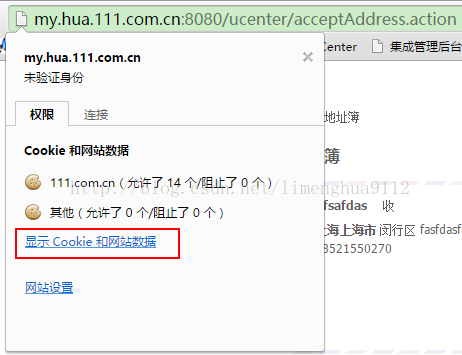
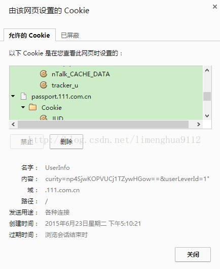
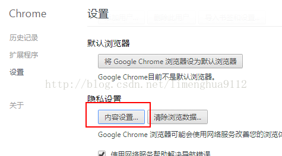
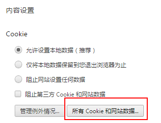
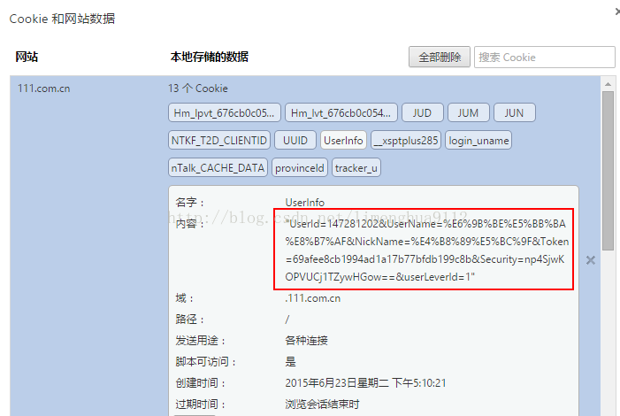

# Chrome浏览器查看所有Cookie

我们如何查看[Chrome浏览器](https://www.baidu.com/s?wd=Chrome%E6%B5%8F%E8%A7%88%E5%99%A8&tn=24004469_oem_dg&rsv_dl=gh_pl_sl_csd)保存在本地磁盘的Cookie呢？

见图：

## 方法一：点击url左边的文本图标，然后“显示Cookie和网站数据”

## 方法二、 Chrome设置-->>内容设置

查看Cookie选项中的“所有Cookie和网站数据...”

找到自己想要查看的网站，然后根据key值，查看cookie内容：

https://blog.csdn.net/limenghua9112/article/details/46618995