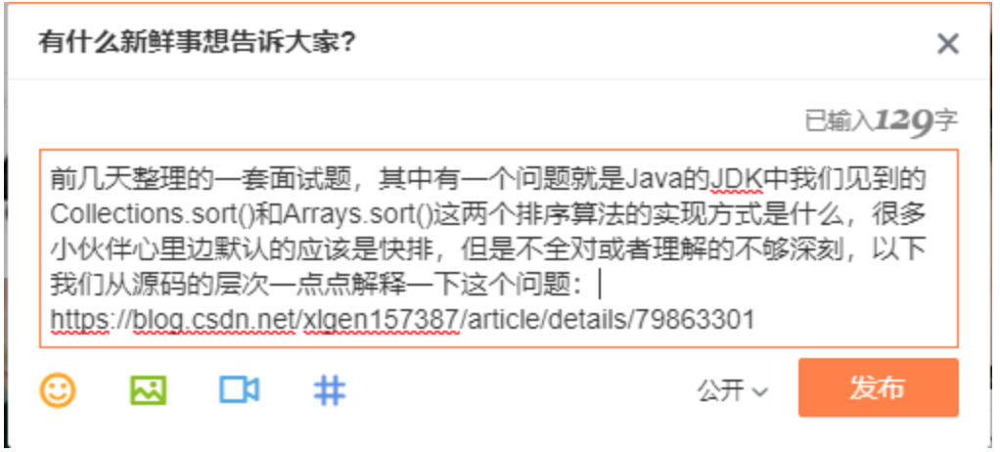
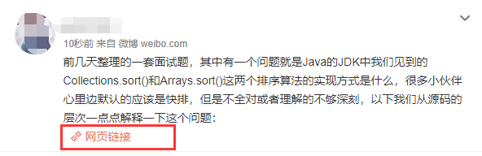
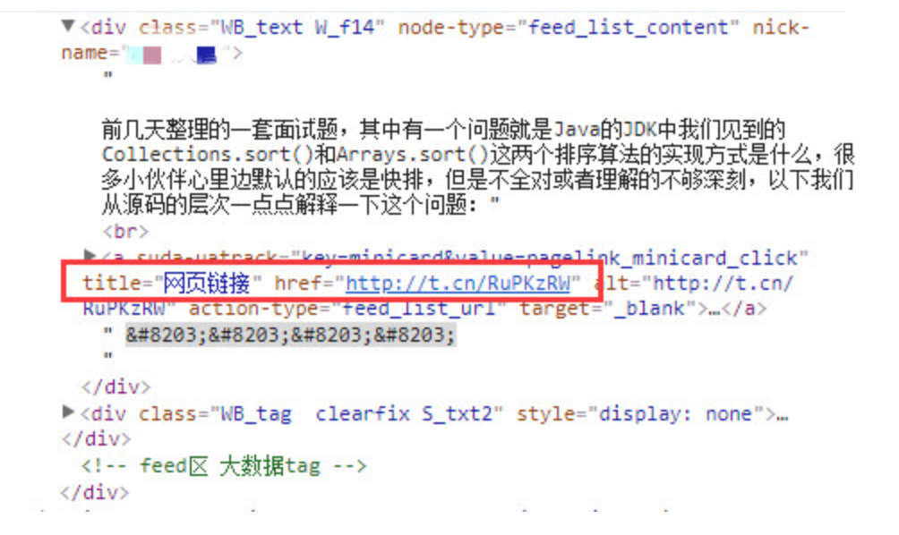
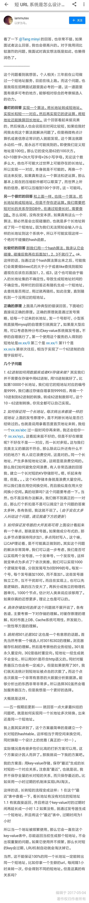

[TOC]


# 如何将一个长URL转换为一个短URL？

2018年04月21日 14:40:41

## 一、前言

前几天整理面试题的时候，有一道试题是《如何将一个很长的URL转换为一个短的URL，并实现他们之间的相互转换？》，现在想起来这是一个绝对不简单的问题，需要考虑很多方面，今天和大家一起学习研究一下！

**短网址**：顾名思义，就是将长网址缩短到一个很短的网址，用户访问这个短网址可以重定向到原本的长网址（也就是还原的过程）。这样可以达到易于记忆、转换的目的，常用于有字数限制的微博、二维码等等场景。

关于短URL的使用场景，举个简单的例子来说明一下，看一下业务中使用短URL的重要性！

## 二、短地址使用场景

**1、新浪微博**

我们在新浪微博上发布网址的时候，微博会自动判别网址，并将其转换，例如：[https://t.cn/RuPKzRW。为什么要这样做的？](https://t.cn/RuPKzRW%E3%80%82%E4%B8%BA%E4%BB%80%E4%B9%88%E8%A6%81%E8%BF%99%E6%A0%B7%E5%81%9A%E7%9A%84%EF%BC%9F)

这是因为微博限制字数为140字一条，那么如果我们需要发一些链接上去，但是这个链接非常的长，以至于将近要占用我们内容的一半篇幅，这肯定是不能被允许的或者说用户体验很差的，所以短网址应运而生了，短网址这种服务可以说是在微博出现之后才流行开来的！往下看：

（1）首先，我先发一条微博带有一个URL地址：


（2）然后，看他转换之后显示的效果是什么样子的哪？


（3）查看对应页面元素的HTML源码如下：


（4）可以看出：<https://blog.csdn.net/xlgen157387/article/details/79863301> 被转换为：[http://t.cn/RuPKzRW，此时你访问http://t.cn/RuPKzRW是可以定位到https://blog.csdn.net/xlgen157387/article/details/79863301，也就是实现了转换。](http://t.cn/RuPKzRW%EF%BC%8C%E6%AD%A4%E6%97%B6%E4%BD%A0%E8%AE%BF%E9%97%AEhttp://t.cn/RuPKzRW%E6%98%AF%E5%8F%AF%E4%BB%A5%E5%AE%9A%E4%BD%8D%E5%88%B0https://blog.csdn.net/xlgen157387/article/details/79863301%EF%BC%8C%E4%B9%9F%E5%B0%B1%E6%98%AF%E5%AE%9E%E7%8E%B0%E4%BA%86%E8%BD%AC%E6%8D%A2%E3%80%82)

**2、短网址二维码**

网址在转换成短网址时，也可以生成相应的短网址二维码，短网址二维码的应用，二维码核心解决的是跨平台、跨现实的数据传输问题；而且二维码跟应用场景结合之后，所能解决的问题会越来越多。

（1）短网址二维码相比短链接更方便，能少输入，尽量少输入，哪怕只是少点一下键盘，都是有意义的。

（2）二维码只是扫描一个简单的链接，打开的却是一个世界。想象一下，用手机购买售货机里商品，二维码扫描是略快于从用手机找到该售货机并找到该商品的，而且这种操作相对于搜索/查找而言不是更优雅吗?

（3）所有商超里面的商品，都是使用条码来确定商品的唯一性的，去买单的时候都是扫描条码。试想，如果里面加入了更多产品的生产日期、厂家、流转途径、原材料等等信息，是不是厉害了呢?特别是针对食品信息的可追溯上，二维码应用场景更广泛。

## 三、短地址的好处

除了上述场景中，我们将长地址转换为短地址的使用场景的优点（压缩URL长度）之外，短地址还具有很多实际场景中的优点，例如：

（1）节省网址长度，便于社交化传播，一个是让URL更短小，传播更方便，尤其是URL中有中文和特殊字符，短网址解决很长的URL难以记忆不利于传播的问题；

（2）短网址在我们项目里可以很好的对开放以及对URL进行管理。有一部分网址可以会涵盖性、暴力、广告等信息，这样我们可以通过用户的举报，完全管理这个连接将不出现在我们的应用中，对同样的URL通过加密算法之后，得到的地址是一样的；

（3）方便后台跟踪点击量、地域分布等用户统计。我们可以对一系列的网址进行流量，点击等统计，挖掘出大多数用户的关注点，这样有利于我们对项目的后续工作更好的作出决策；

（4）规避关键词、域名屏蔽手段、隐藏真实地址，适合做付费推广链接；

（5）当你看到一个淘宝的宝贝连接后面是200个“e7x8bv7c8bisdj”这样的字符的时候，你还会觉得舒服吗。更何况微博字数只有140字，微博或短信里，字数不够，你用条短网址就能帮你腾出很多空间来；

## 四、短网址服务提供平台

目前，国内网又很多提供短地址服务的平台，例如：

- 新浪：<http://sina.lt/>
- 百度：<http://dwz.cn/>
- 0x3：<http://0x3.me/>
- MRW：<http://mrw.so/>

等等还有很多，这个可以搜索一下就会有很多！但是一个注意的是，如果使用某一个平台的短地址服务，一定要保证长期可靠的服务，不然一段时间失效了，我们以前已经转换的URL就完了！

这里以百度例，将我们上述博客的地址转换为短地址如下所示：


当然，对于我们的业务来说，如果自己可以提供自己的短URL服务那才是更好的，不需要受制于人！（中国芯片需要崛起！！！）

## 五、关于如何生成短地址URL的讨论

关于短地址URL如何生成方式的，网上有很多方式，有基于映射的，有基于Hash的，有基于签名的，但是总的来说并不能满足绝大部分场景的使用，或者说是一种错误的设计方式。这里不再重复造轮子！以下是知乎用户**iammutex**关于该问题的探讨，截图过来和大家一起学习一下：



```
作者：iammutex
链接：https://www.zhihu.com/question/29270034/answer/46446911
来源：知乎
著作权归作者所有。商业转载请联系作者获得授权，非商业转载请注明出处。
1234
```

## 六、生成短地址URL需要注意的

看到上述知乎用户iammutex关于如何正确生成短地址URL的探讨，我们知道了，可以通过发号器的方式正确的生成短地址，生成算法设计要点如下：

（1）利用放号器，初始值为0，对于每一个短链接生成请求，都递增放号器的值，再将此值转换为62进制（a-zA-Z0-9），比如第一次请求时放号器的值为0，对应62进制为a，第二次请求时放号器的值为1，对应62进制为b，第10001次请求时放号器的值为10000，对应62进制为sBc。

（2）将短链接服务器域名与放号器的62进制值进行字符串连接，即为短链接的URL，比如：[t.cn/sBc。](http://t.cn/sBc%E3%80%82)

（3）重定向过程：生成短链接之后，需要存储短链接到长链接的映射关系，即sBc -> URL，浏览器访问短链接服务器时，根据URL Path取到原始的链接，然后进行302重定向。映射关系可使用K-V存储，比如Redis或Memcache。

## 七、生成短地址之后如何跳转哪？

对于该部分的讨论，我们可以认为他是整个交互的流程，具体的流程细节如下：

（1）用户访问短链接：[http://t.cn/RuPKzRW；](http://t.cn/RuPKzRW%EF%BC%9B)

（2）短链接服务器t.cn收到请求，根据URL路径RuPKzRW获取到原始的长链接（KV缓存数据库中去查找）：[https://blog.csdn.net/xlgen157387/article/details/79863301；](https://blog.csdn.net/xlgen157387/article/details/79863301%EF%BC%9B)

（3）服务器返回302状态码，将响应头中的Location设置为：[https://blog.csdn.net/xlgen157387/article/details/79863301；](https://blog.csdn.net/xlgen157387/article/details/79863301%EF%BC%9B)

（4）浏览器重新向https://blog.csdn.net/xlgen157387/article/details/79863301发送请求；

（5）返回响应；

## 八、短地址发号器优化方案

**1、算法优化**

采用以上算法，如果不加判断，那么即使对于同一个原始URL，每次生成的短链接也是不同的，这样就会浪费存储空间（因为需要存储多个短链接到同一个URL的映射），如果能将相同的URL映射成同一个短链接，这样就可以节省存储空间了。主要的思路有如下两个：

**方案1：查表**

每次生成短链接时，先在映射表中查找是否已有原始URL的映射关系，如果有，则直接返回结果。很明显，这种方式效率很低。

**方案2：使用LRU本地缓存，空间换时间**

使用固定大小的LRU缓存，存储最近N次的映射结果，这样，如果某一个链接生成的非常频繁，则可以在LRU缓存中找到结果直接返回，这是存储空间和性能方面的折中。

**2、可伸缩和高可用**

如果将短链接生成服务单机部署，缺点一是性能不足，不足以承受海量的并发访问，二是成为系统单点，如果这台机器宕机则整套服务不可 用，为了解决这个问题，可以将系统集群化，进行“分片”。

在以上描述的系统架构中，如果发号器用Redis实现，则Redis是系统的瓶颈与单点，因此，利用数据库分片的设计思想，可部署多个发号器实例，每个实例负责特定号段的发号，比如部署10台Redis，每台分别负责号段尾号为0-9的发号，注意此时发号器的步长则应该设置为10（实例个数）。

另外，也可将长链接与短链接映射关系的存储进行分片，由于没有一个中心化的存储位置，因此需要开发额外的服务，用于查找短链接对应的原始链接的存储节点，这样才能去正确的节点上找到映射关系。

## 九、如何用代码实现短地址

**1、使用随机序列生成短地址**

说到这里终于说到重点了，很多小伙伴已经按捺不住了，不好意思让大家失望了，这只是一片简单的文章，并不能把这么繁杂的一个系统演示清楚！秉着不要重复造轮子的原则，这里给出一个为数不多还算可以的实现短地址的开源项目：urlshorter

注意：urlshorter本身还是基于随机的方式生成短地址的，并不算是一个短地址发号器，因此会有性能问题和冲突的出现，和知乎用户**iammutex** 描述的实现方式还是有区别的！而关于短地址发号器的方式目前还没有找到更好的开源项目可供参考！

项目地址：<https://gitee.com/tinyframework/urlshorter>


**2、使用SnowFlake发号器生成短地址**

实现参考：
<https://github.com/beyondfengyu/SnowFlake>
<http://www.wolfbe.com/detail/201611/381.html>

Twitter的雪花算法SnowFlake，使用Java语言实现。

SnowFlake算法用来生成64位的ID，刚好可以用long整型存储，能够用于分布式系统中生产唯一的ID， 并且生成的ID有大致的顺序。 在这次实现中，生成的64位ID可以分成5个部分：

```
0 - 41位时间戳 - 5位数据中心标识 - 5位机器标识 - 12位序列号
```

5位数据中心标识、5位机器标识这样的分配仅仅是当前实现中分配的，如果业务有其实的需要，可以按其它的分配比例分配，如10位机器标识，不需要数据中心标识。

Java代码实现如下：

```
/**
 * 进制转换工具，最大支持十进制和62进制的转换
 * 1、将十进制的数字转换为指定进制的字符串；
 * 2、将其它进制的数字（字符串形式）转换为十进制的数字
 * @author xuliugen
 * @date 2018/04/23
 */
public class NumericConvertUtils {

    /**
     * 在进制表示中的字符集合，0-Z分别用于表示最大为62进制的符号表示
     */
    private static final char[] digits = {'0', '1', '2', '3', '4', '5', '6', '7', '8', '9',
            'a', 'b', 'c', 'd', 'e', 'f', 'g', 'h', 'i', 'j', 'k', 'l', 'm',
            'n', 'o', 'p', 'q', 'r', 's', 't', 'u', 'v', 'w', 'x', 'y', 'z',
            'A', 'B', 'C', 'D', 'E', 'F', 'G', 'H', 'I', 'J', 'K', 'L', 'M',
            'N', 'O', 'P', 'Q', 'R', 'S', 'T', 'U', 'V', 'W', 'X', 'Y', 'Z'};

    /**
     * 将十进制的数字转换为指定进制的字符串
     * @param number 十进制的数字
     * @param seed   指定的进制
     * @return 指定进制的字符串
     */
    public static String toOtherNumberSystem(long number, int seed) {
        if (number < 0) {
            number = ((long) 2 * 0x7fffffff) + number + 2;
        }
        char[] buf = new char[32];
        int charPos = 32;
        while ((number / seed) > 0) {
            buf[--charPos] = digits[(int) (number % seed)];
            number /= seed;
        }
        buf[--charPos] = digits[(int) (number % seed)];
        return new String(buf, charPos, (32 - charPos));
    }

    /**
     * 将其它进制的数字（字符串形式）转换为十进制的数字
     * @param number 其它进制的数字（字符串形式）
     * @param seed   指定的进制，也就是参数str的原始进制
     * @return 十进制的数字
     */
    public static long toDecimalNumber(String number, int seed) {
        char[] charBuf = number.toCharArray();
        if (seed == 10) {
            return Long.parseLong(number);
        }

        long result = 0, base = 1;

        for (int i = charBuf.length - 1; i >= 0; i--) {
            int index = 0;
            for (int j = 0, length = digits.length; j < length; j++) {
	            //找到对应字符的下标，对应的下标才是具体的数值
                if (digits[j] == charBuf[i]) {
                    index = j;
                }
            }
            result += index * base;
            base *= seed;
        }
        return result;
    }
}  
123456789101112131415161718192021222324252627282930313233343536373839404142434445464748495051525354555657585960616263646566
/**
 * Twitter的SnowFlake算法,使用SnowFlake算法生成一个整数，然后转化为62进制变成一个短地址URL
 * @author beyond
 * @author xuliugen
 * @date 2018/04/23
 */
public class SnowFlakeShortUrl {

    /**
     * 起始的时间戳
     */
    private final static long START_TIMESTAMP = 1480166465631L;

    /**
     * 每一部分占用的位数
     */
    private final static long SEQUENCE_BIT = 12;   //序列号占用的位数
    private final static long MACHINE_BIT = 5;     //机器标识占用的位数
    private final static long DATA_CENTER_BIT = 5; //数据中心占用的位数

    /**
     * 每一部分的最大值
     */
    private final static long MAX_SEQUENCE = -1L ^ (-1L << SEQUENCE_BIT);
    private final static long MAX_MACHINE_NUM = -1L ^ (-1L << MACHINE_BIT);
    private final static long MAX_DATA_CENTER_NUM = -1L ^ (-1L << DATA_CENTER_BIT);

    /**
     * 每一部分向左的位移
     */
    private final static long MACHINE_LEFT = SEQUENCE_BIT;
    private final static long DATA_CENTER_LEFT = SEQUENCE_BIT + MACHINE_BIT;
    private final static long TIMESTAMP_LEFT = DATA_CENTER_LEFT + DATA_CENTER_BIT;

    private long dataCenterId;  //数据中心
    private long machineId;     //机器标识
    private long sequence = 0L; //序列号
    private long lastTimeStamp = -1L;  //上一次时间戳

    /**
     * 根据指定的数据中心ID和机器标志ID生成指定的序列号
     * @param dataCenterId 数据中心ID
     * @param machineId    机器标志ID
     */
    public SnowFlake(long dataCenterId, long machineId) {
        if (dataCenterId > MAX_DATA_CENTER_NUM || dataCenterId < 0) {
            throw new IllegalArgumentException("DtaCenterId can't be greater than MAX_DATA_CENTER_NUM or less than 0！");
        }
        if (machineId > MAX_MACHINE_NUM || machineId < 0) {
            throw new IllegalArgumentException("MachineId can't be greater than MAX_MACHINE_NUM or less than 0！");
        }
        this.dataCenterId = dataCenterId;
        this.machineId = machineId;
    }

    /**
     * 产生下一个ID
     * @return
     */
    public synchronized long nextId() {
        long currTimeStamp = getNewTimeStamp();
        if (currTimeStamp < lastTimeStamp) {
            throw new RuntimeException("Clock moved backwards.  Refusing to generate id");
        }

        if (currTimeStamp == lastTimeStamp) {
            //相同毫秒内，序列号自增
            sequence = (sequence + 1) & MAX_SEQUENCE;
            //同一毫秒的序列数已经达到最大
            if (sequence == 0L) {
                currTimeStamp = getNextMill();
            }
        } else {
            //不同毫秒内，序列号置为0
            sequence = 0L;
        }

        lastTimeStamp = currTimeStamp;

        return (currTimeStamp - START_TIMESTAMP) << TIMESTAMP_LEFT //时间戳部分
                | dataCenterId << DATA_CENTER_LEFT       //数据中心部分
                | machineId << MACHINE_LEFT             //机器标识部分
                | sequence;                             //序列号部分
    }

    private long getNextMill() {
        long mill = getNewTimeStamp();
        while (mill <= lastTimeStamp) {
            mill = getNewTimeStamp();
        }
        return mill;
    }

    private long getNewTimeStamp() {
        return System.currentTimeMillis();
    }

    public static void main(String[] args) {
        SnowFlake snowFlake = new SnowFlake(2, 3);

        for (int i = 0; i < (1 << 4); i++) {
            //10进制
            Long id = snowFlake.nextId();
            //62进制
            String convertedNumStr = NumericConvertUtils.toOtherNumberSystem(id, 62);

            //10进制转化为62进制
            System.out.println("10进制：" + id + "  62进制:" + convertedNumStr);

            //TODO 执行具体的存储操作，可以存放在Redis等中

            //62进制转化为10进制
            System.out.println("62进制：" + convertedNumStr + "  10进制:" + NumericConvertUtils.toDecimalNumber(convertedNumStr, 62));
            System.out.println();
        }
    }
}
//生成结果：
10进制：185784275776581632  62进制:dITqmhW2He
62进制：dITqmhW2He  10进制:185784275776581632

10进制：185784284689477632  62进制:dITqw17E6k
62进制：dITqw17E6k  10进制:185784284689477632

10进制：185784284689477633  62进制:dITqw17E6l
62进制：dITqw17E6l  10进制:185784284689477633

10进制：185784284689477634  62进制:dITqw17E6m
62进制：dITqw17E6m  10进制:185784284689477634

10进制：185784284689477635  62进制:dITqw17E6n
62进制：dITqw17E6n  10进制:185784284689477635

10进制：185784284689477636  62进制:dITqw17E6o
62进制：dITqw17E6o  10进制:185784284689477636

10进制：185784284689477637  62进制:dITqw17E6p
62进制：dITqw17E6p  10进制:185784284689477637

10进制：185784284693671936  62进制:dITqw1pfeo
62进制：dITqw1pfeo  10进制:185784284693671936

10进制：185784284693671937  62进制:dITqw1pfep
62进制：dITqw1pfep  10进制:185784284693671937

10进制：185784284693671938  62进制:dITqw1pfeq
62进制：dITqw1pfeq  10进制:185784284693671938

10进制：185784284693671939  62进制:dITqw1pfer
62进制：dITqw1pfer  10进制:185784284693671939

10进制：185784284693671940  62进制:dITqw1pfes
62进制：dITqw1pfes  10进制:185784284693671940

10进制：185784284693671941  62进制:dITqw1pfet
62进制：dITqw1pfet  10进制:185784284693671941

10进制：185784284693671942  62进制:dITqw1pfeu
62进制：dITqw1pfeu  10进制:185784284693671942

10进制：185784284693671943  62进制:dITqw1pfev
62进制：dITqw1pfev  10进制:185784284693671943

10进制：185784284693671944  62进制:dITqw1pfew
62进制：dITqw1pfew  10进制:185784284693671944
```

最后的代码地址：<https://gitee.com/xuliugen/codes/9upvmzyk6c2i78eb3lgnj63>

**3、推荐一个通用ID发号器**

码云地址：<https://gitee.com/robertleepeak/vesta-id-generator>

这里直接给大家地址，不在介绍，有想了解的可以移步查看文档。

## 十、总结

到此为止，我们一起学习了什么是短地址，短地址的优点，如何选择一种正确的方式来实现我们的短地址，以及在码云上找到的一个还算可以的短地址生成项目，相信此时的你能够有一个更好的了解！

------

参考文章：

1、<https://www.2cto.com/kf/201601/486883.html>
2、<https://blog.csdn.net/lz0426001/article/details/52370177>
3、<http://blog.sina.com.cn/s/blog_16aace20e0102x4tt.html>
4、<https://www.zhihu.com/question/29270034/answer/46446911>
5、<https://github.com/beyondfengyu/SnowFlake>


<https://blog.csdn.net/xlgen157387/article/details/80026452>