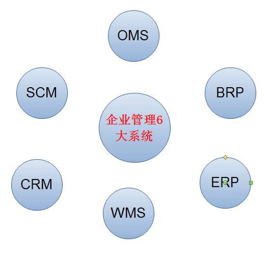
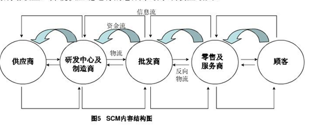
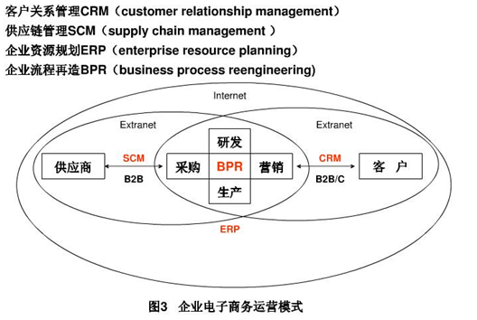

[TOC]

# ERP,SCM,CRM,BRP,OMS,WMS 企业管理的6大核心系统

## **【导读】：**

人体共有八大系统：运动系统、神经系统、内分泌系统、循环系统、呼吸系统、消化系统、泌尿系统、生殖系统。这些系统协调配合，使人体内各种复杂的生命活动能够正常进行。

 

同理，企业要想健康的运转，长久的发展，就必须有几个系统来支撑整个企业。下面就来简单介绍这六大系统：ERP,SCM,CRM,BRP,OMS,WMS。

 

## **OMS**

OMS是Order Management System的缩写，即订单管理系统。订单管理模块是信息系统集中管理的核心模块，是实现宏观调控、统一管理和决策分析的核心。订单管理模块主要以订单管理为核心，辅助以工作流控制技术，使得在供应链上的各个部门，各个工作中心能够统一的协调物流资源，提高协作效率订单管理模块是整个信息化系统的数据中心，拥有各地的所有交易数据。所有物流业务活动的全过程将在订单管理模块得到恰当的体现，为企业的各项分析、决策和其他活动提供基础数据支持。OMS不仅仅是订单执行的分配，而是监控异常，管理订单全程生命周期的系统。

## **WMS**

是仓库管理系统(Warehouse Management System) 的缩写，仓库管理系统是通过入库业务、出库业务、仓库调拨、库存调拨和虚仓管理等功能，综合批次管理、物料对应、库存盘点、质检管理、虚仓管理和即时库存管理等功能综合运用的管理系统，有效控制并跟踪仓库业务的物流和成本管理全过程，实现完善的企业仓储信息管理。该系统可以独立执行库存操作，与其他系统的单据和凭证等结合使用，可提供更为完整全面的企业业务流程和财务管理信息。

## SRM 

SRM是Supplier Relationship Management的缩写，即供应商关系管理。是企业供应链（Supply Chain）上的一个基本环节，它建立在对企业的供方（包括原料供应商，设备及其他资源供应商，服务供应商等）以及与供应相关信息完整有效的管理与运用的基础上，对供应商的现状、历史，提供的产品或服务，沟通、信息交流、合同、资金、合作关系、合作项目以及相关的业务决策等进行全面的管理与支持。

   

## ERP

ERP是Enterprise Resource Planning的缩写，即企业资源计划。ERP系统是指建立在信息技术基础上，以系统化的管理思想，为企业决策层及员工提供决策运行手段的管理平台。它是从MRP（物料需求计划）发展而来的新一代集成化管理信息系统，它扩展了MRP的功能，其核心思想是供应链管理。它跳出了传统企业边界，从供应链范围去优化企业的资源。ERP系统集中信息技术与先进的管理思想於一身，成为现代企业的运行模式，反映时代对企业合理调配资源，最大化地创造社会财富的要求，成为企业在信息时代生存、发展的基石。它对于改善企业业务流程、提高企业核心竞争力的作用是显而易见的。

##  BPR

(business process reengineering)业务流程重组、企业流程再造,是当前[管理学](http://wenwen.soso.com/z/Search.e?sp=S%E7%AE%A1%E7%90%86%E5%AD%A6&ch=w.search.yjjlink&cid=w.search.yjjlink)领域非常有争议的话题，支持者声称BPR 是恢复美国竞争力的惟一途径，并将取代[工业革命](http://wenwen.soso.com/z/Search.e?sp=S%E5%B7%A5%E4%B8%9A%E9%9D%A9%E5%91%BD&ch=w.search.yjjlink&cid=w.search.yjjlink)，使之进入重建革命的时代，而反对者则提出了实施BPR的失败率高达70％。
　　1990年著名[管理学家](http://wenwen.soso.com/z/Search.e?sp=S%E7%AE%A1%E7%90%86%E5%AD%A6%E5%AE%B6&ch=w.search.yjjlink&cid=w.search.yjjlink)Michael Hammer"Reengineering Work：Don't Automate， But Obliterate " 一文中首次提出了BPR的概念。1993年，Michael Hammer和James Champy在"Reengineering The Corporation" 一书中正式对BPR做了如下定义：[企业流程再造](http://wenwen.soso.com/z/Search.e?sp=S%E4%BC%81%E4%B8%9A%E6%B5%81%E7%A8%8B%E5%86%8D%E9%80%A0&ch=w.search.yjjlink&cid=w.search.yjjlink)工程是对企业的业务流程作根本性的思考和彻底重建，其目的是在成本、质量、服务和速度等方面取得显著的改善，使得企业能最大限度地适应以顾客(Customer)、竞争(Competition)、变化(Change)为特征的[现代企业](http://wenwen.soso.com/z/Search.e?sp=S%E7%8E%B0%E4%BB%A3%E4%BC%81%E4%B8%9A&ch=w.search.yjjlink&cid=w.search.yjjlink)经营环境。
　　BPR的定义:
　　对组织中及组织间的工作流程与程序之分析和设计。
　　BPR是一使用[信息技术](http://wenwen.soso.com/z/Search.e?sp=S%E4%BF%A1%E6%81%AF%E6%8A%80%E6%9C%AF&ch=w.search.yjjlink&cid=w.search.yjjlink)从根本上来改变企业流程以达成主要[企业目标](http://wenwen.soso.com/z/Search.e?sp=S%E4%BC%81%E4%B8%9A%E7%9B%AE%E6%A0%87&ch=w.search.yjjlink&cid=w.search.yjjlink)的方法性程序。
　　BPR牵涉到使用信息技术为中心的企业重组。企业程序被重新设计以开发信息技术的能力至极大， 而不是将现有程序做为[信息技术基础](http://wenwen.soso.com/z/Search.e?sp=S%E4%BF%A1%E6%81%AF%E6%8A%80%E6%9C%AF%E5%9F%BA%E7%A1%80&ch=w.search.yjjlink&cid=w.search.yjjlink)架构设计时的限制。彻底检修会限制组织竞争效率及效能的企业流程与[组织架构](http://wenwen.soso.com/z/Search.e?sp=S%E7%BB%84%E7%BB%87%E6%9E%B6%E6%9E%84&ch=w.search.yjjlink&cid=w.search.yjjlink)。是对企业流程的基本分析与重新设计以获致[绩效](http://wenwen.soso.com/z/Search.e?sp=S%E7%BB%A9%E6%95%88&ch=w.search.yjjlink&cid=w.search.yjjlink)上的重大改善。

## **CRM**

（Customer Relationship Management）就是客户关系管理。从字面上来看，是指企业用CRM来管理与客户之间的关系。CRM是选择和管理有价值客户及其关系的一种商业策略，CRM要求以客户为中心的商业哲学和企业文化来支持有效的市场营销、销售与服务流程。CRM是一个获取、保持和增加可获利客户的方法和过程。CRM既是一种崭新的、国际领先的、以客户为中心的企业管理理论、商业理念和商业运作模式，也是一种以信息技术为手段、有效提高企业收益、客户满意度、雇员生产力的具体软件和实现方法。

 

https://www.cnblogs.com/zhangwei595806165/p/4632907.html