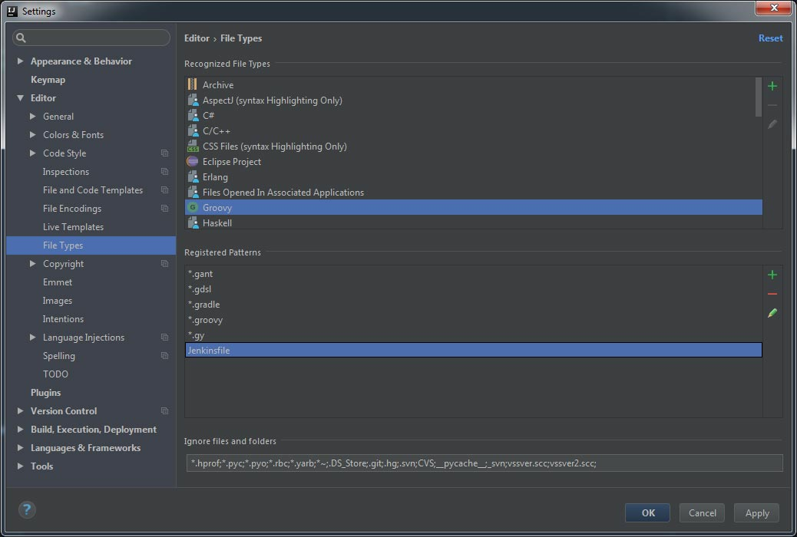
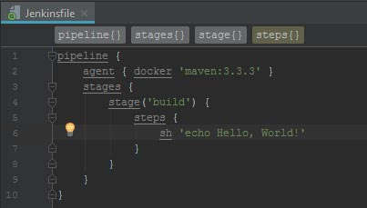

# 题 使用Intellij Idea在Java项目中突出显示Jenkinsfile语法

## 问题

我们已经尝试过如下所示的方法：

- <https://github.com/oliverlockwood/jenkinsfile-idea-plugin>
- <https://st-g.de/2016/08/jenkins-pipeline-autocompletion-in-intellij>

在多天搜索网络了好几个小时后，我们仍然没有找到有关这方面的有用资源。因此，在这里提出一个新问题似乎是有道理的。

我们正在开发IntelliJ想法的Java项目，并希望将我们的构建与Jenkins集成。当我们在Idea中创建Jenkins文件时，我们不会获得语法突出显示或自动完成。由于我们是Jenkins的新手，这些功能对我们非常有用。我们怎样才能让Idea更加支持Jenkinsfiles？

如果没有办法在想法中获得Jenkins文件的语法高亮和自动完成，那么其他编辑器会有什么帮助？

请注意：

- 我们正在使用java项目，而不是groovy项目。

- 我们已经尝试过这个插件了 <https://github.com/oliverlockwood/jenkinsfile-idea-plugin>。当插件被激活时，Jenkins文件被识别为，但是语法高亮显示我们得到错误消息，请参见下文。

  ```
  pipeline {
  agent { docker 'maven:3.3.3' }
  stages {
      stage('build') {
          steps {
              sh 'echo Hello, World!'
          }
      }
    }
  }
  ```

  Idea强调'管道'的'p'为错误。错误消息显示为：

  JenkinsTokenType.COMMENT，JenkinsTokenType.CRLF或者JenkinsTokenType.STEP_KEY期望得到'p'

谢谢你的帮助！


## 答案:

------

如果您希望IDEA将Jenkins文件识别为Groovy文件，则可以将字符串“Jenkinsfile”添加为Groovy文件的有效文件名模式（通常包含文件结尾）。这是“开箱即用”支持，不需要任何额外的插件（“Groovy”插件除外，但这已经是IDEA的一部分）。

为此，请转到设置菜单，打开“编辑器”项，然后打开“文件类型”。现在在上面的列表中选择“Groovy”并添加“Jenkinsfile”。如果你想对结束Jenkinsfile的可选文件更灵活，你也可以使用像“Jenkinsfile *”这样的正则表达式。
该设置现在应如下所示：

您的示例现在在IDEA（具有Dracula主题）中看起来像这样：

因此，就我所知，IDEA现在提供语法高亮和自动完成功能。它在写作时建议现有的函数/方法名称，但我不是Groovy开发人员，因此我无法判断是否缺少某些建议。


http://landcareweb.com/questions/23754/shi-yong-intellij-ideazai-javaxiang-mu-zhong-tu-chu-xian-shi-jenkinsfileyu-fa